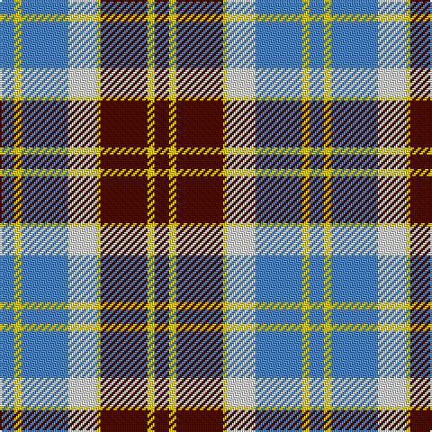

In pattern [BYBWYBYB](/patterns/bybwybyb/).

This was sourced from weddslist.  It is a [8 stripes tartan](/stripes/stripes8/).

Original link http://www.weddslist.com/cgi-bin/tartans/pg.pl?source=sts

## Thread count
B/8 Y4 B26 LN16 Y2 DR26 Y4 DR/8

## Palette
Each colour and its ΔE from the base-6 reference it is a variant of.

| Colour | Shade | Base | ΔE (OKLab) |
|---|---|---|---|
| B | <code style="background-color:#5480B0;">#5480B0</code> `#5480B0` | B <code style="background-color:#2A418A;">#2A418A</code> | 0.19 |
| DR | <code style="background-color:#401000;">#401000</code> `#401000` | B <code style="background-color:#2A418A;">#2A418A</code> | 0.24 |
| LN | <code style="background-color:#E0E0E0;">#E0E0E0</code> `#E0E0E0` | W <code style="background-color:#F7F7F7;">#F7F7F7</code> | 0.07 |
| Y | <code style="background-color:#F0C000;">#F0C000</code> `#F0C000` | Y <code style="background-color:#F2BF00;">#F2BF00</code> | 0.00 |

# Sample pattern

## Nearest tartans

The nearest existing variants by ΔTartan distance.

1. [Bannockbane Grey #1](/setts/s8/k4y2k13y1w8r13y2r4x2~k101010-r888888-wfcfcfc-ye8c000/) — ΔT 0.51
1. [Bannock Bane M.407](/setts/s8/b4g3b21g2w14r22g3r4x2~b080848-g604000-rbe7832-we0e0e0/) — ΔT 0.58
1. [Bannockbane Tan](/setts/s8/b4y2b13w13y1ba13y2ba4x2~b2888c4-ba441800-we0e0e0-ye8c000/) — ΔT 0.61
1. [Bannockbane Blue Trade Tartan Tartan Number: 665. Earliest known date: c.1984 A fashion pattern from the early 1970s. Other variants of the design appeared up to 1984. No place or family of the name is known and the pattern has no association with Bannockburn, or famous battle of 1314. Donald Broun may have been a designer with Edinburgh Woollen Mills. See products available Copyright © Blair Urquhart, Comrie, 2015](/setts/s8/b4y2b13w8y1k13y2k4x2~b5c8ca8-k101010-we0e0e0-ye8c000/) — ΔT 0.67
1. [Unidentified (ex Tony Murray)](/setts/s8/b8w22b5w4k24r6k2r6x2~b003c64-k101010-rc80000-we0e0e0/) — ΔT 0.69
1. [Bannockbane Hunting (MacBean and Bishop)](/setts/s8/g3r2g14r1w10ga14r2ga3x2~g002814-ga808080-rbe7832-we0e0e0/) — ΔT 0.71
1. [Unidentified](/setts/s7/w8k2g12k11w1r6g4x2~g808080-k101010-r960000-we0e0e0/) — ΔT 0.78
1. [Thompson Grey Family Tartan Tartan Number: 1611. Earliest known date: pre 2003 Designed for Lord Thomson of Fleet in 1958 based on a sample in the Moy Hall collection dating from the mid 19th century. The tartan is also suitable for MacTavishs and Thompsons, who claim descent from the Clan MacIntosh. See products available Copyright © Blair Urquhart, Comrie, 2015](/setts/s6/r2ra20k5w10k10r2x2~k101010-rc80000-ra888888-we0e0e0/) — ΔT 0.81
1. [Bannockbane Light Tan](/setts/s8/k4y2k13y1w8ya13y2ya4x2~k101010-we0e0e0-ye8c000-yaa08858/) — ΔT 0.84
1. [MacKintosh (Artefact)](/setts/s7/r5w36b14r9g28r8b2x2~b780078-g006818-r880000-we0e0e0/) — ΔT 0.87

## Neighbour map

Every grey dot is one of 15726 variants placed by the first two principal components of the ΔTartan feature space (44% of its variance). Red is this tartan; blue dots are its nearest — click one to open its page.

<svg viewBox="0 0 640 380" role="img" style="max-width:100%;height:auto;border:1px solid #e0e0e0;border-radius:4px;display:block" xmlns="http://www.w3.org/2000/svg"><image href="/nn/cloud.v1.png" width="640" height="380"/><a href="/setts/s8/k4y2k13y1w8r13y2r4x2~k101010-r888888-wfcfcfc-ye8c000/"><circle cx="149.4" cy="170.1" r="4" fill="#3465a4"><title>Bannockbane Grey #1</title></circle></a><a href="/setts/s8/b4g3b21g2w14r22g3r4x2~b080848-g604000-rbe7832-we0e0e0/"><circle cx="156.8" cy="169.5" r="4" fill="#3465a4"><title>Bannock Bane M.407</title></circle></a><a href="/setts/s8/b4y2b13w13y1ba13y2ba4x2~b2888c4-ba441800-we0e0e0-ye8c000/"><circle cx="139.4" cy="169.8" r="4" fill="#3465a4"><title>Bannockbane Tan</title></circle></a><a href="/setts/s8/b4y2b13w8y1k13y2k4x2~b5c8ca8-k101010-we0e0e0-ye8c000/"><circle cx="150.8" cy="174.4" r="4" fill="#3465a4"><title>Bannockbane Blue Trade Tartan Tartan Number: 665. Earliest known date: c.1984 A fashion pattern from the early 1970s. Other variants of the design appeared up to 1984. No place or family of the name is known and the pattern has no association with Bannockburn, or famous battle of 1314. Donald Broun may have been a designer with Edinburgh Woollen Mills. See products available Copyright © Blair Urquhart, Comrie, 2015</title></circle></a><a href="/setts/s8/b8w22b5w4k24r6k2r6x2~b003c64-k101010-rc80000-we0e0e0/"><circle cx="137.4" cy="167.7" r="4" fill="#3465a4"><title>Unidentified (ex Tony Murray)</title></circle></a><a href="/setts/s8/g3r2g14r1w10ga14r2ga3x2~g002814-ga808080-rbe7832-we0e0e0/"><circle cx="165.0" cy="168.1" r="4" fill="#3465a4"><title>Bannockbane Hunting (MacBean and Bishop)</title></circle></a><a href="/setts/s7/w8k2g12k11w1r6g4x2~g808080-k101010-r960000-we0e0e0/"><circle cx="141.1" cy="195.6" r="4" fill="#3465a4"><title>Unidentified</title></circle></a><a href="/setts/s6/r2ra20k5w10k10r2x2~k101010-rc80000-ra888888-we0e0e0/"><circle cx="172.2" cy="195.7" r="4" fill="#3465a4"><title>Thompson Grey Family Tartan Tartan Number: 1611. Earliest known date: pre 2003 Designed for Lord Thomson of Fleet in 1958 based on a sample in the Moy Hall collection dating from the mid 19th century. The tartan is also suitable for MacTavishs and Thompsons, who claim descent from the Clan MacIntosh. See products available Copyright © Blair Urquhart, Comrie, 2015</title></circle></a><a href="/setts/s8/k4y2k13y1w8ya13y2ya4x2~k101010-we0e0e0-ye8c000-yaa08858/"><circle cx="154.8" cy="171.2" r="4" fill="#3465a4"><title>Bannockbane Light Tan</title></circle></a><a href="/setts/s7/r5w36b14r9g28r8b2x2~b780078-g006818-r880000-we0e0e0/"><circle cx="164.8" cy="159.3" r="4" fill="#3465a4"><title>MacKintosh (Artefact)</title></circle></a><circle cx="161.4" cy="173.1" r="5" fill="#c00000"/></svg>

ID: /setts/s8/b4y2b13y1w8ba13y2ba4x2~b401000-ba5480b0-we0e0e0-yf0c000/
