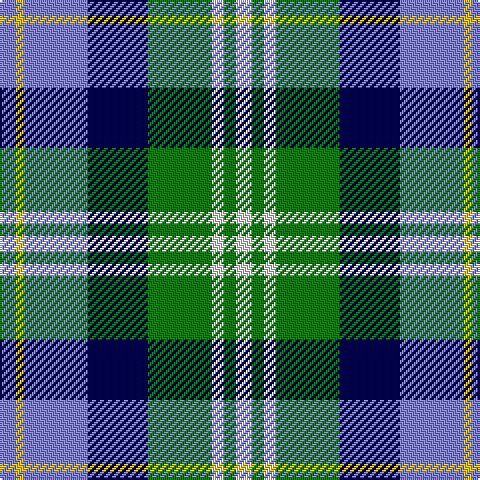

In pattern [BYBBGWGW](/patterns/bybbgwgw/).

This was sourced from weddslist.  It is a [8 stripes tartan](/stripes/stripes8/).

Original link http://www.weddslist.com/cgi-bin/tartans/pg.pl?source=sts

## Thread count
B/8 Y4 B32 DB30 G32 LN6 G6 LN/8

## Palette
Each colour and its ΔE from the base-6 reference it is a variant of.

| Colour | Shade | Base | ΔE (OKLab) |
|---|---|---|---|
| B | <code style="background-color:#8080D0;">#8080D0</code> `#8080D0` | B <code style="background-color:#2A418A;">#2A418A</code> | 0.24 |
| DB | <code style="background-color:#000050;">#000050</code> `#000050` | B <code style="background-color:#2A418A;">#2A418A</code> | 0.21 |
| G | <code style="background-color:#008000;">#008000</code> `#008000` | G <code style="background-color:#006100;">#006100</code> | 0.10 |
| LN | <code style="background-color:#E0E0E0;">#E0E0E0</code> `#E0E0E0` | W <code style="background-color:#F7F7F7;">#F7F7F7</code> | 0.07 |
| Y | <code style="background-color:#F0C000;">#F0C000</code> `#F0C000` | Y <code style="background-color:#F2BF00;">#F2BF00</code> | 0.00 |

# Sample pattern

## Nearest tartans

The nearest existing variants by ΔTartan distance.

1. [Lemania](/setts/s8/g12b3g3b3g3k15y20ba3~b202060-ba2474e8-g408060-k000033-y48a4c0~x2/) — ΔT 1.03
1. [Idaho, Centennial](/setts/s8/b12r2b2r2b2g10w12ra3~b304080-g008000-rc00000-ra806050-we0e0e0~x2/) — ΔT 1.04
1. [Elwyn Glen (Scottish Borders)](/setts/s11/k2g10ga4r5ga2r3ga2r5ga4k15w2~g648070-ga006818-k000034-ra08cb0-wc8c8c8~x2/) — ΔT 1.09
1. [Porteous](/setts/s6/k3y3b20g25w18wa3~b2c2c80-g006818-k101010-w98c8e8-waffffff-ye8c000~x2/) — ΔT 1.11
1. [Porteous (Clan)](/setts/s6/k3y3b20g25w18wa3~b2c2c80-g006818-k101010-w98c8e8-wafcfcfc-ye8c000~x2/) — ΔT 1.11
1. [Inverary Clan Tartan Tartan Number: 772. Earliest known date: pre 2003 From a miniature of Elizabeth Innes at (sic) Edingight from Adam See products available Copyright © Blair Urquhart, Comrie, 2015](/setts/s6/g10k1b13k3w9y3~b2c2c80-g006428-k101010-we0e0e0-ye8c000~x2/) — ΔT 1.13
1. [Alexander Brothers - 2007? (Corp.)](/setts/s8/g5y2b20w2k20w20k2w5~b5c8ca8-g289c18-k101010-we0e0e0-ye8c000~x2/) — ΔT 1.14
1. [Royal College of Surgeons of Edinburgh, The](/setts/s9/b4ba16k2ba2k2ba2k13r20w4~b5c8ca8-ba305870-k101010-r888888-wfcfcfc~x2/) — ΔT 1.18
1. [Ogilvie Hunting Clan/Family Tartan Tartan Number: 6082. Earliest known date: pre 2000 Samples in STA Dalgety Collection labelled "Restricted, Hunting Ogilvie, Family Only". However, the major weavers have this in their swatch books so the restriction mentioned above seems to have been lifted at some stage. See products available Copyright © Blair Urquhart, Comrie, 2015](/setts/s8/b30y3b4k25g26k3g3r4~b5c8ca8-g789484-k101010-re87878-ye8c000~x2/) — ΔT 1.18
1. [Caitriot](/setts/s9/w3b2ba14y8b14bb16ba13b2w3~b5f749c-ba505050-bb000048-wffffff-ya0a0a0~x2/) — ΔT 1.18

## Neighbour map

Every grey dot is one of 15726 variants placed by the first two principal components of the ΔTartan feature space (44% of its variance). Red is this tartan; blue dots are its nearest — click one to open its page.

<svg viewBox="0 0 640 380" role="img" style="max-width:100%;height:auto;border:1px solid #e0e0e0;border-radius:4px;display:block" xmlns="http://www.w3.org/2000/svg"><image href="/nn/cloud.v1.png" width="640" height="380"/><a href="/setts/s8/g12b3g3b3g3k15y20ba3~b202060-ba2474e8-g408060-k000033-y48a4c0~x2/"><circle cx="106.0" cy="193.7" r="4" fill="#3465a4"><title>Lemania</title></circle></a><a href="/setts/s8/b12r2b2r2b2g10w12ra3~b304080-g008000-rc00000-ra806050-we0e0e0~x2/"><circle cx="103.1" cy="185.2" r="4" fill="#3465a4"><title>Idaho, Centennial</title></circle></a><a href="/setts/s11/k2g10ga4r5ga2r3ga2r5ga4k15w2~g648070-ga006818-k000034-ra08cb0-wc8c8c8~x2/"><circle cx="89.9" cy="173.8" r="4" fill="#3465a4"><title>Elwyn Glen (Scottish Borders)</title></circle></a><a href="/setts/s6/k3y3b20g25w18wa3~b2c2c80-g006818-k101010-w98c8e8-waffffff-ye8c000~x2/"><circle cx="95.1" cy="177.6" r="4" fill="#3465a4"><title>Porteous</title></circle></a><a href="/setts/s6/k3y3b20g25w18wa3~b2c2c80-g006818-k101010-w98c8e8-wafcfcfc-ye8c000~x2/"><circle cx="95.4" cy="177.7" r="4" fill="#3465a4"><title>Porteous (Clan)</title></circle></a><a href="/setts/s6/g10k1b13k3w9y3~b2c2c80-g006428-k101010-we0e0e0-ye8c000~x2/"><circle cx="103.4" cy="181.4" r="4" fill="#3465a4"><title>Inverary Clan Tartan Tartan Number: 772. Earliest known date: pre 2003 From a miniature of Elizabeth Innes at (sic) Edingight from Adam See products available Copyright © Blair Urquhart, Comrie, 2015</title></circle></a><a href="/setts/s8/g5y2b20w2k20w20k2w5~b5c8ca8-g289c18-k101010-we0e0e0-ye8c000~x2/"><circle cx="117.5" cy="155.3" r="4" fill="#3465a4"><title>Alexander Brothers - 2007? (Corp.)</title></circle></a><a href="/setts/s9/b4ba16k2ba2k2ba2k13r20w4~b5c8ca8-ba305870-k101010-r888888-wfcfcfc~x2/"><circle cx="130.5" cy="162.4" r="4" fill="#3465a4"><title>Royal College of Surgeons of Edinburgh, The</title></circle></a><a href="/setts/s8/b30y3b4k25g26k3g3r4~b5c8ca8-g789484-k101010-re87878-ye8c000~x2/"><circle cx="155.9" cy="167.0" r="4" fill="#3465a4"><title>Ogilvie Hunting Clan/Family Tartan Tartan Number: 6082. Earliest known date: pre 2000 Samples in STA Dalgety Collection labelled &quot;Restricted, Hunting Ogilvie, Family Only&quot;. However, the major weavers have this in their swatch books so the restriction mentioned above seems to have been lifted at some stage. See products available Copyright © Blair Urquhart, Comrie, 2015</title></circle></a><a href="/setts/s9/w3b2ba14y8b14bb16ba13b2w3~b5f749c-ba505050-bb000048-wffffff-ya0a0a0~x2/"><circle cx="110.7" cy="191.2" r="4" fill="#3465a4"><title>Caitriot</title></circle></a><circle cx="91.5" cy="180.7" r="5" fill="#c00000"/></svg>

ID: /setts/s8/b4y2b16ba15g16w3g3w4~b8080d0-ba000050-g008000-we0e0e0-yf0c000~x2/
