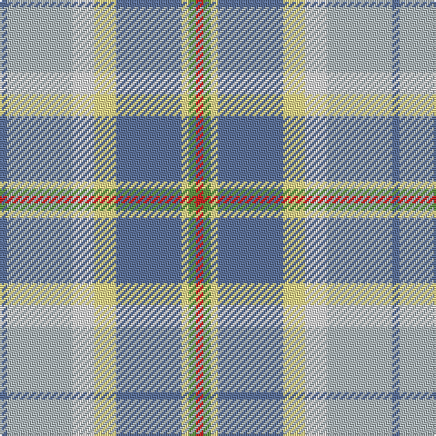

In pattern [BYWYBYGR](/patterns/bywybygr/).

This was sourced from register-of-tartans.  It is a [8 stripes tartan](/stripes/stripes8/).

Original link https://www.tartanregister.gov.uk/tartanDetails.aspx?ref=10942

## Thread count
B/4 N36 LN12 LY12 B36 LY4 LG4 R/4

## Palette
Each colour and its ΔE from the base-6 reference it is a variant of.

| Colour | Shade | Base | ΔE (OKLab) |
|---|---|---|---|
| B | <code style="background-color:#5F749C;">#5F749C</code> `#5F749C` | B <code style="background-color:#2C4084;">#2C4084</code> | 0.17 |
| LG | <code style="background-color:#649848;">#649848</code> `#649848` | G <code style="background-color:#006400;">#006400</code> | 0.19 |
| LN | <code style="background-color:#E0E0E0;">#E0E0E0</code> `#E0E0E0` | W <code style="background-color:#F4F4F0;">#F4F4F0</code> | 0.06 |
| LY | <code style="background-color:#F8E38C;">#F8E38C</code> `#F8E38C` | Y <code style="background-color:#E8C000;">#E8C000</code> | 0.11 |
| N | <code style="background-color:#AFB8BB;">#AFB8BB</code> `#AFB8BB` | Y <code style="background-color:#E8C000;">#E8C000</code> | 0.18 |
| R | <code style="background-color:#C82828;">#C82828</code> `#C82828` | R <code style="background-color:#C80000;">#C80000</code> | 0.03 |

# Sample pattern

ID: /setts/s8/b4y36w12ya12b36ya4g4r4-b5f749c-g649848-rc82828-we0e0e0-yafb8bb-yaf8e38c/
