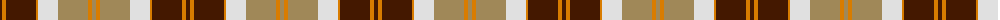

In pattern [BYBYWYYY](/patterns/bybywyyy/).

This was sourced from register-of-tartans.  It is a [8 stripes tartan](/stripes/stripes8/).

Original link https://www.tartanregister.gov.uk/tartanDetails.aspx?ref=204

## Attestations

This cloth appears in 2 source records; the oldest owns this page.

- 01/01/1975 — Bannockbane Orange Stripes (register-of-tartans, [record](https://www.tartanregister.gov.uk/tartanDetails.aspx?ref=204))
- undated — Bannockbane Trade Tartan Tartan Number: 1743. Earliest known date: pre 2003 The original Bannockbane which was later produced in various colourways See products available Copyright © Blair Urquhart, Comrie, 2015 (house-of-tartan, [record](http://www.house-of-tartan.scotland.net/house/TartanViewjs.asp?colr=Def&tnam=1743))

## Thread count
DR/4 O4 DR30 O2 LN20 LT30 O4 LT/4

## Palette
Each colour and its ΔE from the base-6 reference it is a variant of.

| Colour | Shade | Base | ΔE (OKLab) |
|---|---|---|---|
| DR | <code style="background-color:#441800;">#441800</code> `#441800` | B <code style="background-color:#2C4084;">#2C4084</code> | 0.22 |
| LN | <code style="background-color:#E0E0E0;">#E0E0E0</code> `#E0E0E0` | W <code style="background-color:#F4F4F0;">#F4F4F0</code> | 0.06 |
| LT | <code style="background-color:#A08858;">#A08858</code> `#A08858` | Y <code style="background-color:#E8C000;">#E8C000</code> | 0.21 |
| O | <code style="background-color:#D87C00;">#D87C00</code> `#D87C00` | Y <code style="background-color:#E8C000;">#E8C000</code> | 0.17 |

# Sample pattern

ID: /setts/s8/b4y4b30y2w20ya30y4ya4-b441800-we0e0e0-yd87c00-yaa08858/
