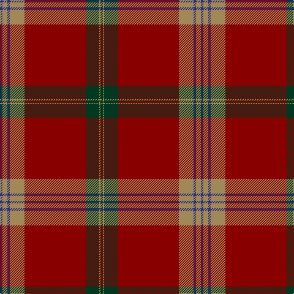

In pattern [BYBYRGYG](/patterns/bybyrgyg/).

This was sourced from tartans-authority.  It is a [8 stripes tartan](/stripes/stripes8/).

Original link http://www.tartansauthority.com/tartan-ferret/display/5795/

## Thread count
DB/4 LT8 DB4 LT24 DR100 DG22 LT2 DG/4

## Palette
Each colour and its ΔE from the base-6 reference it is a variant of.

| Colour | Shade | Base | ΔE (OKLab) |
|---|---|---|---|
| DB | <code style="background-color:#2C2C80;">#2C2C80</code> `#2C2C80` | B <code style="background-color:#2C4084;">#2C4084</code> | 0.05 |
| DG | <code style="background-color:#003820;">#003820</code> `#003820` | G <code style="background-color:#006400;">#006400</code> | 0.16 |
| DR | <code style="background-color:#880000;">#880000</code> `#880000` | R <code style="background-color:#C80000;">#C80000</code> | 0.14 |
| LT | <code style="background-color:#A08858;">#A08858</code> `#A08858` | Y <code style="background-color:#E8C000;">#E8C000</code> | 0.21 |

# Sample pattern

## Nearest tartans

The nearest existing variants by ΔTartan distance.

1. [Slessor (Personal)](/setts/s14/g4y2g22r100y24b4y8b4y8b4y24r100g22y2-b2c2c80-g003820-r880000-ya08858/) — ΔT 1.17
1. [Arbroath Smokie](/setts/s9/y2r90b46w2b12ra4y2ra4y2-b14283c-r880000-rac80000-we0e0e0-ybc8c00/) — ΔT 1.17
1. [Unidentified #60](/setts/s11/r200ra12r16ra16b4ra4b4ra28ba28ra4ba12-b000088-ba085454-r70000c-rab07430/) — ΔT 1.27
1. [MacGregor](/setts/s6/r72g36r8g12k2y4-g11450d-k000000-raa0000-yaaaaaa/) — ΔT 1.37
1. [MacGregor](/setts/s6/r36g18r4g6k1y2-g11450d-k000000-raa0000-yaaaaaa/) — ΔT 1.37
1. [Jack (Personal)](/setts/s6/g8r104k40ga18g4y2-g408060-ga604000-k101010-r880000-ybc8c00/) — ΔT 1.37
1. [Strang (Personal)](/setts/s8/r72g36r8g12k2w4k2g4-g146400-k000000-rb00000-wc8c8c8/) — ΔT 1.37
1. [MacGillivray - 1819 (Clan)](/setts/s13/r12b2ba2r114b4r4ba46r8g60r12b2r12ba4-b5c8ca8-ba14283c-g006818-rc80000/) — ΔT 1.38
1. [Laporte](/setts/s10/g16r12k8r128ra2k56r12g80r12k8-g5c6428-k101010-r880000-ra888888/) — ΔT 1.39
1. [Moulin](/setts/s10/r144k12g12ra4g12k12r16g24k4ra8-g484800-k000000-r740010-ra8c0000/) — ΔT 1.44

## Neighbour map

Every grey dot is one of 15726 variants placed by the first two principal components of the ΔTartan feature space (44% of its variance). Red is this tartan; blue dots are its nearest — click one to open its page.

<svg viewBox="0 0 640 380" role="img" style="max-width:100%;height:auto;border:1px solid #e0e0e0;border-radius:4px;display:block" xmlns="http://www.w3.org/2000/svg"><image href="/nn/cloud.v1.png" width="640" height="380"/><a href="/setts/s14/g4y2g22r100y24b4y8b4y8b4y24r100g22y2-b2c2c80-g003820-r880000-ya08858/"><circle cx="454.2" cy="94.1" r="4" fill="#3465a4"><title>Slessor (Personal)</title></circle></a><a href="/setts/s9/y2r90b46w2b12ra4y2ra4y2-b14283c-r880000-rac80000-we0e0e0-ybc8c00/"><circle cx="430.3" cy="95.9" r="4" fill="#3465a4"><title>Arbroath Smokie</title></circle></a><a href="/setts/s11/r200ra12r16ra16b4ra4b4ra28ba28ra4ba12-b000088-ba085454-r70000c-rab07430/"><circle cx="523.2" cy="92.8" r="4" fill="#3465a4"><title>Unidentified #60</title></circle></a><a href="/setts/s6/r72g36r8g12k2y4-g11450d-k000000-raa0000-yaaaaaa/"><circle cx="450.7" cy="154.4" r="4" fill="#3465a4"><title>MacGregor</title></circle></a><a href="/setts/s6/r36g18r4g6k1y2-g11450d-k000000-raa0000-yaaaaaa/"><circle cx="450.7" cy="154.4" r="4" fill="#3465a4"><title>MacGregor</title></circle></a><a href="/setts/s6/g8r104k40ga18g4y2-g408060-ga604000-k101010-r880000-ybc8c00/"><circle cx="445.0" cy="131.4" r="4" fill="#3465a4"><title>Jack (Personal)</title></circle></a><a href="/setts/s8/r72g36r8g12k2w4k2g4-g146400-k000000-rb00000-wc8c8c8/"><circle cx="421.7" cy="122.2" r="4" fill="#3465a4"><title>Strang (Personal)</title></circle></a><a href="/setts/s13/r12b2ba2r114b4r4ba46r8g60r12b2r12ba4-b5c8ca8-ba14283c-g006818-rc80000/"><circle cx="410.3" cy="77.9" r="4" fill="#3465a4"><title>MacGillivray - 1819 (Clan)</title></circle></a><a href="/setts/s10/g16r12k8r128ra2k56r12g80r12k8-g5c6428-k101010-r880000-ra888888/"><circle cx="391.7" cy="124.9" r="4" fill="#3465a4"><title>Laporte</title></circle></a><a href="/setts/s10/r144k12g12ra4g12k12r16g24k4ra8-g484800-k000000-r740010-ra8c0000/"><circle cx="502.0" cy="123.3" r="4" fill="#3465a4"><title>Moulin</title></circle></a><circle cx="457.8" cy="112.6" r="5" fill="#c00000"/></svg>

ID: /setts/s8/b4y8b4y24r100g22y2g4-b2c2c80-g003820-r880000-ya08858/
