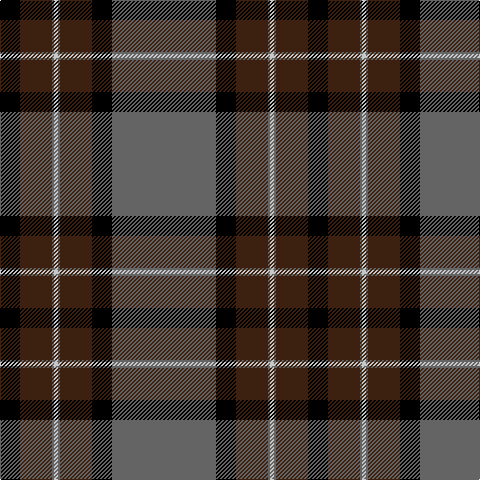

In pattern [BKBBWBBK](/patterns/bkbbwbbk/).

This was sourced from register-of-tartans.  It is a [8 stripes tartan](/stripes/stripes8/).

Original link https://www.tartanregister.gov.uk/tartanDetails.aspx?ref=4513

## Thread count
K/20 Ka32 N2 Na4 N2 Ka32 K20 N/104

## Palette
Each colour and its ΔE from the base-6 reference it is a variant of.

| Colour | Shade | Base | ΔE (OKLab) |
|---|---|---|---|
| K | <code style="background-color:#000000;">#000000</code> `#000000` | K <code style="background-color:#000000;">#000000</code> | 0.00 |
| Ka | <code style="background-color:#3C2010;">#3C2010</code> `#3C2010` | B <code style="background-color:#2A418A;">#2A418A</code> | 0.21 |
| N | <code style="background-color:#646464;">#646464</code> `#646464` | B <code style="background-color:#2A418A;">#2A418A</code> | 0.16 |
| Na | <code style="background-color:#C8C8C8;">#C8C8C8</code> `#C8C8C8` | W <code style="background-color:#F7F7F7;">#F7F7F7</code> | 0.14 |

# Sample pattern

## Nearest tartans

The nearest existing variants by ΔTartan distance.

1. [Cirse 3D](/setts/s8/y8b5r1b15k2y1k36b1x2~b5c5c5c-k101010-r880000-ybc8c00/) — ΔT 0.86
1. [Black Thistle](/setts/s9/b10k6g42k2g1k2r1k24r2x2~b3850c8-g408060-k101010-rc80000/) — ΔT 1.18
1. [MacDiarmid #2](/setts/s8/k83r16g56k2w5k2g56r5x2~g005020-k101010-rdc0000-we0e0e0/) — ΔT 1.21
1. [Hot Boontjie](/setts/s8/r4g4k1w2k1g18k32ra4x2~g005448-k101010-ra00048-rac80000-we0e0e0/) — ΔT 1.27
1. [Kunbi](/setts/s8/k76b11k3y6k3b13k11r76~b003c64-k101010-r888888-ye8c000/) — ΔT 1.28
1. [MacEvil (Corporate)](/setts/s8/r35w8k85ra6k4ra14k2b4~b780078-k101010-r880000-ra888888-we0e0e0/) — ΔT 1.36
1. [Unidentified (School)](/setts/s9/g35k3b2k5b3k1b20k3w3x2~b38409c-g5c6428-k101010-we0e0e0/) — ΔT 1.38
1. [Distripress (Corporate)](/setts/s8/r6k1w4k4b15r1k35ra2x2~b5c5c5c-k101010-rc80000-ra888888-we0e0e0/) — ΔT 1.38
1. [Midnight Balmoral (Fashion)](/setts/s9/r4w1k36b2ra4w1b14ra8w1x2~b202060-k101010-r888888-ra880000-we0e0e0/) — ΔT 1.43
1. [MacDiarmid](/setts/s9/k12r2k28g12k1w3k1g12r4x2~g285800-k101010-rc80000-we0e0e0/) — ΔT 1.44

## Neighbour map

Every grey dot is one of 15726 variants placed by the first two principal components of the ΔTartan feature space (44% of its variance). Red is this tartan; blue dots are its nearest — click one to open its page.

<svg viewBox="0 0 640 380" role="img" style="max-width:100%;height:auto;border:1px solid #e0e0e0;border-radius:4px;display:block" xmlns="http://www.w3.org/2000/svg"><image href="/nn/cloud.v1.png" width="640" height="380"/><a href="/setts/s8/y8b5r1b15k2y1k36b1x2~b5c5c5c-k101010-r880000-ybc8c00/"><circle cx="375.2" cy="131.7" r="4" fill="#3465a4"><title>Cirse 3D</title></circle></a><a href="/setts/s9/b10k6g42k2g1k2r1k24r2x2~b3850c8-g408060-k101010-rc80000/"><circle cx="333.5" cy="117.6" r="4" fill="#3465a4"><title>Black Thistle</title></circle></a><a href="/setts/s8/k83r16g56k2w5k2g56r5x2~g005020-k101010-rdc0000-we0e0e0/"><circle cx="356.2" cy="149.2" r="4" fill="#3465a4"><title>MacDiarmid #2</title></circle></a><a href="/setts/s8/r4g4k1w2k1g18k32ra4x2~g005448-k101010-ra00048-rac80000-we0e0e0/"><circle cx="337.6" cy="127.8" r="4" fill="#3465a4"><title>Hot Boontjie</title></circle></a><a href="/setts/s8/k76b11k3y6k3b13k11r76~b003c64-k101010-r888888-ye8c000/"><circle cx="295.8" cy="140.3" r="4" fill="#3465a4"><title>Kunbi</title></circle></a><a href="/setts/s8/r35w8k85ra6k4ra14k2b4~b780078-k101010-r880000-ra888888-we0e0e0/"><circle cx="360.7" cy="100.1" r="4" fill="#3465a4"><title>MacEvil (Corporate)</title></circle></a><a href="/setts/s9/g35k3b2k5b3k1b20k3w3x2~b38409c-g5c6428-k101010-we0e0e0/"><circle cx="329.3" cy="127.6" r="4" fill="#3465a4"><title>Unidentified (School)</title></circle></a><a href="/setts/s8/r6k1w4k4b15r1k35ra2x2~b5c5c5c-k101010-rc80000-ra888888-we0e0e0/"><circle cx="353.3" cy="111.5" r="4" fill="#3465a4"><title>Distripress (Corporate)</title></circle></a><a href="/setts/s9/r4w1k36b2ra4w1b14ra8w1x2~b202060-k101010-r888888-ra880000-we0e0e0/"><circle cx="326.4" cy="108.6" r="4" fill="#3465a4"><title>Midnight Balmoral (Fashion)</title></circle></a><a href="/setts/s9/k12r2k28g12k1w3k1g12r4x2~g285800-k101010-rc80000-we0e0e0/"><circle cx="350.0" cy="157.6" r="4" fill="#3465a4"><title>MacDiarmid</title></circle></a><circle cx="343.9" cy="124.1" r="5" fill="#c00000"/></svg>

ID: /setts/s8/b52k10ba16b1w2b1ba16k10x2~b646464-ba3c2010-k000000-wc8c8c8/
