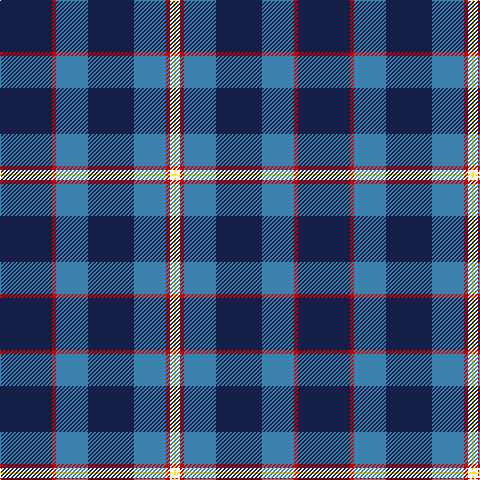

In pattern [BRBBBRWY](/patterns/brbbbrwy/).

This was sourced from register-of-tartans.  It is a [8 stripes tartan](/stripes/stripes8/).

Original link https://www.tartanregister.gov.uk/tartanDetails.aspx?ref=11429

## Thread count
DB/52 R4 B32 DB46 B32 R4 W4 Y/2

## Palette
Each colour and its ΔE from the base-6 reference it is a variant of.

| Colour | Shade | Base | ΔE (OKLab) |
|---|---|---|---|
| B | <code style="background-color:#3C82AF;">#3C82AF</code> `#3C82AF` | B <code style="background-color:#2A418A;">#2A418A</code> | 0.19 |
| DB | <code style="background-color:#141E46;">#141E46</code> `#141E46` | B <code style="background-color:#2A418A;">#2A418A</code> | 0.16 |
| R | <code style="background-color:#C80000;">#C80000</code> `#C80000` | R <code style="background-color:#CC0000;">#CC0000</code> | 0.01 |
| W | <code style="background-color:#FFFFFF;">#FFFFFF</code> `#FFFFFF` | W <code style="background-color:#F7F7F7;">#F7F7F7</code> | 0.02 |
| Y | <code style="background-color:#FFE600;">#FFE600</code> `#FFE600` | Y <code style="background-color:#F2BF00;">#F2BF00</code> | 0.10 |

# Sample pattern

## Nearest tartans

The nearest existing variants by ΔTartan distance.

1. [Katsushika (Corporate)](/setts/s8/b44y4b2y4b20g4ga22g12-b2c2c80-g808080-ga006818-ye8c000/) — ΔT 1.19
1. [International Pairs (Corporate)](/setts/s10/b68y12g12r4w4r4g20y16b46w4-b2c2c80-g007460-rc80000-we0e0e0-ybc8c00/) — ΔT 1.20
1. [Warren Wilson College (Corporate)](/setts/s8/g40y12b40ya6b96r12b8r12-b1c0070-g006818-r880000-ya0a0a0-yae8c000/) — ΔT 1.24
1. [Al-Fadhli (Personal)](/setts/s10/k34b48g6b6w6b6r6b48k34w2-b2c2c80-g006818-k101010-rc80000-we0e0e0/) — ΔT 1.24
1. [Gorman Family (Canada) (Personal)](/setts/s6/g12b32ba98bb28ba4w12-b405068-ba1c0070-bb487088-g289c18-we0e0e0/) — ΔT 1.28
1. [Katsushika Corporate Tartan Tartan Number: 2343. Earliest known date: 1997 Designed for Katsushika Scottish country dancers from Hiroshima. See products available Copyright © Blair Urquhart, Comrie, 2015](/setts/s8/b44y4b2y4b20r4g22r12-b2c2c80-g006818-rc80000-ye8c000/) — ΔT 1.28
1. [Schöbitz (2016)](/setts/s8/r2b46y6ba32y6b44r2w2-b1c1c1c-ba3850c8-rc8002c-wf8f8f8-ye0a126/) — ΔT 1.36
1. [MacCormick Festive](/setts/s9/w6b6k2ba32k2b16r6b48y6-b2c2c80-ba5c8ca8-k101010-rc80000-we0e0e0-ye8c000/) — ΔT 1.36
1. [Unidentified Plaid 9](/setts/s10/b52g12b52r4g52w2r12b4r12b26-b000050-g006030-rc00000-we0e0e0/) — ΔT 1.37
1. [Roxburgh, Green (District)](/setts/s8/b92w4b4w4b32g88r4b12-b1c0070-g006818-rc80000-wf8f8f8/) — ΔT 1.38

## Neighbour map

Every grey dot is one of 15726 variants placed by the first two principal components of the ΔTartan feature space (44% of its variance). Red is this tartan; blue dots are its nearest — click one to open its page.

<svg viewBox="0 0 640 380" role="img" style="max-width:100%;height:auto;border:1px solid #e0e0e0;border-radius:4px;display:block" xmlns="http://www.w3.org/2000/svg"><image href="/nn/cloud.v1.png" width="640" height="380"/><a href="/setts/s8/b44y4b2y4b20g4ga22g12-b2c2c80-g808080-ga006818-ye8c000/"><circle cx="345.9" cy="169.8" r="4" fill="#3465a4"><title>Katsushika (Corporate)</title></circle></a><a href="/setts/s10/b68y12g12r4w4r4g20y16b46w4-b2c2c80-g007460-rc80000-we0e0e0-ybc8c00/"><circle cx="320.5" cy="140.6" r="4" fill="#3465a4"><title>International Pairs (Corporate)</title></circle></a><a href="/setts/s8/g40y12b40ya6b96r12b8r12-b1c0070-g006818-r880000-ya0a0a0-yae8c000/"><circle cx="347.5" cy="162.4" r="4" fill="#3465a4"><title>Warren Wilson College (Corporate)</title></circle></a><a href="/setts/s10/k34b48g6b6w6b6r6b48k34w2-b2c2c80-g006818-k101010-rc80000-we0e0e0/"><circle cx="330.7" cy="152.8" r="4" fill="#3465a4"><title>Al-Fadhli (Personal)</title></circle></a><a href="/setts/s6/g12b32ba98bb28ba4w12-b405068-ba1c0070-bb487088-g289c18-we0e0e0/"><circle cx="301.3" cy="155.7" r="4" fill="#3465a4"><title>Gorman Family (Canada) (Personal)</title></circle></a><a href="/setts/s8/b44y4b2y4b20r4g22r12-b2c2c80-g006818-rc80000-ye8c000/"><circle cx="341.1" cy="162.7" r="4" fill="#3465a4"><title>Katsushika Corporate Tartan Tartan Number: 2343. Earliest known date: 1997 Designed for Katsushika Scottish country dancers from Hiroshima. See products available Copyright © Blair Urquhart, Comrie, 2015</title></circle></a><a href="/setts/s8/r2b46y6ba32y6b44r2w2-b1c1c1c-ba3850c8-rc8002c-wf8f8f8-ye0a126/"><circle cx="365.0" cy="142.0" r="4" fill="#3465a4"><title>Schöbitz (2016)</title></circle></a><a href="/setts/s9/w6b6k2ba32k2b16r6b48y6-b2c2c80-ba5c8ca8-k101010-rc80000-we0e0e0-ye8c000/"><circle cx="292.9" cy="112.1" r="4" fill="#3465a4"><title>MacCormick Festive</title></circle></a><a href="/setts/s10/b52g12b52r4g52w2r12b4r12b26-b000050-g006030-rc00000-we0e0e0/"><circle cx="349.3" cy="165.4" r="4" fill="#3465a4"><title>Unidentified Plaid 9</title></circle></a><a href="/setts/s8/b92w4b4w4b32g88r4b12-b1c0070-g006818-rc80000-wf8f8f8/"><circle cx="370.8" cy="155.0" r="4" fill="#3465a4"><title>Roxburgh, Green (District)</title></circle></a><circle cx="318.4" cy="150.6" r="5" fill="#c00000"/></svg>

ID: /setts/s8/b52r4ba32b46ba32r4w4y2-b141e46-ba3c82af-rc80000-wffffff-yffe600/
