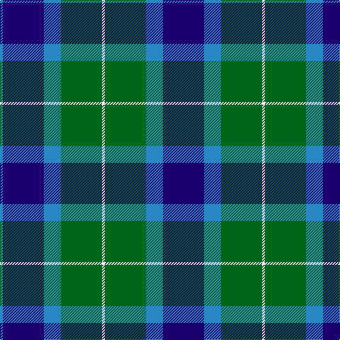

In pattern [BBBGWGBB](/patterns/bbbgwgbb/).

This was sourced from register-of-tartans.  It is a [8 stripes tartan](/stripes/stripes8/).

Original link https://www.tartanregister.gov.uk/tartanDetails.aspx?ref=4483

## Thread count
B/4 DB58 B24 G58 W4 G58 B24 DB/58

## Palette
Each colour and its ΔE from the base-6 reference it is a variant of.

| Colour | Shade | Base | ΔE (OKLab) |
|---|---|---|---|
| B | <code style="background-color:#2888C4;">#2888C4</code> `#2888C4` | B <code style="background-color:#2C4084;">#2C4084</code> | 0.21 |
| DB | <code style="background-color:#1C0070;">#1C0070</code> `#1C0070` | B <code style="background-color:#2C4084;">#2C4084</code> | 0.14 |
| G | <code style="background-color:#006818;">#006818</code> `#006818` | G <code style="background-color:#006400;">#006400</code> | 0.02 |
| LP | <code style="background-color:#A8ACE8;">#A8ACE8</code> `#A8ACE8` | W <code style="background-color:#F4F4F0;">#F4F4F0</code> | 0.22 |
| N | <code style="background-color:#C0C0C0;">#C0C0C0</code> `#C0C0C0` | W <code style="background-color:#F4F4F0;">#F4F4F0</code> | 0.16 |
| W | <code style="background-color:#F8F8F8;">#F8F8F8</code> `#F8F8F8` | W <code style="background-color:#F4F4F0;">#F4F4F0</code> | 0.01 |

# Sample pattern

## Nearest tartans

The nearest existing variants by ΔTartan distance.

1. [Pinney's of Scotland](/setts/s10/k8g4b20y2b4g26k22g26b26y4-b304080-g008000-k000030-yf0c000/) — ΔT 1.14
1. [U.S. Border Patrol](/setts/s8/k20b20k30g80k30b20k20y6-b1474b4-g408060-k101010-ye8c000/) — ΔT 1.15
1. [Sinclair of Ulbster](/setts/s6/b96k32g48y8g48k32-b1474b4-g006818-k101010-yd8b000/) — ΔT 1.27
1. [Blaylock Annandale](/setts/s7/g48b12w6k12b24k30g8-b1f5aba-g10712e-k101010-w9eafdb/) — ΔT 1.27
1. [Pinney's of Scotland](/setts/s10/b8g4ba20y2ba4g26b22g26ba26y4-b202060-ba2c2c80-g006818-ye8c000/) — ΔT 1.29
1. [Granger/Grainger (Personal)](/setts/s10/g54k42b24k8b80k8b24k42g54w8-b2c2c80-g006818-k101010-we0e0e0/) — ΔT 1.31
1. [MacKirdy](/setts/s5/k4g24k22b24w2-b1474b4-g408060-k101010-wfcfcfc/) — ΔT 1.32
1. [MacRobart (Personal)](/setts/s6/b60k20g20w4g30w4-b202060-g006818-k101010-wa8ace8/) — ΔT 1.33
1. [Hamilton of Clayton (Personal)](/setts/s10/g6y6g36b28r10b28r10b28g42y6-b000088-g004c00-r880000-yb0b0b0/) — ΔT 1.34
1. [Granger (Personal)](/setts/s6/b80k8b24k42g54w8-b2c2c80-g006818-k101010-we0e0e0/) — ΔT 1.36

## Neighbour map

Every grey dot is one of 15726 variants placed by the first two principal components of the ΔTartan feature space (44% of its variance). Red is this tartan; blue dots are its nearest — click one to open its page.

<svg viewBox="0 0 640 380" role="img" style="max-width:100%;height:auto;border:1px solid #e0e0e0;border-radius:4px;display:block" xmlns="http://www.w3.org/2000/svg"><image href="/nn/cloud.v1.png" width="640" height="380"/><a href="/setts/s10/k8g4b20y2b4g26k22g26b26y4-b304080-g008000-k000030-yf0c000/"><circle cx="186.6" cy="195.2" r="4" fill="#3465a4"><title>Pinney's of Scotland</title></circle></a><a href="/setts/s8/k20b20k30g80k30b20k20y6-b1474b4-g408060-k101010-ye8c000/"><circle cx="225.0" cy="201.4" r="4" fill="#3465a4"><title>U.S. Border Patrol</title></circle></a><a href="/setts/s6/b96k32g48y8g48k32-b1474b4-g006818-k101010-yd8b000/"><circle cx="188.4" cy="235.9" r="4" fill="#3465a4"><title>Sinclair of Ulbster</title></circle></a><a href="/setts/s7/g48b12w6k12b24k30g8-b1f5aba-g10712e-k101010-w9eafdb/"><circle cx="185.9" cy="232.5" r="4" fill="#3465a4"><title>Blaylock Annandale</title></circle></a><a href="/setts/s10/b8g4ba20y2ba4g26b22g26ba26y4-b202060-ba2c2c80-g006818-ye8c000/"><circle cx="223.5" cy="210.7" r="4" fill="#3465a4"><title>Pinney's of Scotland</title></circle></a><a href="/setts/s10/g54k42b24k8b80k8b24k42g54w8-b2c2c80-g006818-k101010-we0e0e0/"><circle cx="193.1" cy="219.9" r="4" fill="#3465a4"><title>Granger/Grainger (Personal)</title></circle></a><a href="/setts/s5/k4g24k22b24w2-b1474b4-g408060-k101010-wfcfcfc/"><circle cx="175.7" cy="230.4" r="4" fill="#3465a4"><title>MacKirdy</title></circle></a><a href="/setts/s6/b60k20g20w4g30w4-b202060-g006818-k101010-wa8ace8/"><circle cx="260.3" cy="212.9" r="4" fill="#3465a4"><title>MacRobart (Personal)</title></circle></a><a href="/setts/s10/g6y6g36b28r10b28r10b28g42y6-b000088-g004c00-r880000-yb0b0b0/"><circle cx="201.2" cy="231.5" r="4" fill="#3465a4"><title>Hamilton of Clayton (Personal)</title></circle></a><a href="/setts/s6/b80k8b24k42g54w8-b2c2c80-g006818-k101010-we0e0e0/"><circle cx="250.7" cy="234.7" r="4" fill="#3465a4"><title>Granger (Personal)</title></circle></a><circle cx="212.5" cy="212.8" r="5" fill="#c00000"/></svg>

ID: /setts/s8/b58ba24g58w4g58ba24b58ba4-b1c0070-ba2888c4-g006818-wf8f8f8/
