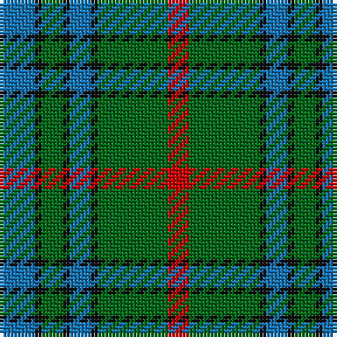

**Bands:** [BKGKBKGR](/stripes/bkgkbkgr/) · **Stripes:** [B K G K B K G R](/stripes/stripes8/) B K G K B K G R

This was sourced from tartans-authority.  It is a [8 band tartan](/bands/bands8/).

Original link http://www.tartansauthority.com/tartan-ferret/display/8979/

## Thread count
B/10 K2 G6 K2 B6 K2 G20 R/6

## Palette
Each colour and its ΔE from the base-6 reference it is a variant of.

| Colour | Shade | Base | ΔE (OKLab) |
|---|---|---|---|
| B | <code style="background-color:#1474B4;">#1474B4</code> `#1474B4` | B <code style="background-color:#2A418A;">#2A418A</code> | 0.15 |
| G | <code style="background-color:#006818;">#006818</code> `#006818` | G <code style="background-color:#006100;">#006100</code> | 0.02 |
| K | <code style="background-color:#101010;">#101010</code> `#101010` | K <code style="background-color:#000000;">#000000</code> | 0.17 |
| R | <code style="background-color:#C80000;">#C80000</code> `#C80000` | R <code style="background-color:#CC0000;">#CC0000</code> | 0.01 |

# Sample pattern

## Nearest tartans

The nearest existing variants by ΔTartan distance.

1. [AIton - 1979 (Clan)](/setts/s8/db6k1g3k1db3k1g10r3~x2/) — ΔT 0.74
1. [Marie Curie Fields Of Hope](/setts/s9/b12lo1b2lo1b3k5g10lo1g2~x4/) — ΔT 0.91
1. [Stewart of Appin 2](/setts/s10/g11r4g4r7g41db11t4db41r4db8/) — ΔT 0.98
1. [Abercrombie](/setts/s9/g14w1g7k7db2k2db2k2db7~x4/) — ΔT 0.99
1. [Smeaton #2 (Name)](/setts/s10/db12w2db7g15k2g4k2g15db2k7~x2/) — ΔT 1.03
1. [Cork](/setts/s9/g28r12g4db20ly2db3ly2db3g7~x2/) — ΔT 1.04
1. [Daks (0600150)](/setts/s8/r5dt12g3db4g20dt3g3r5~x4/) — ΔT 1.04
1. [Trafalgar (Fashion)](/setts/s6/g3db1g8db7k3ly1~x2/) — ΔT 1.07
1. [Valley, of the Green. (The )](/setts/s7/t4dg26g8t8g8g3t2~x2/) — ΔT 1.09
1. [Crantock](/setts/s8/y24dp3y3dp3y3dp7dg20r3~x2/) — ΔT 1.10

## Neighbour map

Every grey dot is one of 14313 variants placed by the first two principal components of the ΔTartan feature space (44% of its variance). Red is this tartan; blue dots are its nearest — click one to open its page.

<svg viewBox="0 0 640 380" role="img" style="max-width:100%;height:auto;border:1px solid #e0e0e0;border-radius:4px;display:block" xmlns="http://www.w3.org/2000/svg"><image href="/nn/cloud.v1.png" width="640" height="380"/><a href="/setts/s8/db6k1g3k1db3k1g10r3~x2/"><circle cx="256.1" cy="215.9" r="4" fill="#3465a4"><title>AIton - 1979 (Clan)</title></circle></a><a href="/setts/s9/b12lo1b2lo1b3k5g10lo1g2~x4/"><circle cx="254.4" cy="192.8" r="4" fill="#3465a4"><title>Marie Curie Fields Of Hope</title></circle></a><a href="/setts/s10/g11r4g4r7g41db11t4db41r4db8/"><circle cx="278.2" cy="191.4" r="4" fill="#3465a4"><title>Stewart of Appin 2</title></circle></a><a href="/setts/s9/g14w1g7k7db2k2db2k2db7~x4/"><circle cx="266.8" cy="203.2" r="4" fill="#3465a4"><title>Abercrombie</title></circle></a><a href="/setts/s10/db12w2db7g15k2g4k2g15db2k7~x2/"><circle cx="248.9" cy="226.2" r="4" fill="#3465a4"><title>Smeaton #2 (Name)</title></circle></a><a href="/setts/s9/g28r12g4db20ly2db3ly2db3g7~x2/"><circle cx="274.6" cy="177.9" r="4" fill="#3465a4"><title>Cork</title></circle></a><a href="/setts/s8/r5dt12g3db4g20dt3g3r5~x4/"><circle cx="248.5" cy="231.4" r="4" fill="#3465a4"><title>Daks (0600150)</title></circle></a><a href="/setts/s6/g3db1g8db7k3ly1~x2/"><circle cx="248.8" cy="247.5" r="4" fill="#3465a4"><title>Trafalgar (Fashion)</title></circle></a><a href="/setts/s7/t4dg26g8t8g8g3t2~x2/"><circle cx="252.8" cy="210.6" r="4" fill="#3465a4"><title>Valley, of the Green. (The )</title></circle></a><a href="/setts/s8/y24dp3y3dp3y3dp7dg20r3~x2/"><circle cx="268.5" cy="215.3" r="4" fill="#3465a4"><title>Crantock</title></circle></a><circle cx="258.7" cy="215.0" r="5" fill="#c00000"/></svg>

ID: /setts/s8/b5k1g3k1b3k1g10r3~x2/
