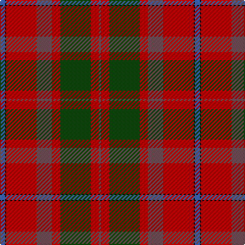

**Bands:** [BKRBRGRB](/stripes/bkrbrgrb/) · **Stripes:** [B K R N R DG R N](/stripes/stripes8/) B K R N R DG R N

This was sourced from weddslist.  It is a [8 band tartan](/bands/bands8/).

Original link http://www.weddslist.com/cgi-bin/tartans/pg.pl?source=x

## Register references

External register numbers recorded for this tartan.

- Scottish Register of Tartans: [2540](https://www.tartanregister.gov.uk/tartanDetails.aspx?ref=2540)
- Scottish Register of Tartans: [2625](https://www.tartanregister.gov.uk/tartanDetails.aspx?ref=2625)
- Scottish Register of Tartans: [3555](https://www.tartanregister.gov.uk/tartanDetails.aspx?ref=3555)
- Scottish Tartans Authority (ITI): 1429
- Scottish Tartans Authority (ITI): 218
- Scottish Tartans World Register: 1429
- Scottish Tartans World Register: 218
- Scottish Tartans World Register: 864

## Variants

Other setts woven to the same stripe pattern.

- [Shaw](/setts/s8/b5k1r30n15r8dg30r8n2~x2/)

## Thread count
B/5 K1 DR30 N15 DR8 DG30 DR8 N/2

## Palette
Each colour and its ΔE from the base-6 reference it is a variant of.

| Colour | Shade | Base | ΔE (OKLab) |
|---|---|---|---|
| B | <code style="background-color:#4367AE;">#4367AE</code> `#4367AE` | B <code style="background-color:#2A418A;">#2A418A</code> | 0.12 |
| DG | <code style="background-color:#11450D;">#11450D</code> `#11450D` | G <code style="background-color:#006100;">#006100</code> | 0.09 |
| DR | <code style="background-color:#AA0000;">#AA0000</code> `#AA0000` | R <code style="background-color:#CC0000;">#CC0000</code> | 0.07 |
| K | <code style="background-color:#000000;">#000000</code> `#000000` | K <code style="background-color:#000000;">#000000</code> | 0.00 |
| N | <code style="background-color:#6E5058;">#6E5058</code> `#6E5058` | B <code style="background-color:#2A418A;">#2A418A</code> | 0.15 |

# Sample pattern

## Nearest tartans

The nearest existing variants by ΔTartan distance.

1. [Shaw](/setts/s8/b5k1r30n15r8dg30r8n2~x2/) — ΔT 0.00
1. [Bell of Ardbel (Personal)](/setts/s10/do7r4do4r25dp1y32dp4y2w2y5~x2/) — ΔT 1.03
1. [Redpath, Robert A (Personal)](/setts/s8/r26n4r1p2dg1n4dg14w2~x2/) — ΔT 1.13
1. [Bell of Ardbel (Name)](/setts/s10/o7r4o4r25dp1y32dp4y2w2y5~x2/) — ΔT 1.39
1. [Miller, Reverend Ian (Personal](/setts/s6/dp2g18dp15r24k1ly2~x2/) — ΔT 1.40
1. [Shaw of Tordarroch Clan Tartan Tartan Number: 352. Earliest known date: 1969 When Major C.J. Shaw of Tordarroch, matriculated and became the first chief of the Clan for some 400 years, he had a new tartan designed, which reflects the Clan's Mackintosh ancestry. He specifically states that the old design is still perfectly acceptable and approves its continued use by all members of the Clan. Donald Stewart, who designed the new sett, is the author of 'The Setts of the Scottish Tartans', the first comprehensive record of tartan patterns, published in 1950. See products available Copyright © Blair Urquhart, Comrie, 2015](/setts/s8/t5k1r30dp15r8g30r8dp2/) — ΔT 1.40
1. [MacDougall VS](/setts/s11/n4dg8db6n8r6dg2r2dg2r24dg1r3~x2/) — ΔT 1.43
1. [Bell, John](/setts/s10/dr7m4dr4m25p1dy32p4dy2w2dy5~x2/) — ΔT 1.46
1. [Rice Welsh Name Tartan Tartan Number: 5754. Earliest known date: 2002 The tartan for this Welsh surname and its variations, Brice, Bryce, Price, Pryce, Rice, Rhys, Ryce, is actually woven in Wales at the Cambrian Woollen Mill, weaving on the same site since 1830. This tartan differs from many traditional patterns in that the warp and weft differ, giving the finished worsted wool cloth more of a predominant stripe, noticeable in the finished Kilt, or Cilt in Wales. See products available Copyright © Blair Urquhart, Comrie, 2015](/setts/s10/lo4r21lo1r21y8db4y5db4y4lo4/) — ΔT 1.47
1. [Marshall](/setts/s10/r4n4dt2n24lb1dt14n2r18n4dt3~x4/) — ΔT 1.48

## Neighbour map

Every grey dot is one of 14313 variants placed by the first two principal components of the ΔTartan feature space (44% of its variance). Red is this tartan; blue dots are its nearest — click one to open its page.

<svg viewBox="0 0 640 380" role="img" style="max-width:100%;height:auto;border:1px solid #e0e0e0;border-radius:4px;display:block" xmlns="http://www.w3.org/2000/svg"><image href="/nn/cloud.v1.png" width="640" height="380"/><a href="/setts/s8/b5k1r30n15r8dg30r8n2~x2/"><circle cx="328.2" cy="161.9" r="4" fill="#3465a4"><title>Shaw</title></circle></a><a href="/setts/s10/do7r4do4r25dp1y32dp4y2w2y5~x2/"><circle cx="339.1" cy="130.1" r="4" fill="#3465a4"><title>Bell of Ardbel (Personal)</title></circle></a><a href="/setts/s8/r26n4r1p2dg1n4dg14w2~x2/"><circle cx="347.4" cy="139.9" r="4" fill="#3465a4"><title>Redpath, Robert A (Personal)</title></circle></a><a href="/setts/s10/o7r4o4r25dp1y32dp4y2w2y5~x2/"><circle cx="360.6" cy="142.3" r="4" fill="#3465a4"><title>Bell of Ardbel (Name)</title></circle></a><a href="/setts/s6/dp2g18dp15r24k1ly2~x2/"><circle cx="264.9" cy="168.6" r="4" fill="#3465a4"><title>Miller, Reverend Ian (Personal</title></circle></a><a href="/setts/s8/t5k1r30dp15r8g30r8dp2/"><circle cx="294.7" cy="137.6" r="4" fill="#3465a4"><title>Shaw of Tordarroch Clan Tartan Tartan Number: 352. Earliest known date: 1969 When Major C.J. Shaw of Tordarroch, matriculated and became the first chief of the Clan for some 400 years, he had a new tartan designed, which reflects the Clan's Mackintosh ancestry. He specifically states that the old design is still perfectly acceptable and approves its continued use by all members of the Clan. Donald Stewart, who designed the new sett, is the author of 'The Setts of the Scottish Tartans', the first comprehensive record of tartan patterns, published in 1950. See products available Copyright © Blair Urquhart, Comrie, 2015</title></circle></a><a href="/setts/s11/n4dg8db6n8r6dg2r2dg2r24dg1r3~x2/"><circle cx="363.5" cy="155.3" r="4" fill="#3465a4"><title>MacDougall VS</title></circle></a><a href="/setts/s10/dr7m4dr4m25p1dy32p4dy2w2dy5~x2/"><circle cx="364.3" cy="146.2" r="4" fill="#3465a4"><title>Bell, John</title></circle></a><a href="/setts/s10/lo4r21lo1r21y8db4y5db4y4lo4/"><circle cx="372.7" cy="175.8" r="4" fill="#3465a4"><title>Rice Welsh Name Tartan Tartan Number: 5754. Earliest known date: 2002 The tartan for this Welsh surname and its variations, Brice, Bryce, Price, Pryce, Rice, Rhys, Ryce, is actually woven in Wales at the Cambrian Woollen Mill, weaving on the same site since 1830. This tartan differs from many traditional patterns in that the warp and weft differ, giving the finished worsted wool cloth more of a predominant stripe, noticeable in the finished Kilt, or Cilt in Wales. See products available Copyright © Blair Urquhart, Comrie, 2015</title></circle></a><a href="/setts/s10/r4n4dt2n24lb1dt14n2r18n4dt3~x4/"><circle cx="314.5" cy="155.7" r="4" fill="#3465a4"><title>Marshall</title></circle></a><circle cx="328.2" cy="161.9" r="5" fill="#c00000"/></svg>

ID: /setts/s8/b5k1r30n15r8dg30r8n2/
