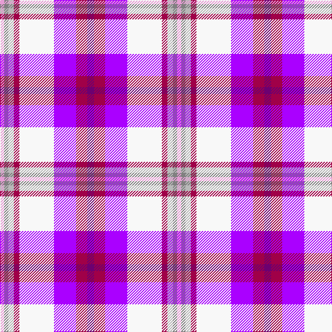

In pattern [BRBWRYGW](/patterns/brbwrygw/).

This was sourced from register-of-tartans.  It is a [8 stripes tartan](/stripes/stripes8/).

Original link https://www.tartanregister.gov.uk/tartanDetails.aspx?ref=11522

## Thread count
LP/6 N6 Na8 R8 W50 Pa32 R16 P/10

## Palette
Each colour and its ΔE from the base-6 reference it is a variant of.

| Colour | Shade | Base | ΔE (OKLab) |
|---|---|---|---|
| LP | <code style="background-color:#E69DD4;">#E69DD4</code> `#E69DD4` | W <code style="background-color:#F7F7F7;">#F7F7F7</code> | 0.22 |
| N | <code style="background-color:#808080;">#808080</code> `#808080` | G <code style="background-color:#006100;">#006100</code> | 0.23 |
| Na | <code style="background-color:#B8B8B8;">#B8B8B8</code> `#B8B8B8` | Y <code style="background-color:#F2BF00;">#F2BF00</code> | 0.17 |
| P | <code style="background-color:#6C0070;">#6C0070</code> `#6C0070` | B <code style="background-color:#2A418A;">#2A418A</code> | 0.16 |
| Pa | <code style="background-color:#AA00FF;">#AA00FF</code> `#AA00FF` | B <code style="background-color:#2A418A;">#2A418A</code> | 0.28 |
| R | <code style="background-color:#A00048;">#A00048</code> `#A00048` | R <code style="background-color:#CC0000;">#CC0000</code> | 0.12 |
| W | <code style="background-color:#F8F8F8;">#F8F8F8</code> `#F8F8F8` | W <code style="background-color:#F7F7F7;">#F7F7F7</code> | 0.00 |

# Sample pattern

## Nearest tartans

The nearest existing variants by ΔTartan distance.

1. [Heather (R.S.S.P.C.C.) Corporate Tartan Tartan Number: 2108. Earliest known date: 1990 The design 'Heather Tartan' has been produced at the request of the Royal Society for Prevention of Cruelty to Children, as the Society's corporate tartan. The colours of the design are taken from the Society's badge and lettrhead. Dark Pink Mix, Light Pink Mix, Kingfisher and Emerald. See products available Copyright © Blair Urquhart, Comrie, 2015](/setts/s9/b4w3wa28w3ba16w4ba8wb46g4~b1c0070-ba780078-g006818-we0e0e0-wac0c0c0-wbc49cd8/) — ΔT 2.00
1. [Heather, (R.S.S.P.C.C.)](/setts/s9/b4w3wa28w3ba16w4ba8wb46g4~b000060-ba800080-g008000-we0e0e0-wac0c0c0-wbc0a0e0/) — ΔT 2.03
1. [MacDonald of Glencoe (Dance) Fashion Tartan Tartan Number: 6553. Earliest known date: 01/01/2005 Threadcount taken from DC Dalgliesh Dancers' Swatch book, 2005./Threadcount and colours aren't 100% original. Generated manually./ See products available Copyright © Blair Urquhart, Comrie, 2015](/setts/s12/b6r2b2ba2w31ba12wa2b26g3b4bb2b4~b8c008c-ba002440-bb2c2c80-g289c18-ra00024-we0e0e0-waa8ace8~x2/) — ΔT 2.18
1. [Culloden Dress](/setts/s8/r6b3ba24y2k23w23k2w6~b5c8ca8-ba780078-k101010-rc80000-wfcfcfc-ye8c000~x2/) — ΔT 2.18
1. [Robieson Kith & Kin (Personal)](/setts/s13/w1r1b8wa1k1w8k1y8wa1y1b8wa1y1~b0000ff-k101010-rff0000-wffffff-wac0c0c0-yff8000~x6/) — ΔT 2.19
1. [Praetorian Imperator](/setts/s14/w1b1y1ba8k1wa1w8wa1k8wa1w1ba8wa1w1~b400040-ba800080-k101010-wffffff-wac0c0c0-yffff00~x6/) — ΔT 2.20
1. [Galvez-Brown](/setts/s7/b36y5r12ra9ba5w12y7~b212160-ba551a8b-re3170d-raff0000-wffffff-yffb90f~x2/) — ΔT 2.22
1. [Humming Bird (Fashion)](/setts/s8/r6b3ra20y2k20w20k2w5~b5c8ca8-k101010-rc80000-raa00470-we0e0e0-ye8c000~x2/) — ΔT 2.25
1. [Edgar-Feyen](/setts/s6/w18k1b4g4ba10y2~b0000cd-baaa00ff-g008b00-k101010-wffffff-yffa500~x4/) — ΔT 2.28
1. [Lashbrooke of Barrowfield](/setts/s12/b3w3r3w24y4g6b3r2b16ba12y2b3~b202060-ba3850c8-g643424-rc80000-wfcfcfc-ye8c000~x2/) — ΔT 2.30

## Neighbour map

Every grey dot is one of 15726 variants placed by the first two principal components of the ΔTartan feature space (44% of its variance). Red is this tartan; blue dots are its nearest — click one to open its page.

<svg viewBox="0 0 640 380" role="img" style="max-width:100%;height:auto;border:1px solid #e0e0e0;border-radius:4px;display:block" xmlns="http://www.w3.org/2000/svg"><image href="/nn/cloud.v1.png" width="640" height="380"/><a href="/setts/s9/b4w3wa28w3ba16w4ba8wb46g4~b1c0070-ba780078-g006818-we0e0e0-wac0c0c0-wbc49cd8/"><circle cx="183.7" cy="107.6" r="4" fill="#3465a4"><title>Heather (R.S.S.P.C.C.) Corporate Tartan Tartan Number: 2108. Earliest known date: 1990 The design 'Heather Tartan' has been produced at the request of the Royal Society for Prevention of Cruelty to Children, as the Society's corporate tartan. The colours of the design are taken from the Society's badge and lettrhead. Dark Pink Mix, Light Pink Mix, Kingfisher and Emerald. See products available Copyright © Blair Urquhart, Comrie, 2015</title></circle></a><a href="/setts/s9/b4w3wa28w3ba16w4ba8wb46g4~b000060-ba800080-g008000-we0e0e0-wac0c0c0-wbc0a0e0/"><circle cx="183.3" cy="107.9" r="4" fill="#3465a4"><title>Heather, (R.S.S.P.C.C.)</title></circle></a><a href="/setts/s12/b6r2b2ba2w31ba12wa2b26g3b4bb2b4~b8c008c-ba002440-bb2c2c80-g289c18-ra00024-we0e0e0-waa8ace8~x2/"><circle cx="173.5" cy="65.6" r="4" fill="#3465a4"><title>MacDonald of Glencoe (Dance) Fashion Tartan Tartan Number: 6553. Earliest known date: 01/01/2005 Threadcount taken from DC Dalgliesh Dancers' Swatch book, 2005./Threadcount and colours aren't 100% original. Generated manually./ See products available Copyright © Blair Urquhart, Comrie, 2015</title></circle></a><a href="/setts/s8/r6b3ba24y2k23w23k2w6~b5c8ca8-ba780078-k101010-rc80000-wfcfcfc-ye8c000~x2/"><circle cx="95.0" cy="125.2" r="4" fill="#3465a4"><title>Culloden Dress</title></circle></a><a href="/setts/s13/w1r1b8wa1k1w8k1y8wa1y1b8wa1y1~b0000ff-k101010-rff0000-wffffff-wac0c0c0-yff8000~x6/"><circle cx="97.6" cy="107.4" r="4" fill="#3465a4"><title>Robieson Kith &amp; Kin (Personal)</title></circle></a><a href="/setts/s14/w1b1y1ba8k1wa1w8wa1k8wa1w1ba8wa1w1~b400040-ba800080-k101010-wffffff-wac0c0c0-yffff00~x6/"><circle cx="104.4" cy="101.0" r="4" fill="#3465a4"><title>Praetorian Imperator</title></circle></a><a href="/setts/s7/b36y5r12ra9ba5w12y7~b212160-ba551a8b-re3170d-raff0000-wffffff-yffb90f~x2/"><circle cx="109.4" cy="153.7" r="4" fill="#3465a4"><title>Galvez-Brown</title></circle></a><a href="/setts/s8/r6b3ra20y2k20w20k2w5~b5c8ca8-k101010-rc80000-raa00470-we0e0e0-ye8c000~x2/"><circle cx="88.8" cy="135.7" r="4" fill="#3465a4"><title>Humming Bird (Fashion)</title></circle></a><a href="/setts/s6/w18k1b4g4ba10y2~b0000cd-baaa00ff-g008b00-k101010-wffffff-yffa500~x4/"><circle cx="170.4" cy="116.4" r="4" fill="#3465a4"><title>Edgar-Feyen</title></circle></a><a href="/setts/s12/b3w3r3w24y4g6b3r2b16ba12y2b3~b202060-ba3850c8-g643424-rc80000-wfcfcfc-ye8c000~x2/"><circle cx="86.3" cy="99.1" r="4" fill="#3465a4"><title>Lashbrooke of Barrowfield</title></circle></a><circle cx="82.5" cy="114.6" r="5" fill="#c00000"/></svg>

ID: /setts/s8/b5r8ba16w25r4y4g3wa3~b6c0070-baaa00ff-g808080-ra00048-wf8f8f8-wae69dd4-yb8b8b8~x2/
