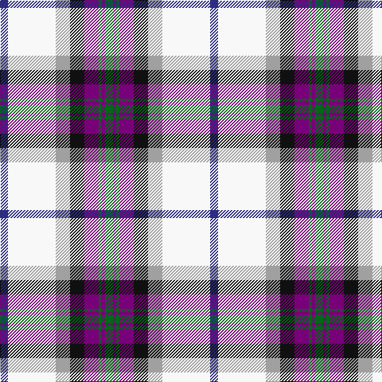

In pattern [BWYKBGBG](/patterns/bwykbgbg/).

This was sourced from register-of-tartans.  It is a [8 stripes tartan](/stripes/stripes8/).

Original link https://www.tartanregister.gov.uk/tartanDetails.aspx?ref=48

## Attestations

This cloth appears in 2 source records; the oldest owns this page.

- 01/01/2005 — Alexander of Menstry Dress (register-of-tartans, [record](https://www.tartanregister.gov.uk/tartanDetails.aspx?ref=48))
- pre 2005 — Alexander of Menstry Dress (Personal (tartans-authority, [record](http://www.tartansauthority.com/tartan-ferret/display/6716/))

## Register references

External register numbers recorded for this tartan.

- Scottish Register of Tartans: [48](https://www.tartanregister.gov.uk/tartanDetails.aspx?ref=48)
- Scottish Tartans Authority (ITI): 6716

## Thread count
DB/10 W60 N18 K18 P18 G4 P4 G/10

## Palette
Each colour and its ΔE from the base-6 reference it is a variant of.

| Colour | Shade | Base | ΔE (OKLab) |
|---|---|---|---|
| DB | <code style="background-color:#2C2C80;">#2C2C80</code> `#2C2C80` | B <code style="background-color:#2A418A;">#2A418A</code> | 0.06 |
| G | <code style="background-color:#006818;">#006818</code> `#006818` | G <code style="background-color:#006100;">#006100</code> | 0.02 |
| K | <code style="background-color:#101010;">#101010</code> `#101010` | K <code style="background-color:#000000;">#000000</code> | 0.17 |
| N | <code style="background-color:#A0A0A0;">#A0A0A0</code> `#A0A0A0` | Y <code style="background-color:#F2BF00;">#F2BF00</code> | 0.21 |
| P | <code style="background-color:#780078;">#780078</code> `#780078` | B <code style="background-color:#2A418A;">#2A418A</code> | 0.17 |
| W | <code style="background-color:#F8F8F8;">#F8F8F8</code> `#F8F8F8` | W <code style="background-color:#F7F7F7;">#F7F7F7</code> | 0.00 |

# Sample pattern

## Nearest tartans

The nearest existing variants by ΔTartan distance.

1. [Dignan](/setts/s7/y2r1b16k5ba2w11ba1~b5480b0-ba800080-k000000-rc00000-we0e0e0-yf0c000~x4/) — ΔT 0.78
1. [Gillies, Blue dress](/setts/s10/r7k2b16y5b10k13w28g2w4g2~b5480b0-g008000-k000000-rc00000-we0e0e0-yf0c000~x2/) — ΔT 0.93
1. [Hebridean Arisaid, Red/White (Dance)](/setts/s9/w37k4b12g12w2y2r23w4r6~b30308c-g006818-k101010-r800028-we0e0e0-ye08070~x2/) — ΔT 0.93
1. [Gillies Dress Blue #1 (Dance)](/setts/s10/r7k2b16y5b10k13w28g2w4g4~b5c8ca8-g003820-k101010-rc80000-wfcfcfc-yd8b000~x2/) — ΔT 0.95
1. [Edinburgh Dress (Dance)](/setts/s10/w4k2w30g3b3g3b7ba14g3r3~b780078-ba2c2c80-g006818-k101010-rc80000-wfcfcfc~x2/) — ΔT 0.97
1. [Edinburgh, dress](/setts/s10/w4k2w30g3b3g3b7ba14g3r3~b800080-ba304080-g008000-k000000-rc00000-we0e0e0~x2/) — ΔT 0.97
1. [Alberta Dress](/setts/s10/w4g3w19g8k1r4k1b18k1y2~b2c40a0-g006818-k101010-r880000-wf8f8f8-yd09800~x2/) — ΔT 0.98
1. [Gillies Blue Dress Clan Tartan Tartan Number: 934. Earliest known date: pre 2003 A name associated with Badenoch and the Hebrides. It means 'servant of Jesus'. See products available Copyright © Blair Urquhart, Comrie, 2015](/setts/s10/r7k2b16y5b10k13w28g2w4g2~b5c8ca8-g006818-k101010-rc80000-we0e0e0-ye8c000~x2/) — ΔT 0.99
1. [Edinburgh Dress District Tartan Tartan Number: 1461. Earliest known date: Edinburgh One of a number of dress tartans produced by Hugh Macpherson, a kiltmaker in Edinburgh, intended for dancing and other informal occassions. The 'dress' version of clan tartan is usually created by substituting white for one of the 'ground' colours. See products available Copyright © Blair Urquhart, Comrie, 2015](/setts/s10/w4k2w30g3b3g3b7ba14g3r3~b780078-ba2c2c80-g006818-k101010-rc80000-we0e0e0~x2/) — ΔT 1.00
1. [Edgar-Feyen (Personal)](/setts/s6/w18k1b4g4ba10y2~b2c2c80-ba780078-g006818-k101010-we0e0e0-yd87c00~x4/) — ΔT 1.04

## Neighbour map

Every grey dot is one of 15726 variants placed by the first two principal components of the ΔTartan feature space (44% of its variance). Red is this tartan; blue dots are its nearest — click one to open its page.

<svg viewBox="0 0 640 380" role="img" style="max-width:100%;height:auto;border:1px solid #e0e0e0;border-radius:4px;display:block" xmlns="http://www.w3.org/2000/svg"><image href="/nn/cloud.v1.png" width="640" height="380"/><a href="/setts/s7/y2r1b16k5ba2w11ba1~b5480b0-ba800080-k000000-rc00000-we0e0e0-yf0c000~x4/"><circle cx="157.0" cy="117.7" r="4" fill="#3465a4"><title>Dignan</title></circle></a><a href="/setts/s10/r7k2b16y5b10k13w28g2w4g2~b5480b0-g008000-k000000-rc00000-we0e0e0-yf0c000~x2/"><circle cx="98.5" cy="111.1" r="4" fill="#3465a4"><title>Gillies, Blue dress</title></circle></a><a href="/setts/s9/w37k4b12g12w2y2r23w4r6~b30308c-g006818-k101010-r800028-we0e0e0-ye08070~x2/"><circle cx="163.5" cy="100.0" r="4" fill="#3465a4"><title>Hebridean Arisaid, Red/White (Dance)</title></circle></a><a href="/setts/s10/r7k2b16y5b10k13w28g2w4g4~b5c8ca8-g003820-k101010-rc80000-wfcfcfc-yd8b000~x2/"><circle cx="90.8" cy="111.7" r="4" fill="#3465a4"><title>Gillies Dress Blue #1 (Dance)</title></circle></a><a href="/setts/s10/w4k2w30g3b3g3b7ba14g3r3~b780078-ba2c2c80-g006818-k101010-rc80000-wfcfcfc~x2/"><circle cx="171.3" cy="87.1" r="4" fill="#3465a4"><title>Edinburgh Dress (Dance)</title></circle></a><a href="/setts/s10/w4k2w30g3b3g3b7ba14g3r3~b800080-ba304080-g008000-k000000-rc00000-we0e0e0~x2/"><circle cx="180.1" cy="92.1" r="4" fill="#3465a4"><title>Edinburgh, dress</title></circle></a><a href="/setts/s10/w4g3w19g8k1r4k1b18k1y2~b2c40a0-g006818-k101010-r880000-wf8f8f8-yd09800~x2/"><circle cx="134.3" cy="89.3" r="4" fill="#3465a4"><title>Alberta Dress</title></circle></a><a href="/setts/s10/r7k2b16y5b10k13w28g2w4g2~b5c8ca8-g006818-k101010-rc80000-we0e0e0-ye8c000~x2/"><circle cx="108.4" cy="113.4" r="4" fill="#3465a4"><title>Gillies Blue Dress Clan Tartan Tartan Number: 934. Earliest known date: pre 2003 A name associated with Badenoch and the Hebrides. It means 'servant of Jesus'. See products available Copyright © Blair Urquhart, Comrie, 2015</title></circle></a><a href="/setts/s10/w4k2w30g3b3g3b7ba14g3r3~b780078-ba2c2c80-g006818-k101010-rc80000-we0e0e0~x2/"><circle cx="180.3" cy="92.3" r="4" fill="#3465a4"><title>Edinburgh Dress District Tartan Tartan Number: 1461. Earliest known date: Edinburgh One of a number of dress tartans produced by Hugh Macpherson, a kiltmaker in Edinburgh, intended for dancing and other informal occassions. The 'dress' version of clan tartan is usually created by substituting white for one of the 'ground' colours. See products available Copyright © Blair Urquhart, Comrie, 2015</title></circle></a><a href="/setts/s6/w18k1b4g4ba10y2~b2c2c80-ba780078-g006818-k101010-we0e0e0-yd87c00~x4/"><circle cx="182.6" cy="123.7" r="4" fill="#3465a4"><title>Edgar-Feyen (Personal)</title></circle></a><circle cx="129.1" cy="109.3" r="5" fill="#c00000"/></svg>

ID: /setts/s8/b5w30y9k9ba9g2ba2g5~b2c2c80-ba780078-g006818-k101010-wf8f8f8-ya0a0a0~x2/
