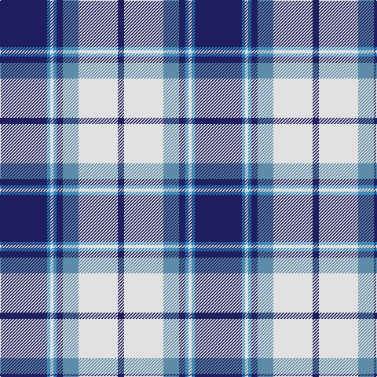

In pattern [BBWBBBWB](/patterns/bbwbbbwb/).

This was sourced from house-of-tartan.  It is a [8 stripes tartan](/stripes/stripes8/).

Original link http://www.house-of-tartan.scotland.net/house/TartanViewjs.asp?colr=Def&tnam=4799

## Thread count
DB/60 B4 LN4 B4 DB8 Ba20 LN50 DB/8

## Palette
Each colour and its ΔE from the base-6 reference it is a variant of.

| Colour | Shade | Base | ΔE (OKLab) |
|---|---|---|---|
| B | <code style="background-color:#2888C4;">#2888C4</code> `#2888C4` | B <code style="background-color:#2C4084;">#2C4084</code> | 0.21 |
| Ba | <code style="background-color:#5C8CA8;">#5C8CA8</code> `#5C8CA8` | B <code style="background-color:#2C4084;">#2C4084</code> | 0.23 |
| DB | <code style="background-color:#202060;">#202060</code> `#202060` | B <code style="background-color:#2C4084;">#2C4084</code> | 0.11 |
| LN | <code style="background-color:#E0E0E0;">#E0E0E0</code> `#E0E0E0` | W <code style="background-color:#F4F4F0;">#F4F4F0</code> | 0.06 |

# Sample pattern

## Nearest tartans

The nearest existing variants by ΔTartan distance.

1. [Harmony Eildon (Dance)](/setts/s8/b82ba4w4ba4b10bb24w62b8-b2c2c80-ba5c8ca8-bb2888c4-we0e0e0/) — ΔT 0.74
1. [Lord Arran (Corporate)](/setts/s9/r6g2w24g4b4g4b28w4b4-b2c2c80-g604000-r880000-we0e0e0/) — ΔT 0.75
1. [Harmony, Eildon](/setts/s8/b82ba4w4ba4b10bb24w62b8-b304080-ba5480b0-bb8080d0-we0e0e0/) — ΔT 0.85
1. [Longniddry Eildon Blue Dress Fancy Tartan Tartan Number: 5486. Earliest known date: pre 1992 Dancers tartan See products available Copyright © Blair Urquhart, Comrie, 2015](/setts/s8/b84w4wa4w4b10ba24wa64b8-b202060-ba003c64-wa8ace8-wac0c0c0/) — ΔT 0.90
1. [Highlands School (N. Carolina) Corporate Tartan Tartan Number: 2109. Earliest known date: 1990 Highlands in North Carolina is the home of the Scottish Tartans Society's Museum Extension. The school tartan was designed by Bob Martin who is a 'Fellow of the Society'. Blue and Gold are the school colours. See products available Copyright © Blair Urquhart, Comrie, 2015](/setts/s8/y24b4y4b60ba6b4ba26w8-b2c2c80-ba202060-we0e0e0-ye8c000/) — ΔT 0.92
1. [Cunningham, Dress Blue (Dance)](/setts/s7/b6ba4k4ba56w60ba4w6-b2474e8-ba1c0070-k101010-we0e0e0/) — ΔT 0.93
1. [(1) Abercrombie](/setts/s9/b27w2b14k14y4k4y4k4y27-b868aff-k000000-wffffff-y86ae9a/) — ΔT 0.95
1. [Yale College, Wrexham](/setts/s8/b57k5b9r29k18w9r9w5-b2383bf-k101010-rc52e8b-wffffff/) — ΔT 0.99
1. [Sinclair Dress (Dance)](/setts/s7/b8r4b62k20g8w42g4-b38409c-g006818-k101010-rc80000-we0e0e0/) — ΔT 1.02
1. [Detroit Lions](/setts/s8/b60w4k18wa6b12wa8k6w12-b2c4084-k101010-wc8c8c8-waffffff/) — ΔT 1.03

## Neighbour map

Every grey dot is one of 15726 variants placed by the first two principal components of the ΔTartan feature space (44% of its variance). Red is this tartan; blue dots are its nearest — click one to open its page.

<svg viewBox="0 0 640 380" role="img" style="max-width:100%;height:auto;border:1px solid #e0e0e0;border-radius:4px;display:block" xmlns="http://www.w3.org/2000/svg"><image href="/nn/cloud.v1.png" width="640" height="380"/><a href="/setts/s8/b82ba4w4ba4b10bb24w62b8-b2c2c80-ba5c8ca8-bb2888c4-we0e0e0/"><circle cx="275.4" cy="133.9" r="4" fill="#3465a4"><title>Harmony Eildon (Dance)</title></circle></a><a href="/setts/s9/r6g2w24g4b4g4b28w4b4-b2c2c80-g604000-r880000-we0e0e0/"><circle cx="222.0" cy="144.2" r="4" fill="#3465a4"><title>Lord Arran (Corporate)</title></circle></a><a href="/setts/s8/b82ba4w4ba4b10bb24w62b8-b304080-ba5480b0-bb8080d0-we0e0e0/"><circle cx="283.1" cy="135.1" r="4" fill="#3465a4"><title>Harmony, Eildon</title></circle></a><a href="/setts/s8/b84w4wa4w4b10ba24wa64b8-b202060-ba003c64-wa8ace8-wac0c0c0/"><circle cx="285.4" cy="138.3" r="4" fill="#3465a4"><title>Longniddry Eildon Blue Dress Fancy Tartan Tartan Number: 5486. Earliest known date: pre 1992 Dancers tartan See products available Copyright © Blair Urquhart, Comrie, 2015</title></circle></a><a href="/setts/s8/y24b4y4b60ba6b4ba26w8-b2c2c80-ba202060-we0e0e0-ye8c000/"><circle cx="256.7" cy="155.1" r="4" fill="#3465a4"><title>Highlands School (N. Carolina) Corporate Tartan Tartan Number: 2109. Earliest known date: 1990 Highlands in North Carolina is the home of the Scottish Tartans Society's Museum Extension. The school tartan was designed by Bob Martin who is a 'Fellow of the Society'. Blue and Gold are the school colours. See products available Copyright © Blair Urquhart, Comrie, 2015</title></circle></a><a href="/setts/s7/b6ba4k4ba56w60ba4w6-b2474e8-ba1c0070-k101010-we0e0e0/"><circle cx="265.7" cy="142.3" r="4" fill="#3465a4"><title>Cunningham, Dress Blue (Dance)</title></circle></a><a href="/setts/s9/b27w2b14k14y4k4y4k4y27-b868aff-k000000-wffffff-y86ae9a/"><circle cx="180.9" cy="160.2" r="4" fill="#3465a4"><title>(1) Abercrombie</title></circle></a><a href="/setts/s8/b57k5b9r29k18w9r9w5-b2383bf-k101010-rc52e8b-wffffff/"><circle cx="220.9" cy="166.9" r="4" fill="#3465a4"><title>Yale College, Wrexham</title></circle></a><a href="/setts/s7/b8r4b62k20g8w42g4-b38409c-g006818-k101010-rc80000-we0e0e0/"><circle cx="210.0" cy="143.4" r="4" fill="#3465a4"><title>Sinclair Dress (Dance)</title></circle></a><a href="/setts/s8/b60w4k18wa6b12wa8k6w12-b2c4084-k101010-wc8c8c8-waffffff/"><circle cx="288.1" cy="153.3" r="4" fill="#3465a4"><title>Detroit Lions</title></circle></a><circle cx="240.6" cy="147.5" r="5" fill="#c00000"/></svg>

ID: /setts/s8/b60ba4w4ba4b8bb20w50b8-b202060-ba2888c4-bb5c8ca8-we0e0e0/
