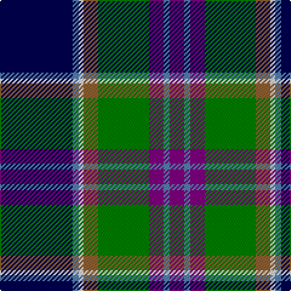

In pattern [BBBGRWBB](/patterns/bbbgrwbb/).

This was sourced from weddslist.  It is a [8 stripes tartan](/stripes/stripes8/).

Original link http://www.weddslist.com/cgi-bin/tartans/pg.pl?source=sts

## Thread count
DB/60 B5 LN4 LT12 G42 P12 B5 P/12

## Palette
Each colour and its ΔE from the base-6 reference it is a variant of.

| Colour | Shade | Base | ΔE (OKLab) |
|---|---|---|---|
| B | <code style="background-color:#5480B0;">#5480B0</code> `#5480B0` | B <code style="background-color:#2C4084;">#2C4084</code> | 0.20 |
| DB | <code style="background-color:#000050;">#000050</code> `#000050` | B <code style="background-color:#2C4084;">#2C4084</code> | 0.20 |
| G | <code style="background-color:#008000;">#008000</code> `#008000` | G <code style="background-color:#006400;">#006400</code> | 0.09 |
| LN | <code style="background-color:#E0E0E0;">#E0E0E0</code> `#E0E0E0` | W <code style="background-color:#F4F4F0;">#F4F4F0</code> | 0.06 |
| LT | <code style="background-color:#906030;">#906030</code> `#906030` | R <code style="background-color:#C80000;">#C80000</code> | 0.15 |
| P | <code style="background-color:#800080;">#800080</code> `#800080` | B <code style="background-color:#2C4084;">#2C4084</code> | 0.17 |

# Sample pattern

## Nearest tartans

The nearest existing variants by ΔTartan distance.

1. [Souza Nery (Personal)](/setts/s7/y8g44r6k34r6b74w6-b2c2c80-g006818-k101010-rc8002c-we0e0e0-yfccc00/) — ΔT 0.62
1. [Unidentified (Woven sample)](/setts/s8/k16w6k4b64r19k8g42y6-b3850c8-g006818-k101010-r981c70-wf8f8f8-ye8c000/) — ΔT 0.63
1. [Leung (Personal)](/setts/s9/r8k14r4b50k38w4g26k4y6-b2c2c80-g006818-k101010-rb468ac-wfcfcfc-ye8c000/) — ΔT 0.67
1. [Minnesota (District)](/setts/s8/k12w6k4b60r18k8g40y6-b2c2c80-g289c18-k101010-ra00024-we0e0e0-ye8c000/) — ΔT 0.77
1. [St. Andrews Golf Club (Corporate)](/setts/s9/w4b48k36g4k4g20wa4g12y4-b2c2c80-g00643c-k101010-wfcfcfc-wa98c8e8-yec8048/) — ΔT 0.78
1. [Loch Awe](/setts/s9/b6k4r6g40k48ba40r6k4y6-b778899-ba0000cd-g008b00-k101010-rff0000-yffe600/) — ΔT 0.85
1. [Moran (Virgin Islands) (Personal)](/setts/s9/b6r6k10g16w4k26ba26b52w6-b2888c4-ba2c2c80-g006818-k101010-rc80000-we0e0e0/) — ΔT 0.87
1. [Moran (Coilessan) (Personal)](/setts/s8/b52ba26k26w4g16k10r6b6-b2888c4-ba2c2c80-g006818-k101010-rc80000-we0e0e0/) — ΔT 0.87
1. [Renfrewshire Tartan](/setts/s7/b8ba4bb16ba50k16g26y8-b800080-ba304080-bb5480b0-g008000-k000000-yf0c000/) — ΔT 0.88
1. [Greene](/setts/s10/b12r8b48w6k12g36y8g4y4g8-b00008c-g007800-k000000-r8c0000-wc8c8c8-yc88c00/) — ΔT 0.90

## Neighbour map

Every grey dot is one of 15726 variants placed by the first two principal components of the ΔTartan feature space (44% of its variance). Red is this tartan; blue dots are its nearest — click one to open its page.

<svg viewBox="0 0 640 380" role="img" style="max-width:100%;height:auto;border:1px solid #e0e0e0;border-radius:4px;display:block" xmlns="http://www.w3.org/2000/svg"><image href="/nn/cloud.v1.png" width="640" height="380"/><a href="/setts/s7/y8g44r6k34r6b74w6-b2c2c80-g006818-k101010-rc8002c-we0e0e0-yfccc00/"><circle cx="171.3" cy="153.0" r="4" fill="#3465a4"><title>Souza Nery (Personal)</title></circle></a><a href="/setts/s8/k16w6k4b64r19k8g42y6-b3850c8-g006818-k101010-r981c70-wf8f8f8-ye8c000/"><circle cx="156.2" cy="133.1" r="4" fill="#3465a4"><title>Unidentified (Woven sample)</title></circle></a><a href="/setts/s9/r8k14r4b50k38w4g26k4y6-b2c2c80-g006818-k101010-rb468ac-wfcfcfc-ye8c000/"><circle cx="146.8" cy="145.1" r="4" fill="#3465a4"><title>Leung (Personal)</title></circle></a><a href="/setts/s8/k12w6k4b60r18k8g40y6-b2c2c80-g289c18-k101010-ra00024-we0e0e0-ye8c000/"><circle cx="149.5" cy="131.5" r="4" fill="#3465a4"><title>Minnesota (District)</title></circle></a><a href="/setts/s9/w4b48k36g4k4g20wa4g12y4-b2c2c80-g00643c-k101010-wfcfcfc-wa98c8e8-yec8048/"><circle cx="158.4" cy="145.9" r="4" fill="#3465a4"><title>St. Andrews Golf Club (Corporate)</title></circle></a><a href="/setts/s9/b6k4r6g40k48ba40r6k4y6-b778899-ba0000cd-g008b00-k101010-rff0000-yffe600/"><circle cx="114.5" cy="133.0" r="4" fill="#3465a4"><title>Loch Awe</title></circle></a><a href="/setts/s9/b6r6k10g16w4k26ba26b52w6-b2888c4-ba2c2c80-g006818-k101010-rc80000-we0e0e0/"><circle cx="127.6" cy="142.7" r="4" fill="#3465a4"><title>Moran (Virgin Islands) (Personal)</title></circle></a><a href="/setts/s8/b52ba26k26w4g16k10r6b6-b2888c4-ba2c2c80-g006818-k101010-rc80000-we0e0e0/"><circle cx="145.4" cy="156.3" r="4" fill="#3465a4"><title>Moran (Coilessan) (Personal)</title></circle></a><a href="/setts/s7/b8ba4bb16ba50k16g26y8-b800080-ba304080-bb5480b0-g008000-k000000-yf0c000/"><circle cx="144.4" cy="162.5" r="4" fill="#3465a4"><title>Renfrewshire Tartan</title></circle></a><a href="/setts/s10/b12r8b48w6k12g36y8g4y4g8-b00008c-g007800-k000000-r8c0000-wc8c8c8-yc88c00/"><circle cx="148.5" cy="136.2" r="4" fill="#3465a4"><title>Greene</title></circle></a><circle cx="160.8" cy="135.1" r="5" fill="#c00000"/></svg>

ID: /setts/s8/b60ba5w4r12g42bb12ba5bb12-b000050-ba5480b0-bb800080-g008000-r906030-we0e0e0/
