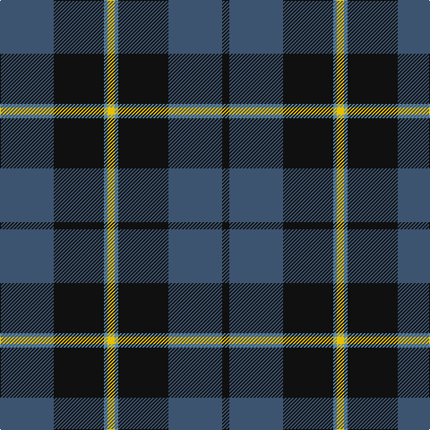

In pattern [BKBYBKBK](/patterns/bkbybkbk/).

This was sourced from register-of-tartans.  It is a [8 stripes tartan](/stripes/stripes8/).

Original link https://www.tartanregister.gov.uk/tartanDetails.aspx?ref=3840

## Attestations

This cloth appears in 2 source records; the oldest owns this page.

- 01/01/1995 — South African Air Force (register-of-tartans, [record](https://www.tartanregister.gov.uk/tartanDetails.aspx?ref=3840))
- 1995 — South African Air Force (Military) (tartans-authority, [record](http://www.tartansauthority.com/tartan-ferret/display/5317/))

## Thread count
B/60 K56 Ba4 Y8 Ba4 K56 B60 K/8

## Palette
Each colour and its ΔE from the base-6 reference it is a variant of.

| Colour | Shade | Base | ΔE (OKLab) |
|---|---|---|---|
| B | <code style="background-color:#3C5470;">#3C5470</code> `#3C5470` | B <code style="background-color:#2A418A;">#2A418A</code> | 0.08 |
| Ba | <code style="background-color:#5C8CA8;">#5C8CA8</code> `#5C8CA8` | B <code style="background-color:#2A418A;">#2A418A</code> | 0.23 |
| DB | <code style="background-color:#1C0070;">#1C0070</code> `#1C0070` | B <code style="background-color:#2A418A;">#2A418A</code> | 0.14 |
| DY | <code style="background-color:#D09800;">#D09800</code> `#D09800` | Y <code style="background-color:#F2BF00;">#F2BF00</code> | 0.12 |
| K | <code style="background-color:#101010;">#101010</code> `#101010` | K <code style="background-color:#000000;">#000000</code> | 0.17 |
| LB | <code style="background-color:#98C8E8;">#98C8E8</code> `#98C8E8` | W <code style="background-color:#F7F7F7;">#F7F7F7</code> | 0.18 |
| Y | <code style="background-color:#E8C000;">#E8C000</code> `#E8C000` | Y <code style="background-color:#F2BF00;">#F2BF00</code> | 0.02 |

# Sample pattern

## Nearest tartans

The nearest existing variants by ΔTartan distance.

1. [Gracie](/setts/s8/g94r6g12b70y6b70g12r6-b1c0070-g006818-r880000-yd09800/) — ΔT 1.00
1. [Fibonacci7](/setts/s7/b52g32r20b12g8r4y4-b141e46-g004c00-rb03000-yffe600/) — ΔT 1.11
1. [Kinross (Fashion)](/setts/s8/g40b4ga12b4g8b54y4b16-b1c0070-g285800-ga408060-yd09800/) — ΔT 1.16
1. [St. Andrews Old Course Hotel (Corp)](/setts/s6/g104b40k12b8ga8b40-b1c0070-g006818-ga604000-k101010/) — ΔT 1.18
1. [Connaught Green](/setts/s6/r2b24g10b4g8w2-b202060-g5c6428-ra00000-wc0c0c0/) — ΔT 1.19
1. [Tartan Army Children's Charity (Corp](/setts/s7/b68k14b24k78b6k8y6-b5c5c5c-k101010-y48a4c0/) — ΔT 1.20
1. [Mountain Rescue Association Honor Guard](/setts/s7/k64b4k12b4k26ba60w4-b0000ff-ba2f4f4f-k101010-wffffff/) — ΔT 1.21
1. [Greenways Marketing Intl (Corporate)](/setts/s7/b48g6b6g6y4g36r4-b1c0070-g006818-r880000-yd09800/) — ΔT 1.22
1. [MacIntyre LC](/setts/s6/g8b24r6b24g64y8-b000052-g11450d-raa0000-yaaaaaa/) — ΔT 1.22
1. [MacIntyre LC](/setts/s6/g4b12r3b12g32y4-b000052-g11450d-raa0000-yaaaaaa/) — ΔT 1.22

## Neighbour map

Every grey dot is one of 15726 variants placed by the first two principal components of the ΔTartan feature space (44% of its variance). Red is this tartan; blue dots are its nearest — click one to open its page.

<svg viewBox="0 0 640 380" role="img" style="max-width:100%;height:auto;border:1px solid #e0e0e0;border-radius:4px;display:block" xmlns="http://www.w3.org/2000/svg"><image href="/nn/cloud.v1.png" width="640" height="380"/><a href="/setts/s8/g94r6g12b70y6b70g12r6-b1c0070-g006818-r880000-yd09800/"><circle cx="322.4" cy="185.9" r="4" fill="#3465a4"><title>Gracie</title></circle></a><a href="/setts/s7/b52g32r20b12g8r4y4-b141e46-g004c00-rb03000-yffe600/"><circle cx="280.9" cy="203.8" r="4" fill="#3465a4"><title>Fibonacci7</title></circle></a><a href="/setts/s8/g40b4ga12b4g8b54y4b16-b1c0070-g285800-ga408060-yd09800/"><circle cx="330.3" cy="193.4" r="4" fill="#3465a4"><title>Kinross (Fashion)</title></circle></a><a href="/setts/s6/g104b40k12b8ga8b40-b1c0070-g006818-ga604000-k101010/"><circle cx="311.9" cy="212.9" r="4" fill="#3465a4"><title>St. Andrews Old Course Hotel (Corp)</title></circle></a><a href="/setts/s6/r2b24g10b4g8w2-b202060-g5c6428-ra00000-wc0c0c0/"><circle cx="351.4" cy="215.8" r="4" fill="#3465a4"><title>Connaught Green</title></circle></a><a href="/setts/s7/b68k14b24k78b6k8y6-b5c5c5c-k101010-y48a4c0/"><circle cx="360.8" cy="219.3" r="4" fill="#3465a4"><title>Tartan Army Children's Charity (Corp</title></circle></a><a href="/setts/s7/k64b4k12b4k26ba60w4-b0000ff-ba2f4f4f-k101010-wffffff/"><circle cx="374.1" cy="198.4" r="4" fill="#3465a4"><title>Mountain Rescue Association Honor Guard</title></circle></a><a href="/setts/s7/b48g6b6g6y4g36r4-b1c0070-g006818-r880000-yd09800/"><circle cx="308.6" cy="193.5" r="4" fill="#3465a4"><title>Greenways Marketing Intl (Corporate)</title></circle></a><a href="/setts/s6/g8b24r6b24g64y8-b000052-g11450d-raa0000-yaaaaaa/"><circle cx="319.1" cy="224.4" r="4" fill="#3465a4"><title>MacIntyre LC</title></circle></a><a href="/setts/s6/g4b12r3b12g32y4-b000052-g11450d-raa0000-yaaaaaa/"><circle cx="319.1" cy="224.4" r="4" fill="#3465a4"><title>MacIntyre LC</title></circle></a><circle cx="308.0" cy="204.4" r="5" fill="#c00000"/></svg>

ID: /setts/s8/b60k56ba4y8ba4k56b60k8-b3c5470-ba5c8ca8-k101010-ye8c000/
