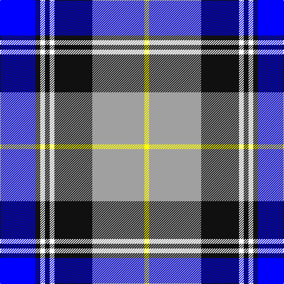

In pattern [BKWKWKYY](/patterns/bkwkwkyy/).

This was sourced from register-of-tartans.  It is a [8 stripes tartan](/stripes/stripes8/).

Original link https://www.tartanregister.gov.uk/tartanDetails.aspx?ref=11519

## Thread count
B/60 K8 W8 K8 W8 K64 N88 Y/8

## Palette
Each colour and its ΔE from the base-6 reference it is a variant of.

| Colour | Shade | Base | ΔE (OKLab) |
|---|---|---|---|
| B | <code style="background-color:#0000FF;">#0000FF</code> `#0000FF` | B <code style="background-color:#2C4084;">#2C4084</code> | 0.21 |
| K | <code style="background-color:#101010;">#101010</code> `#101010` | K <code style="background-color:#000000;">#000000</code> | 0.17 |
| N | <code style="background-color:#A0A0A0;">#A0A0A0</code> `#A0A0A0` | Y <code style="background-color:#E8C000;">#E8C000</code> | 0.20 |
| W | <code style="background-color:#FFFFFF;">#FFFFFF</code> `#FFFFFF` | W <code style="background-color:#F4F4F0;">#F4F4F0</code> | 0.03 |
| Y | <code style="background-color:#FFFF00;">#FFFF00</code> `#FFFF00` | Y <code style="background-color:#E8C000;">#E8C000</code> | 0.16 |

# Sample pattern

## Nearest tartans

The nearest existing variants by ΔTartan distance.

1. [Arran, (Navy)](/setts/s8/b48k4b4k4b4ba32w36g8-b5480b0-ba000050-g808080-k000000-we0e0e0/) — ΔT 0.59
1. [Arran (Pendleton)](/setts/s8/b48k4b4k4b4ba32w36g8-b3c82af-ba080848-g808080-k101010-we0e0e0/) — ΔT 0.74
1. [St. Francis Xavier University](/setts/s7/k12y4w36y4b36k12ba4-b00008c-ba788cb4-k000000-wc8c8c8-yc88c00/) — ΔT 0.79
1. [Loch Ness (Fashion)](/setts/s7/r4b4r4b42y22k34w4-b5c8ca8-k00002c-rc80000-w98c8e8-y48a4c0/) — ΔT 0.89
1. [Thompson Variant](/setts/s10/r4k4w8k8w8k4w16k4b36y4-b2c2c80-k101010-rc80000-wc0c0c0-yd09800/) — ΔT 1.02
1. [MacKellar Royal Blue Dress Tartan Tartan Number: 8181. Earliest known date: Threadcount and colours aren't 100% original. Generated manually. See products available Copyright © Blair Urquhart, Comrie, 2015](/setts/s11/b46w4b6ba8b6w4b10k22bb4w46k6-b2c2c80-ba2888c4-bb8c008c-k101010-we0e0e0/) — ΔT 1.02
1. [Hanna of Stirlingshire (Clan)](/setts/s10/r4k4y8k8y8k4y16k4b36ya4-b1c0070-k101010-r880000-yb8b8b8-yad09800/) — ΔT 1.03
1. [Davidson, Bride's](/setts/s7/r8b56k24g4w48g4w8-b304080-g008000-k000000-rc00000-we0e0e0/) — ΔT 1.04
1. [Sibbald Blue (2014)](/setts/s9/g8b44ba12w20b6w12bb8ba6w8-b141e46-ba003c64-bb64008c-g003c14-wfcfcfc/) — ΔT 1.05
1. [Davidson (Wedding) (Personal)](/setts/s7/r8b56k24g4w48g4w8-b2c2c80-g006818-k101010-rc80000-wfcfcfc/) — ΔT 1.08

## Neighbour map

Every grey dot is one of 15726 variants placed by the first two principal components of the ΔTartan feature space (44% of its variance). Red is this tartan; blue dots are its nearest — click one to open its page.

<svg viewBox="0 0 640 380" role="img" style="max-width:100%;height:auto;border:1px solid #e0e0e0;border-radius:4px;display:block" xmlns="http://www.w3.org/2000/svg"><image href="/nn/cloud.v1.png" width="640" height="380"/><a href="/setts/s8/b48k4b4k4b4ba32w36g8-b5480b0-ba000050-g808080-k000000-we0e0e0/"><circle cx="149.7" cy="145.7" r="4" fill="#3465a4"><title>Arran, (Navy)</title></circle></a><a href="/setts/s8/b48k4b4k4b4ba32w36g8-b3c82af-ba080848-g808080-k101010-we0e0e0/"><circle cx="153.6" cy="147.7" r="4" fill="#3465a4"><title>Arran (Pendleton)</title></circle></a><a href="/setts/s7/k12y4w36y4b36k12ba4-b00008c-ba788cb4-k000000-wc8c8c8-yc88c00/"><circle cx="106.3" cy="169.1" r="4" fill="#3465a4"><title>St. Francis Xavier University</title></circle></a><a href="/setts/s7/r4b4r4b42y22k34w4-b5c8ca8-k00002c-rc80000-w98c8e8-y48a4c0/"><circle cx="165.0" cy="169.1" r="4" fill="#3465a4"><title>Loch Ness (Fashion)</title></circle></a><a href="/setts/s10/r4k4w8k8w8k4w16k4b36y4-b2c2c80-k101010-rc80000-wc0c0c0-yd09800/"><circle cx="145.0" cy="147.0" r="4" fill="#3465a4"><title>Thompson Variant</title></circle></a><a href="/setts/s11/b46w4b6ba8b6w4b10k22bb4w46k6-b2c2c80-ba2888c4-bb8c008c-k101010-we0e0e0/"><circle cx="168.6" cy="127.3" r="4" fill="#3465a4"><title>MacKellar Royal Blue Dress Tartan Tartan Number: 8181. Earliest known date: Threadcount and colours aren't 100% original. Generated manually. See products available Copyright © Blair Urquhart, Comrie, 2015</title></circle></a><a href="/setts/s10/r4k4y8k8y8k4y16k4b36ya4-b1c0070-k101010-r880000-yb8b8b8-yad09800/"><circle cx="143.7" cy="148.9" r="4" fill="#3465a4"><title>Hanna of Stirlingshire (Clan)</title></circle></a><a href="/setts/s7/r8b56k24g4w48g4w8-b304080-g008000-k000000-rc00000-we0e0e0/"><circle cx="147.7" cy="143.6" r="4" fill="#3465a4"><title>Davidson, Bride's</title></circle></a><a href="/setts/s9/g8b44ba12w20b6w12bb8ba6w8-b141e46-ba003c64-bb64008c-g003c14-wfcfcfc/"><circle cx="119.6" cy="166.0" r="4" fill="#3465a4"><title>Sibbald Blue (2014)</title></circle></a><a href="/setts/s7/r8b56k24g4w48g4w8-b2c2c80-g006818-k101010-rc80000-wfcfcfc/"><circle cx="145.6" cy="140.4" r="4" fill="#3465a4"><title>Davidson (Wedding) (Personal)</title></circle></a><circle cx="129.8" cy="147.3" r="5" fill="#c00000"/></svg>

ID: /setts/s8/b60k8w8k8w8k64y88ya8-b0000ff-k101010-wffffff-ya0a0a0-yaffff00/
