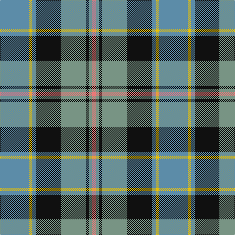

In pattern [BYBKGKGR](/patterns/bybkgkgr/).

This was sourced from house-of-tartan.  It is a [8 stripes tartan](/stripes/stripes8/).

Original link http://www.house-of-tartan.scotland.net/house/TartanViewjs.asp?colr=Def&tnam=6082

## Thread count
B/60 Y6 B8 K50 LG52 K6 LG6 LR/8

## Palette
Each colour and its ΔE from the base-6 reference it is a variant of.

| Colour | Shade | Base | ΔE (OKLab) |
|---|---|---|---|
| B | <code style="background-color:#5C8CA8;">#5C8CA8</code> `#5C8CA8` | B <code style="background-color:#2A418A;">#2A418A</code> | 0.23 |
| Ba | <code style="background-color:#48A4C0;">#48A4C0</code> `#48A4C0` | Y <code style="background-color:#F2BF00;">#F2BF00</code> | 0.29 |
| K | <code style="background-color:#101010;">#101010</code> `#101010` | K <code style="background-color:#000000;">#000000</code> | 0.17 |
| LG | <code style="background-color:#789484;">#789484</code> `#789484` | G <code style="background-color:#006100;">#006100</code> | 0.24 |
| LP | <code style="background-color:#A8ACE8;">#A8ACE8</code> `#A8ACE8` | W <code style="background-color:#F7F7F7;">#F7F7F7</code> | 0.23 |
| LR | <code style="background-color:#E87878;">#E87878</code> `#E87878` | R <code style="background-color:#CC0000;">#CC0000</code> | 0.19 |
| Y | <code style="background-color:#E8C000;">#E8C000</code> `#E8C000` | Y <code style="background-color:#F2BF00;">#F2BF00</code> | 0.02 |

# Sample pattern

## Nearest tartans

The nearest existing variants by ΔTartan distance.

1. [Royal College of Surgeons of Edinburgh, The](/setts/s9/b8ba32k4ba4k4ba4k26r40w8-b5c8ca8-ba305870-k101010-r888888-wfcfcfc/) — ΔT 0.61
1. [Ritchie, Stephen James (Personal)](/setts/s7/b8ba38y4k38ba4y50w4-b2888c4-ba5c5c5c-k101010-wc4c4c4-ya0a0a0/) — ΔT 0.61
1. [Law Society of Scotland](/setts/s10/b5r3b30k6w4k6g24r4g6r3-b5c8ca8-g006428-k101010-r901c38-we0e0e0/) — ΔT 0.87
1. [Green MacLeod](/setts/s7/y8k4b40k20g30k4r6-b1474b4-g006818-k101010-rc80000-ye8c000/) — ΔT 0.89
1. [Heart of the Highlands](/setts/s9/y36k6y8w6y8k38b40k4r8-b505050-k101010-ra00048-we0e0e0-ya0a0a0/) — ΔT 0.89
1. [Dunbartonshire](/setts/s9/g44k8g4r16b4r16b52w8b4-b304080-g008000-k000000-r802040-w90d0f0/) — ΔT 0.91
1. [Heart of the Highlands](/setts/s9/r36k6r8w6r8k36b40k4ra8-b5c5c5c-k101010-r888888-raa00048-wc0c0c0/) — ΔT 0.94
1. [Antrim Irish County Tartan Tartan Number: 2282. Earliest known date: 1993 One of a series of Irish District tartans designed by Polly Wittering of the House of Edgar, with colours reminiscent of the Country with soft warm colours dominating. See products available Copyright © Blair Urquhart, Comrie, 2015](/setts/s10/g10b4g34y4ba10y4r10ba34g4y8-b043c48-ba101448-g4c9864-rb03000-yf4bc3c/) — ΔT 0.95
1. [Leitrem County Crest (Fashion)](/setts/s10/y10b24y5b13y24b5g52b5ba18w8-b1c1c50-ba2c2c80-g006818-we0e0e0-ybc8c00/) — ΔT 0.98
1. [McCandlish Dress, Grey (Name)](/setts/s11/w12k4b48k4b4k8b4k24y48k4ya4-b5c5c5c-k101010-wa8ace8-ya0a0a0-yad09800/) — ΔT 1.00

## Neighbour map

Every grey dot is one of 15726 variants placed by the first two principal components of the ΔTartan feature space (44% of its variance). Red is this tartan; blue dots are its nearest — click one to open its page.

<svg viewBox="0 0 640 380" role="img" style="max-width:100%;height:auto;border:1px solid #e0e0e0;border-radius:4px;display:block" xmlns="http://www.w3.org/2000/svg"><image href="/nn/cloud.v1.png" width="640" height="380"/><a href="/setts/s9/b8ba32k4ba4k4ba4k26r40w8-b5c8ca8-ba305870-k101010-r888888-wfcfcfc/"><circle cx="129.0" cy="163.1" r="4" fill="#3465a4"><title>Royal College of Surgeons of Edinburgh, The</title></circle></a><a href="/setts/s7/b8ba38y4k38ba4y50w4-b2888c4-ba5c5c5c-k101010-wc4c4c4-ya0a0a0/"><circle cx="171.8" cy="166.4" r="4" fill="#3465a4"><title>Ritchie, Stephen James (Personal)</title></circle></a><a href="/setts/s10/b5r3b30k6w4k6g24r4g6r3-b5c8ca8-g006428-k101010-r901c38-we0e0e0/"><circle cx="178.7" cy="161.5" r="4" fill="#3465a4"><title>Law Society of Scotland</title></circle></a><a href="/setts/s7/y8k4b40k20g30k4r6-b1474b4-g006818-k101010-rc80000-ye8c000/"><circle cx="144.0" cy="186.1" r="4" fill="#3465a4"><title>Green MacLeod</title></circle></a><a href="/setts/s9/y36k6y8w6y8k38b40k4r8-b505050-k101010-ra00048-we0e0e0-ya0a0a0/"><circle cx="137.9" cy="162.5" r="4" fill="#3465a4"><title>Heart of the Highlands</title></circle></a><a href="/setts/s9/g44k8g4r16b4r16b52w8b4-b304080-g008000-k000000-r802040-w90d0f0/"><circle cx="190.8" cy="158.5" r="4" fill="#3465a4"><title>Dunbartonshire</title></circle></a><a href="/setts/s9/r36k6r8w6r8k36b40k4ra8-b5c5c5c-k101010-r888888-raa00048-wc0c0c0/"><circle cx="157.2" cy="172.1" r="4" fill="#3465a4"><title>Heart of the Highlands</title></circle></a><a href="/setts/s10/g10b4g34y4ba10y4r10ba34g4y8-b043c48-ba101448-g4c9864-rb03000-yf4bc3c/"><circle cx="152.3" cy="161.1" r="4" fill="#3465a4"><title>Antrim Irish County Tartan Tartan Number: 2282. Earliest known date: 1993 One of a series of Irish District tartans designed by Polly Wittering of the House of Edgar, with colours reminiscent of the Country with soft warm colours dominating. See products available Copyright © Blair Urquhart, Comrie, 2015</title></circle></a><a href="/setts/s10/y10b24y5b13y24b5g52b5ba18w8-b1c1c50-ba2c2c80-g006818-we0e0e0-ybc8c00/"><circle cx="121.7" cy="165.9" r="4" fill="#3465a4"><title>Leitrem County Crest (Fashion)</title></circle></a><a href="/setts/s11/w12k4b48k4b4k8b4k24y48k4ya4-b5c5c5c-k101010-wa8ace8-ya0a0a0-yad09800/"><circle cx="162.7" cy="132.7" r="4" fill="#3465a4"><title>McCandlish Dress, Grey (Name)</title></circle></a><circle cx="154.7" cy="167.4" r="5" fill="#c00000"/></svg>

ID: /setts/s8/b60y6b8k50g52k6g6r8-b5c8ca8-g789484-k101010-re87878-ye8c000/
