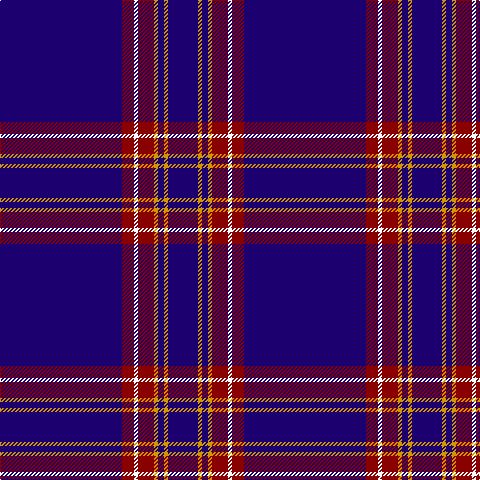

In pattern [BRWRYBYB](/patterns/brwrybyb/).

This was sourced from tartans-authority.  It is a [8 stripes tartan](/stripes/stripes8/).

Original link http://www.tartansauthority.com/tartan-ferret/display/3609/

## Thread count
DB/122 DR12 W4 DR16 DY4 DB6 DY4 DB/30

## Palette
Each colour and its ΔE from the base-6 reference it is a variant of.

| Colour | Shade | Base | ΔE (OKLab) |
|---|---|---|---|
| DB | <code style="background-color:#1C0070;">#1C0070</code> `#1C0070` | B <code style="background-color:#2A418A;">#2A418A</code> | 0.14 |
| DR | <code style="background-color:#880000;">#880000</code> `#880000` | R <code style="background-color:#CC0000;">#CC0000</code> | 0.15 |
| DY | <code style="background-color:#D09800;">#D09800</code> `#D09800` | Y <code style="background-color:#F2BF00;">#F2BF00</code> | 0.12 |
| W | <code style="background-color:#FCFCFC;">#FCFCFC</code> `#FCFCFC` | W <code style="background-color:#F7F7F7;">#F7F7F7</code> | 0.01 |

# Sample pattern

## Nearest tartans

The nearest existing variants by ΔTartan distance.

1. [Duke of York (Royal)](/setts/s8/b61r6w2r8y2b3y2b15x2~b00008c-r8c0000-wfcfcfc-yc88c00/) — ΔT 0.96
1. [Cougan Irish Personal Tartan Tartan Number: 6782. Earliest known date: 2005 September Designed by Douglas Gregor of Tartanweb as a personal tartan for Margot Coogan of County Laois, Ireland. The colours reflect those in the Cougan coat of arms - deep red representing the red cross in the shield and the white lines representing the three silver oak leaves. See products available Copyright © Blair Urquhart, Comrie, 2015](/setts/s10/b66r16w2r1w1r1w2r16b66y2x2~b1c0070-r880000-wf8f8f8-ye8c000/) — ΔT 1.01
1. [RAAF](/setts/s9/b66w2b10w2b10w2b12r3ba24x2~b1c0070-ba5c8ca8-rc80000-we0e0e0/) — ΔT 1.20
1. [Coogan (Personal)](/setts/s6/y2b66r16w2r1w1x2~b1c0070-r880000-wf8f8f8-ye8c000/) — ΔT 1.24
1. [United States (Corporate)](/setts/s9/b7ba5w6ba5r7ba2b2ba70w2~b1474b4-ba202060-rc80000-wfcfcfc/) — ΔT 1.25
1. [RAAF #4](/setts/s9/b48w2b7w2b7w2b20ba11r2x2~b2c2c80-ba5c8ca8-rc80000-we0e0e0/) — ΔT 1.27
1. [MacLaine of Lochbuie Hunting Clan Tartan Tartan Number: 491. Earliest known date: 1906 The Sett is also recorded by Adam in 1908. The hunting version first appeared in this century, in the work of H. Whyte published by W. and A.K. Johnston. His book introduced many new hunting and dress forms of both clan and family tartans. D.W. Stewart (1893) pointed out that the use of so much blue, was unique among old tartan setts. See products available Copyright © Blair Urquhart, Comrie, 2015](/setts/s5/b32r3b4k1y3x2~b2c2c80-k101010-rc80000-ye8c000/) — ΔT 1.40
1. [United States](/setts/s9/b7k5y6k5r7k2b2k70y2~b304080-k000030-rc00000-yb0b0b0/) — ΔT 1.47
1. [Waugh (Name)](/setts/s5/b100ba10k5ba10r8~b1c0070-ba7098b0-k101010-r980000/) — ΔT 1.47
1. [Inverness, Duke of York](/setts/s8/b122r11w4r15y4b6y4b30~b304080-rc00000-we0e0e0-yf0c000/) — ΔT 1.48

## Neighbour map

Every grey dot is one of 15726 variants placed by the first two principal components of the ΔTartan feature space (44% of its variance). Red is this tartan; blue dots are its nearest — click one to open its page.

<svg viewBox="0 0 640 380" role="img" style="max-width:100%;height:auto;border:1px solid #e0e0e0;border-radius:4px;display:block" xmlns="http://www.w3.org/2000/svg"><image href="/nn/cloud.v1.png" width="640" height="380"/><a href="/setts/s8/b61r6w2r8y2b3y2b15x2~b00008c-r8c0000-wfcfcfc-yc88c00/"><circle cx="548.3" cy="144.0" r="4" fill="#3465a4"><title>Duke of York (Royal)</title></circle></a><a href="/setts/s10/b66r16w2r1w1r1w2r16b66y2x2~b1c0070-r880000-wf8f8f8-ye8c000/"><circle cx="544.5" cy="116.8" r="4" fill="#3465a4"><title>Cougan Irish Personal Tartan Tartan Number: 6782. Earliest known date: 2005 September Designed by Douglas Gregor of Tartanweb as a personal tartan for Margot Coogan of County Laois, Ireland. The colours reflect those in the Cougan coat of arms - deep red representing the red cross in the shield and the white lines representing the three silver oak leaves. See products available Copyright © Blair Urquhart, Comrie, 2015</title></circle></a><a href="/setts/s9/b66w2b10w2b10w2b12r3ba24x2~b1c0070-ba5c8ca8-rc80000-we0e0e0/"><circle cx="492.1" cy="136.3" r="4" fill="#3465a4"><title>RAAF</title></circle></a><a href="/setts/s6/y2b66r16w2r1w1x2~b1c0070-r880000-wf8f8f8-ye8c000/"><circle cx="540.4" cy="126.6" r="4" fill="#3465a4"><title>Coogan (Personal)</title></circle></a><a href="/setts/s9/b7ba5w6ba5r7ba2b2ba70w2~b1474b4-ba202060-rc80000-wfcfcfc/"><circle cx="523.2" cy="111.9" r="4" fill="#3465a4"><title>United States (Corporate)</title></circle></a><a href="/setts/s9/b48w2b7w2b7w2b20ba11r2x2~b2c2c80-ba5c8ca8-rc80000-we0e0e0/"><circle cx="547.6" cy="159.9" r="4" fill="#3465a4"><title>RAAF #4</title></circle></a><a href="/setts/s5/b32r3b4k1y3x2~b2c2c80-k101010-rc80000-ye8c000/"><circle cx="595.2" cy="168.7" r="4" fill="#3465a4"><title>MacLaine of Lochbuie Hunting Clan Tartan Tartan Number: 491. Earliest known date: 1906 The Sett is also recorded by Adam in 1908. The hunting version first appeared in this century, in the work of H. Whyte published by W. and A.K. Johnston. His book introduced many new hunting and dress forms of both clan and family tartans. D.W. Stewart (1893) pointed out that the use of so much blue, was unique among old tartan setts. See products available Copyright © Blair Urquhart, Comrie, 2015</title></circle></a><a href="/setts/s9/b7k5y6k5r7k2b2k70y2~b304080-k000030-rc00000-yb0b0b0/"><circle cx="532.2" cy="123.4" r="4" fill="#3465a4"><title>United States</title></circle></a><a href="/setts/s5/b100ba10k5ba10r8~b1c0070-ba7098b0-k101010-r980000/"><circle cx="509.9" cy="185.0" r="4" fill="#3465a4"><title>Waugh (Name)</title></circle></a><a href="/setts/s8/b122r11w4r15y4b6y4b30~b304080-rc00000-we0e0e0-yf0c000/"><circle cx="574.9" cy="140.3" r="4" fill="#3465a4"><title>Inverness, Duke of York</title></circle></a><circle cx="559.1" cy="142.9" r="5" fill="#c00000"/></svg>

ID: /setts/s8/b61r6w2r8y2b3y2b15x2~b1c0070-r880000-wfcfcfc-yd09800/
