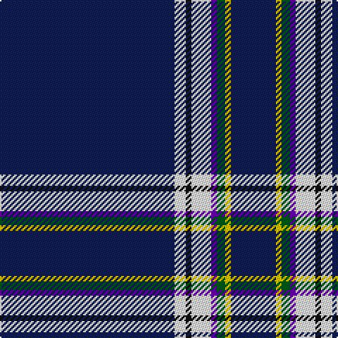

In pattern [BWKWBGYB](/patterns/bwkwbgyb/).

This was sourced from register-of-tartans.  It is a [8 stripes tartan](/stripes/stripes8/).

Original link https://www.tartanregister.gov.uk/tartanDetails.aspx?ref=5843

## Thread count
DB/124 W8 K4 W14 P4 G6 Y4 DB/32

## Palette
Each colour and its ΔE from the base-6 reference it is a variant of.

| Colour | Shade | Base | ΔE (OKLab) |
|---|---|---|---|
| DB | <code style="background-color:#141E46;">#141E46</code> `#141E46` | B <code style="background-color:#2A418A;">#2A418A</code> | 0.16 |
| G | <code style="background-color:#005020;">#005020</code> `#005020` | G <code style="background-color:#006100;">#006100</code> | 0.07 |
| K | <code style="background-color:#101010;">#101010</code> `#101010` | K <code style="background-color:#000000;">#000000</code> | 0.17 |
| P | <code style="background-color:#5A008C;">#5A008C</code> `#5A008C` | B <code style="background-color:#2A418A;">#2A418A</code> | 0.13 |
| W | <code style="background-color:#FFFFFF;">#FFFFFF</code> `#FFFFFF` | W <code style="background-color:#F7F7F7;">#F7F7F7</code> | 0.02 |
| Y | <code style="background-color:#E8C000;">#E8C000</code> `#E8C000` | Y <code style="background-color:#F2BF00;">#F2BF00</code> | 0.02 |

# Sample pattern

## Nearest tartans

The nearest existing variants by ΔTartan distance.

1. [Nunavut Territory (District)](/setts/s7/b60w1y4k4w1wa8w2~b1c1c50-k101010-we0e0e0-wac49cd8-ye8c000~x2/) — ΔT 1.46
1. [Centrica Energy (Corporate)](/setts/s9/w12b79y6b53wa4b22wb10b24g8~b1c1c50-g289c18-we0e0e0-wa98c8e8-wbc49cd8-yd87c00/) — ΔT 1.63
1. [Boat of Garten (District)](/setts/s8/b61w4b2w7ba2g3y2b16~b2c2c80-ba9050d8-g006818-we0e0e0-ye8c000~x2/) — ΔT 1.69
1. [Scotch Whisky, Heritage](/setts/s8/b73g16b10r8b10k4b10w2~b000050-g008000-k000000-rc00000-we0e0e0/) — ΔT 1.71
1. [Parkin](/setts/s8/w3b9y1wa3ba9wa1b40ba2~b14283c-ba780078-we0e0e0-waa8ace8-ye8c000~x2/) — ΔT 1.76
1. [Mohammed, Abu Hassan (Personal)](/setts/s9/b60w1b6g10r1g7k2y2w2~b1c1c50-g006818-k101010-rc80000-wfcfcec-ybc8c00~x2/) — ΔT 1.78
1. [St. Petersburg City (District)](/setts/s8/b60g10b3w6y2b9r2wa2~b34349c-g289c18-rc80000-w98c8e8-wae0e0e0-ye8c000~x2/) — ΔT 1.80
1. [McCuaig (Glenelg and the Western Isles) Hunting](/setts/s9/k20b2k2b4g4y2k40r2w3~b2c2c80-g003c14-k101010-rc82828-wffffff-ye8c000~x2/) — ΔT 1.81
1. [Jewish (Kosher) (Corporate)](/setts/s11/w3b3w1ba44r1ba2r1ra4r1ba5y2~b2800a4-ba003c64-r888888-ra880000-wf0f0d8-ybc8c00~x2/) — ΔT 1.83
1. [Washington County Sheriff’s Office (Oregon)](/setts/s8/b6k6b6ba3w1k39y3k3~b778899-ba0000cd-k101010-wffffff-yffd700~x2/) — ΔT 1.84

## Neighbour map

Every grey dot is one of 15726 variants placed by the first two principal components of the ΔTartan feature space (44% of its variance). Red is this tartan; blue dots are its nearest — click one to open its page.

<svg viewBox="0 0 640 380" role="img" style="max-width:100%;height:auto;border:1px solid #e0e0e0;border-radius:4px;display:block" xmlns="http://www.w3.org/2000/svg"><image href="/nn/cloud.v1.png" width="640" height="380"/><a href="/setts/s7/b60w1y4k4w1wa8w2~b1c1c50-k101010-we0e0e0-wac49cd8-ye8c000~x2/"><circle cx="495.3" cy="90.2" r="4" fill="#3465a4"><title>Nunavut Territory (District)</title></circle></a><a href="/setts/s9/w12b79y6b53wa4b22wb10b24g8~b1c1c50-g289c18-we0e0e0-wa98c8e8-wbc49cd8-yd87c00/"><circle cx="464.6" cy="143.5" r="4" fill="#3465a4"><title>Centrica Energy (Corporate)</title></circle></a><a href="/setts/s8/b61w4b2w7ba2g3y2b16~b2c2c80-ba9050d8-g006818-we0e0e0-ye8c000~x2/"><circle cx="532.4" cy="115.7" r="4" fill="#3465a4"><title>Boat of Garten (District)</title></circle></a><a href="/setts/s8/b73g16b10r8b10k4b10w2~b000050-g008000-k000000-rc00000-we0e0e0/"><circle cx="501.0" cy="133.7" r="4" fill="#3465a4"><title>Scotch Whisky, Heritage</title></circle></a><a href="/setts/s8/w3b9y1wa3ba9wa1b40ba2~b14283c-ba780078-we0e0e0-waa8ace8-ye8c000~x2/"><circle cx="472.2" cy="111.2" r="4" fill="#3465a4"><title>Parkin</title></circle></a><a href="/setts/s9/b60w1b6g10r1g7k2y2w2~b1c1c50-g006818-k101010-rc80000-wfcfcec-ybc8c00~x2/"><circle cx="485.9" cy="76.8" r="4" fill="#3465a4"><title>Mohammed, Abu Hassan (Personal)</title></circle></a><a href="/setts/s8/b60g10b3w6y2b9r2wa2~b34349c-g289c18-rc80000-w98c8e8-wae0e0e0-ye8c000~x2/"><circle cx="476.7" cy="99.0" r="4" fill="#3465a4"><title>St. Petersburg City (District)</title></circle></a><a href="/setts/s9/k20b2k2b4g4y2k40r2w3~b2c2c80-g003c14-k101010-rc82828-wffffff-ye8c000~x2/"><circle cx="473.1" cy="124.8" r="4" fill="#3465a4"><title>McCuaig (Glenelg and the Western Isles) Hunting</title></circle></a><a href="/setts/s11/w3b3w1ba44r1ba2r1ra4r1ba5y2~b2800a4-ba003c64-r888888-ra880000-wf0f0d8-ybc8c00~x2/"><circle cx="503.5" cy="64.3" r="4" fill="#3465a4"><title>Jewish (Kosher) (Corporate)</title></circle></a><a href="/setts/s8/b6k6b6ba3w1k39y3k3~b778899-ba0000cd-k101010-wffffff-yffd700~x2/"><circle cx="444.9" cy="109.3" r="4" fill="#3465a4"><title>Washington County Sheriff’s Office (Oregon)</title></circle></a><circle cx="483.7" cy="95.4" r="5" fill="#c00000"/></svg>

ID: /setts/s8/b62w4k2w7ba2g3y2b16~b141e46-ba5a008c-g005020-k101010-wffffff-ye8c000~x2/
