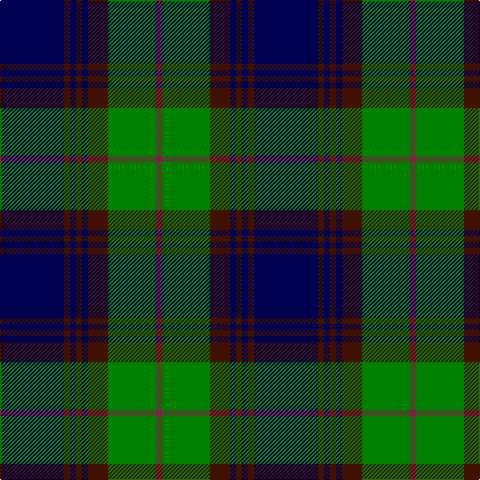

In pattern [BBBBBBGR](/patterns/bbbbbbgr/).

This was sourced from weddslist.  It is a [8 stripes tartan](/stripes/stripes8/).

Original link http://www.weddslist.com/cgi-bin/tartans/pg.pl?source=sts

## Thread count
DB/64 DRa6 DB6 DRa6 DB6 DRa20 G48 DR/6

## Palette
Each colour and its ΔE from the base-6 reference it is a variant of.

| Colour | Shade | Base | ΔE (OKLab) |
|---|---|---|---|
| DB | <code style="background-color:#000050;">#000050</code> `#000050` | B <code style="background-color:#2C4084;">#2C4084</code> | 0.20 |
| DR | <code style="background-color:#802040;">#802040</code> `#802040` | R <code style="background-color:#C80000;">#C80000</code> | 0.16 |
| DRa | <code style="background-color:#401000;">#401000</code> `#401000` | B <code style="background-color:#2C4084;">#2C4084</code> | 0.23 |
| G | <code style="background-color:#008000;">#008000</code> `#008000` | G <code style="background-color:#006400;">#006400</code> | 0.09 |

# Sample pattern

## Nearest tartans

The nearest existing variants by ΔTartan distance.

1. [Guthrie (Name)](/setts/s9/k4g48k48r4k4r4k48b48r4-b1474b4-g408060-k101010-rc80000/) — ΔT 0.74
1. [Gary/Garry (Name)](/setts/s8/b8g6b24k12b6ba12g48k8-b501464-ba00008c-g146400-k000000/) — ΔT 0.89
1. [New Golf Club](/setts/s9/g8k8g46k22r4k4r4k40w8-g004010-k000030-rc00000-we0e0e0/) — ΔT 0.91
1. [Gammell (1978) (Personal)](/setts/s7/b6r4b44k22g44r4g6-b1c0070-g006818-k101010-rc80000/) — ΔT 0.95
1. [Greenways Marketing Intl (Corporate)](/setts/s7/b48g6b6g6y4g36r4-b1c0070-g006818-r880000-yd09800/) — ΔT 1.07
1. [Frederiction Police Force](/setts/s8/r12k110b16g12b20g12b12g8-b2c2c80-g289c18-k101010-rc80000/) — ΔT 1.09
1. [Colvin](/setts/s8/b72w8b8w8b32g128r18b12-b00008c-g004c00-r8c0000-wc8c8c8/) — ΔT 1.09
1. [Auld Lang Syne Burns Commemorative Tartan Tartan Number: 2400. Earliest known date: 01/01/2002 Launched on the 25th January at a the Beach Ballroom Aberdeen, to celebrate the birth of Robert Burns 2002./Threadcount and colours aren't 100% original. Generated manually./ See products available Copyright © Blair Urquhart, Comrie, 2015](/setts/s8/k6b6k6b48ba48k6ba6w6-b205d7a-ba351d00-k090700-wa7eae1/) — ΔT 1.10
1. [Unidentified Portrait](/setts/s9/g20r2g2r2g2r8b24r2b4-b000050-g007800-r8c0000/) — ΔT 1.12
1. [Rowan (Name)](/setts/s10/b4k4b32k8y4g48y4b32k4b4-b2c2c80-g006818-k101010-yd09800/) — ΔT 1.12

## Neighbour map

Every grey dot is one of 15726 variants placed by the first two principal components of the ΔTartan feature space (44% of its variance). Red is this tartan; blue dots are its nearest — click one to open its page.

<svg viewBox="0 0 640 380" role="img" style="max-width:100%;height:auto;border:1px solid #e0e0e0;border-radius:4px;display:block" xmlns="http://www.w3.org/2000/svg"><image href="/nn/cloud.v1.png" width="640" height="380"/><a href="/setts/s9/k4g48k48r4k4r4k48b48r4-b1474b4-g408060-k101010-rc80000/"><circle cx="252.6" cy="184.2" r="4" fill="#3465a4"><title>Guthrie (Name)</title></circle></a><a href="/setts/s8/b8g6b24k12b6ba12g48k8-b501464-ba00008c-g146400-k000000/"><circle cx="210.2" cy="209.8" r="4" fill="#3465a4"><title>Gary/Garry (Name)</title></circle></a><a href="/setts/s9/g8k8g46k22r4k4r4k40w8-g004010-k000030-rc00000-we0e0e0/"><circle cx="284.2" cy="190.3" r="4" fill="#3465a4"><title>New Golf Club</title></circle></a><a href="/setts/s7/b6r4b44k22g44r4g6-b1c0070-g006818-k101010-rc80000/"><circle cx="227.3" cy="206.4" r="4" fill="#3465a4"><title>Gammell (1978) (Personal)</title></circle></a><a href="/setts/s7/b48g6b6g6y4g36r4-b1c0070-g006818-r880000-yd09800/"><circle cx="308.6" cy="193.5" r="4" fill="#3465a4"><title>Greenways Marketing Intl (Corporate)</title></circle></a><a href="/setts/s8/r12k110b16g12b20g12b12g8-b2c2c80-g289c18-k101010-rc80000/"><circle cx="317.8" cy="165.9" r="4" fill="#3465a4"><title>Frederiction Police Force</title></circle></a><a href="/setts/s8/b72w8b8w8b32g128r18b12-b00008c-g004c00-r8c0000-wc8c8c8/"><circle cx="285.6" cy="173.5" r="4" fill="#3465a4"><title>Colvin</title></circle></a><a href="/setts/s8/k6b6k6b48ba48k6ba6w6-b205d7a-ba351d00-k090700-wa7eae1/"><circle cx="251.4" cy="201.2" r="4" fill="#3465a4"><title>Auld Lang Syne Burns Commemorative Tartan Tartan Number: 2400. Earliest known date: 01/01/2002 Launched on the 25th January at a the Beach Ballroom Aberdeen, to celebrate the birth of Robert Burns 2002./Threadcount and colours aren't 100% original. Generated manually./ See products available Copyright © Blair Urquhart, Comrie, 2015</title></circle></a><a href="/setts/s9/g20r2g2r2g2r8b24r2b4-b000050-g007800-r8c0000/"><circle cx="263.2" cy="187.5" r="4" fill="#3465a4"><title>Unidentified Portrait</title></circle></a><a href="/setts/s10/b4k4b32k8y4g48y4b32k4b4-b2c2c80-g006818-k101010-yd09800/"><circle cx="296.1" cy="180.7" r="4" fill="#3465a4"><title>Rowan (Name)</title></circle></a><circle cx="258.1" cy="190.1" r="5" fill="#c00000"/></svg>

ID: /setts/s8/b64ba6b6ba6b6ba20g48r6-b000050-ba401000-g008000-r802040/
