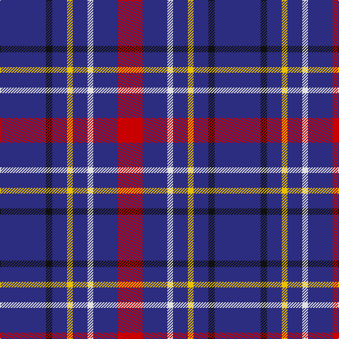

In pattern [BKBYBWBR](/patterns/bkbybwbr/).

This was sourced from house-of-tartan.  It is a [8 stripes tartan](/stripes/stripes8/).

Original link http://www.house-of-tartan.scotland.net/house/TartanViewjs.asp?colr=Def&tnam=268

## Thread count
DB/65 K9 DB21 Y8 DB21 LN8 DB35 R/35

## Palette
Each colour and its ΔE from the base-6 reference it is a variant of.

| Colour | Shade | Base | ΔE (OKLab) |
|---|---|---|---|
| DB | <code style="background-color:#2C2C80;">#2C2C80</code> `#2C2C80` | B <code style="background-color:#2C4084;">#2C4084</code> | 0.05 |
| K | <code style="background-color:#101010;">#101010</code> `#101010` | K <code style="background-color:#000000;">#000000</code> | 0.17 |
| LN | <code style="background-color:#E0E0E0;">#E0E0E0</code> `#E0E0E0` | W <code style="background-color:#F4F4F0;">#F4F4F0</code> | 0.06 |
| R | <code style="background-color:#C80000;">#C80000</code> `#C80000` | R <code style="background-color:#C80000;">#C80000</code> | 0.00 |
| Y | <code style="background-color:#E8C000;">#E8C000</code> `#E8C000` | Y <code style="background-color:#E8C000;">#E8C000</code> | 0.00 |

# Sample pattern

## Nearest tartans

The nearest existing variants by ΔTartan distance.

1. [Maud, Mary](/setts/s8/b65k9b21y8b21w8b35r35-b304080-k000000-rc00000-we0e0e0-yf0c000/) — ΔT 0.49
1. [Louisville Fire & Rescue P&D](/setts/s9/w4b32r12b8r4b8r12b32y4-b2c2c80-rc80000-we0e0e0-ybc8c00/) — ΔT 1.05
1. [Stradling (Name)](/setts/s6/b40w7b60k10r25y4-b2c2c80-k101010-r880000-we0e0e0-ye8c000/) — ΔT 1.29
1. [de Grussa (Personal)](/setts/s6/b48w8b48y8r10k8-b1c1c50-k101010-r880000-wf8f8f8-ybc8c00/) — ΔT 1.34
1. [De Grussa](/setts/s6/b48w8b48y8r10k8-b191970-k101010-r8b0000-wffffff-yffd700/) — ΔT 1.42
1. [Abertay University (Estimated threadcount)](/setts/s6/r10b30g6b30y6b6-b2c2c80-g006818-rc80000-ye8c000/) — ΔT 1.50
1. [Mortell (Personal)](/setts/s10/b40ba4w10r4b20ba10b40ba4w10r10-b2c2c80-ba1870a4-rc80000-we0e0e0/) — ΔT 1.51
1. [Fitzgerald Blue Irish Family Tartan Tartan Number: 1419. Earliest known date: pre 2003 One of four Fitzgerald tartans all apparently designed by Robert P. Fitzgerald of Philadelphia. Starting with this variation of Robertson, he then designed the blue and hunting as color variations and a further "fancy dress" version. See products available Copyright © Blair Urquhart, Comrie, 2015](/setts/s9/r6b42r6b6k26b26ba6b6w4-b2c2c80-ba5c8ca8-k101010-rc80000-we0e0e0/) — ΔT 1.53
1. [Fitzgerald, Blue](/setts/s9/r6b42r6b6k26b26ba6b6w4-b304080-ba5480b0-k000000-rc00000-we0e0e0/) — ΔT 1.55
1. [International Festival of Authors](/setts/s6/b60r10b10ba8b8y24-b59178a-ba009ec7-re026a3-y00b052/) — ΔT 1.55

## Neighbour map

Every grey dot is one of 15726 variants placed by the first two principal components of the ΔTartan feature space (44% of its variance). Red is this tartan; blue dots are its nearest — click one to open its page.

<svg viewBox="0 0 640 380" role="img" style="max-width:100%;height:auto;border:1px solid #e0e0e0;border-radius:4px;display:block" xmlns="http://www.w3.org/2000/svg"><image href="/nn/cloud.v1.png" width="640" height="380"/><a href="/setts/s8/b65k9b21y8b21w8b35r35-b304080-k000000-rc00000-we0e0e0-yf0c000/"><circle cx="349.3" cy="203.3" r="4" fill="#3465a4"><title>Maud, Mary</title></circle></a><a href="/setts/s9/w4b32r12b8r4b8r12b32y4-b2c2c80-rc80000-we0e0e0-ybc8c00/"><circle cx="381.7" cy="206.6" r="4" fill="#3465a4"><title>Louisville Fire &amp; Rescue P&amp;D</title></circle></a><a href="/setts/s6/b40w7b60k10r25y4-b2c2c80-k101010-r880000-we0e0e0-ye8c000/"><circle cx="384.0" cy="191.5" r="4" fill="#3465a4"><title>Stradling (Name)</title></circle></a><a href="/setts/s6/b48w8b48y8r10k8-b1c1c50-k101010-r880000-wf8f8f8-ybc8c00/"><circle cx="376.4" cy="219.9" r="4" fill="#3465a4"><title>de Grussa (Personal)</title></circle></a><a href="/setts/s6/b48w8b48y8r10k8-b191970-k101010-r8b0000-wffffff-yffd700/"><circle cx="358.8" cy="213.5" r="4" fill="#3465a4"><title>De Grussa</title></circle></a><a href="/setts/s6/r10b30g6b30y6b6-b2c2c80-g006818-rc80000-ye8c000/"><circle cx="401.7" cy="254.2" r="4" fill="#3465a4"><title>Abertay University (Estimated threadcount)</title></circle></a><a href="/setts/s10/b40ba4w10r4b20ba10b40ba4w10r10-b2c2c80-ba1870a4-rc80000-we0e0e0/"><circle cx="335.5" cy="185.6" r="4" fill="#3465a4"><title>Mortell (Personal)</title></circle></a><a href="/setts/s9/r6b42r6b6k26b26ba6b6w4-b2c2c80-ba5c8ca8-k101010-rc80000-we0e0e0/"><circle cx="329.3" cy="182.9" r="4" fill="#3465a4"><title>Fitzgerald Blue Irish Family Tartan Tartan Number: 1419. Earliest known date: pre 2003 One of four Fitzgerald tartans all apparently designed by Robert P. Fitzgerald of Philadelphia. Starting with this variation of Robertson, he then designed the blue and hunting as color variations and a further &quot;fancy dress&quot; version. See products available Copyright © Blair Urquhart, Comrie, 2015</title></circle></a><a href="/setts/s9/r6b42r6b6k26b26ba6b6w4-b304080-ba5480b0-k000000-rc00000-we0e0e0/"><circle cx="303.4" cy="172.9" r="4" fill="#3465a4"><title>Fitzgerald, Blue</title></circle></a><a href="/setts/s6/b60r10b10ba8b8y24-b59178a-ba009ec7-re026a3-y00b052/"><circle cx="348.1" cy="210.1" r="4" fill="#3465a4"><title>International Festival of Authors</title></circle></a><circle cx="350.6" cy="203.6" r="5" fill="#c00000"/></svg>

ID: /setts/s8/b65k9b21y8b21w8b35r35-b2c2c80-k101010-rc80000-we0e0e0-ye8c000/
