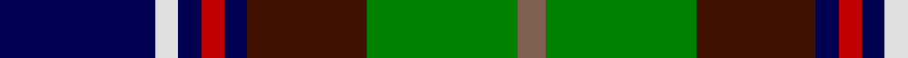

In pattern [BWBRBBGR](/patterns/bwbrbbgr/).

This was sourced from weddslist.  It is a [8 stripes tartan](/stripes/stripes8/).

Original link http://www.weddslist.com/cgi-bin/tartans/pg.pl?source=sts

## Thread count
DB/68 LN10 DB10 R10 DB10 DR52 G66 LT/12

## Palette
Each colour and its ΔE from the base-6 reference it is a variant of.

| Colour | Shade | Base | ΔE (OKLab) |
|---|---|---|---|
| DB | <code style="background-color:#000050;">#000050</code> `#000050` | B <code style="background-color:#2C4084;">#2C4084</code> | 0.20 |
| DR | <code style="background-color:#401000;">#401000</code> `#401000` | B <code style="background-color:#2C4084;">#2C4084</code> | 0.23 |
| G | <code style="background-color:#008000;">#008000</code> `#008000` | G <code style="background-color:#006400;">#006400</code> | 0.09 |
| LN | <code style="background-color:#E0E0E0;">#E0E0E0</code> `#E0E0E0` | W <code style="background-color:#F4F4F0;">#F4F4F0</code> | 0.06 |
| LT | <code style="background-color:#806050;">#806050</code> `#806050` | R <code style="background-color:#C80000;">#C80000</code> | 0.17 |
| R | <code style="background-color:#C00000;">#C00000</code> `#C00000` | R <code style="background-color:#C80000;">#C80000</code> | 0.02 |

# Sample pattern

## Nearest tartans

The nearest existing variants by ΔTartan distance.

1. [MacCraig](/setts/s9/b16w8g56r8k56g8ba56r8g16-b4c0000-ba1c0070-g006818-k000000-r880000-wa8ace8/) — ΔT 0.68
1. [MacLean, Donald Personal Tartan Tartan Number: 3440. Earliest known date: pre 2002 From Pendleton Woolen Mills of Oregon, owners of the only copy of Clans Originaux. EBW 8.11.02. This is the same as MacTaggart #408 and #409!!! See products available Copyright © Blair Urquhart, Comrie, 2015](/setts/s7/g32w6g6k20b24r4ka6-b1c0070-g006818-k101010-ka000000-r880000-wa8ace8/) — ΔT 0.73
1. [Cowan of Inveresk Family Tartan Tartan Number: 1549. Earliest known date: 1979 This is a modern family tartan designed by the representer of the family of Cowan of Inveresk, in the parish of that name in Musselburgh, Mr Robert Cowan of Atlanta, Georgia. Cowans are a Sept of the Colquhouns, variously spelt Macillechomhghain, Comhain, Comhan and Cowen. Cowans not associated with the Inveresk branch of the family may wear the Colquhoun tartan on which this design is based. See products available Copyright © Blair Urquhart, Comrie, 2015](/setts/s8/r8g32w4k30b30k4b4y4-b2c2c80-g006818-k101010-rc80000-we0e0e0-ye8c000/) — ΔT 0.73
1. [Scottish Cultural Society (Corporate](/setts/s9/b16g32k64y8k8ba32w8ba8w16-b6c0070-ba1c0070-g006818-k101010-wc0c0c0-yd09800/) — ΔT 0.75
1. [Unidentified #37](/setts/s10/k12g28b4r6b4k32y4ba32g32r6-b3c82af-ba0596fa-g005020-k101010-rdc0000-ye8c000/) — ΔT 0.80
1. [Harvey of Cornwall (Personal)](/setts/s7/w10k52b52g24y10g5r5-b2c4084-g003c14-k101010-rdc0000-we0e0e0-ye8c000/) — ΔT 0.87
1. [McCuaig (2010) (Name)](/setts/s9/k20y6k4b40k20g30k4r6w6-b1474b4-g006818-k101010-rc8002c-we0e0e0-ye8c000/) — ΔT 0.88
1. [McComb](/setts/s7/b6r4b36k12g36y4ga6-b304080-g003000-ga008000-k000000-rc00000-yf0c000/) — ΔT 0.90
1. [Morris of Eddergoll (Personal)](/setts/s6/w4b40r6k20g40y4-b1c0070-g006818-k101010-rc80000-wf8f8f8-yd09800/) — ΔT 0.91
1. [Cowan, of Inveresk](/setts/s8/r8g32w4k30b30k4b4y4-b304080-g008000-k000000-rc00000-we0e0e0-yf0c000/) — ΔT 0.95

## Neighbour map

Every grey dot is one of 15726 variants placed by the first two principal components of the ΔTartan feature space (44% of its variance). Red is this tartan; blue dots are its nearest — click one to open its page.

<svg viewBox="0 0 640 380" role="img" style="max-width:100%;height:auto;border:1px solid #e0e0e0;border-radius:4px;display:block" xmlns="http://www.w3.org/2000/svg"><image href="/nn/cloud.v1.png" width="640" height="380"/><a href="/setts/s9/b16w8g56r8k56g8ba56r8g16-b4c0000-ba1c0070-g006818-k000000-r880000-wa8ace8/"><circle cx="97.5" cy="174.5" r="4" fill="#3465a4"><title>MacCraig</title></circle></a><a href="/setts/s7/g32w6g6k20b24r4ka6-b1c0070-g006818-k101010-ka000000-r880000-wa8ace8/"><circle cx="125.0" cy="193.2" r="4" fill="#3465a4"><title>MacLean, Donald Personal Tartan Tartan Number: 3440. Earliest known date: pre 2002 From Pendleton Woolen Mills of Oregon, owners of the only copy of Clans Originaux. EBW 8.11.02. This is the same as MacTaggart #408 and #409!!! See products available Copyright © Blair Urquhart, Comrie, 2015</title></circle></a><a href="/setts/s8/r8g32w4k30b30k4b4y4-b2c2c80-g006818-k101010-rc80000-we0e0e0-ye8c000/"><circle cx="99.5" cy="171.1" r="4" fill="#3465a4"><title>Cowan of Inveresk Family Tartan Tartan Number: 1549. Earliest known date: 1979 This is a modern family tartan designed by the representer of the family of Cowan of Inveresk, in the parish of that name in Musselburgh, Mr Robert Cowan of Atlanta, Georgia. Cowans are a Sept of the Colquhouns, variously spelt Macillechomhghain, Comhain, Comhan and Cowen. Cowans not associated with the Inveresk branch of the family may wear the Colquhoun tartan on which this design is based. See products available Copyright © Blair Urquhart, Comrie, 2015</title></circle></a><a href="/setts/s9/b16g32k64y8k8ba32w8ba8w16-b6c0070-ba1c0070-g006818-k101010-wc0c0c0-yd09800/"><circle cx="103.7" cy="164.0" r="4" fill="#3465a4"><title>Scottish Cultural Society (Corporate</title></circle></a><a href="/setts/s10/k12g28b4r6b4k32y4ba32g32r6-b3c82af-ba0596fa-g005020-k101010-rdc0000-ye8c000/"><circle cx="108.4" cy="167.2" r="4" fill="#3465a4"><title>Unidentified #37</title></circle></a><a href="/setts/s7/w10k52b52g24y10g5r5-b2c4084-g003c14-k101010-rdc0000-we0e0e0-ye8c000/"><circle cx="118.4" cy="165.2" r="4" fill="#3465a4"><title>Harvey of Cornwall (Personal)</title></circle></a><a href="/setts/s9/k20y6k4b40k20g30k4r6w6-b1474b4-g006818-k101010-rc8002c-we0e0e0-ye8c000/"><circle cx="110.2" cy="157.6" r="4" fill="#3465a4"><title>McCuaig (2010) (Name)</title></circle></a><a href="/setts/s7/b6r4b36k12g36y4ga6-b304080-g003000-ga008000-k000000-rc00000-yf0c000/"><circle cx="172.3" cy="178.2" r="4" fill="#3465a4"><title>McComb</title></circle></a><a href="/setts/s6/w4b40r6k20g40y4-b1c0070-g006818-k101010-rc80000-wf8f8f8-yd09800/"><circle cx="134.0" cy="179.0" r="4" fill="#3465a4"><title>Morris of Eddergoll (Personal)</title></circle></a><a href="/setts/s8/r8g32w4k30b30k4b4y4-b304080-g008000-k000000-rc00000-we0e0e0-yf0c000/"><circle cx="74.2" cy="162.0" r="4" fill="#3465a4"><title>Cowan, of Inveresk</title></circle></a><circle cx="114.5" cy="177.1" r="5" fill="#c00000"/></svg>

ID: /setts/s8/b68w10b10r10b10ba52g66ra12-b000050-ba401000-g008000-rc00000-ra806050-we0e0e0/
