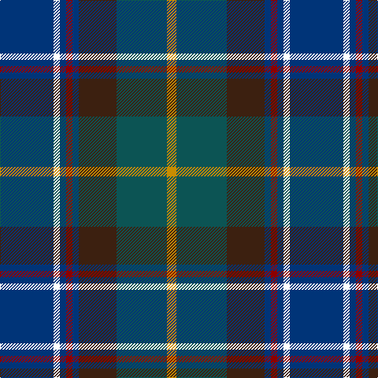

In pattern [BWBRBBGY](/patterns/bwbrbbgy/).

This was sourced from register-of-tartans.  It is a [8 stripes tartan](/stripes/stripes8/).

Original link https://www.tartanregister.gov.uk/tartanDetails.aspx?ref=294

## Thread count
DB/68 W8 DB8 DR8 DB8 K48 G64 DY/12

## Palette
Each colour and its ΔE from the base-6 reference it is a variant of.

| Colour | Shade | Base | ΔE (OKLab) |
|---|---|---|---|
| DB | <code style="background-color:#003478;">#003478</code> `#003478` | B <code style="background-color:#2A418A;">#2A418A</code> | 0.06 |
| DR | <code style="background-color:#8C0000;">#8C0000</code> `#8C0000` | R <code style="background-color:#CC0000;">#CC0000</code> | 0.14 |
| DY | <code style="background-color:#C88C00;">#C88C00</code> `#C88C00` | Y <code style="background-color:#F2BF00;">#F2BF00</code> | 0.15 |
| G | <code style="background-color:#0C5454;">#0C5454</code> `#0C5454` | G <code style="background-color:#006100;">#006100</code> | 0.12 |
| K | <code style="background-color:#3C2010;">#3C2010</code> `#3C2010` | B <code style="background-color:#2A418A;">#2A418A</code> | 0.21 |
| W | <code style="background-color:#FFFFFF;">#FFFFFF</code> `#FFFFFF` | W <code style="background-color:#F7F7F7;">#F7F7F7</code> | 0.02 |

# Sample pattern

## Nearest tartans

The nearest existing variants by ΔTartan distance.

1. [Blairmore House (Corporate)](/setts/s8/b68w8b8r8b8ba48g64y12-b003478-ba3c2010-g0c5454-r8c0000-wc8c8c8-yc88c00/) — ΔT 0.56
1. [Remember the Somme 1916](/setts/s8/g20ga8b8ba60r8y8g20r8-b2c2c80-ba202060-g003820-ga006818-ra00000-y48a4c0/) — ΔT 0.97
1. [Westbrook (2013)](/setts/s9/g30ga6b4ga6g16ba24bb40r4bb8-b4c0000-ba1870a4-bb1c1c50-g004c00-ga718048-r880000/) — ΔT 0.98
1. [State Seal of North Dakota (Fashion)](/setts/s11/g74b10g10b24ba20bb10ba10bb80ga8bb8y8-b440044-ba1474b4-bb2c2c80-g006818-ga604000-ybc8c00/) — ΔT 0.99
1. [Schmidt (2014)](/setts/s10/k6b40ba16b8g40k4g4r4g6y6-b000048-ba202060-g005448-k101010-rc8002c-ye0a126/) — ΔT 1.04
1. [Cowie](/setts/s6/r6b48k14ba22g22y4-b003c64-ba2c2c80-g006818-k101010-rc80000-ye8c000/) — ΔT 1.06
1. [McComb (Personal)](/setts/s7/b6r4b36k12g36y4ga6-b2c2c80-g006818-ga408060-k101010-rc80000-ye8c000/) — ΔT 1.07
1. [Porteous Family Tartan Tartan Number: 1264. Earliest known date: 1978 Designed for the Porteous Family Association, and submitted to the Monitoring Committee of the Scottish Tartan Society by Captain Barry Porteous who was president of the association at that time. See products available Copyright © Blair Urquhart, Comrie, 2015](/setts/s6/k2y2b16g20ba14w2-b2c2c80-ba1c4874-g006818-k101010-we0e0e0-ye8c000/) — ΔT 1.08
1. [State Seal of Iowa (Fashion)](/setts/s8/b10ba86b36w8ba12r10g50y10-b003c64-ba1474b4-g604000-r880000-we8ccb8-ybc8c00/) — ΔT 1.10
1. [Schmidt (2014)](/setts/s10/k6b40ba16b8g40k4g4r4g6y6-b202060-ba2c2c80-g006818-k101010-rc80000-yfccc00/) — ΔT 1.11

## Neighbour map

Every grey dot is one of 15726 variants placed by the first two principal components of the ΔTartan feature space (44% of its variance). Red is this tartan; blue dots are its nearest — click one to open its page.

<svg viewBox="0 0 640 380" role="img" style="max-width:100%;height:auto;border:1px solid #e0e0e0;border-radius:4px;display:block" xmlns="http://www.w3.org/2000/svg"><image href="/nn/cloud.v1.png" width="640" height="380"/><a href="/setts/s8/b68w8b8r8b8ba48g64y12-b003478-ba3c2010-g0c5454-r8c0000-wc8c8c8-yc88c00/"><circle cx="188.1" cy="191.3" r="4" fill="#3465a4"><title>Blairmore House (Corporate)</title></circle></a><a href="/setts/s8/g20ga8b8ba60r8y8g20r8-b2c2c80-ba202060-g003820-ga006818-ra00000-y48a4c0/"><circle cx="217.3" cy="194.6" r="4" fill="#3465a4"><title>Remember the Somme 1916</title></circle></a><a href="/setts/s9/g30ga6b4ga6g16ba24bb40r4bb8-b4c0000-ba1870a4-bb1c1c50-g004c00-ga718048-r880000/"><circle cx="170.2" cy="188.6" r="4" fill="#3465a4"><title>Westbrook (2013)</title></circle></a><a href="/setts/s11/g74b10g10b24ba20bb10ba10bb80ga8bb8y8-b440044-ba1474b4-bb2c2c80-g006818-ga604000-ybc8c00/"><circle cx="188.4" cy="155.3" r="4" fill="#3465a4"><title>State Seal of North Dakota (Fashion)</title></circle></a><a href="/setts/s10/k6b40ba16b8g40k4g4r4g6y6-b000048-ba202060-g005448-k101010-rc8002c-ye0a126/"><circle cx="186.1" cy="165.1" r="4" fill="#3465a4"><title>Schmidt (2014)</title></circle></a><a href="/setts/s6/r6b48k14ba22g22y4-b003c64-ba2c2c80-g006818-k101010-rc80000-ye8c000/"><circle cx="192.1" cy="201.2" r="4" fill="#3465a4"><title>Cowie</title></circle></a><a href="/setts/s7/b6r4b36k12g36y4ga6-b2c2c80-g006818-ga408060-k101010-rc80000-ye8c000/"><circle cx="180.1" cy="180.1" r="4" fill="#3465a4"><title>McComb (Personal)</title></circle></a><a href="/setts/s6/k2y2b16g20ba14w2-b2c2c80-ba1c4874-g006818-k101010-we0e0e0-ye8c000/"><circle cx="159.8" cy="196.1" r="4" fill="#3465a4"><title>Porteous Family Tartan Tartan Number: 1264. Earliest known date: 1978 Designed for the Porteous Family Association, and submitted to the Monitoring Committee of the Scottish Tartan Society by Captain Barry Porteous who was president of the association at that time. See products available Copyright © Blair Urquhart, Comrie, 2015</title></circle></a><a href="/setts/s8/b10ba86b36w8ba12r10g50y10-b003c64-ba1474b4-g604000-r880000-we8ccb8-ybc8c00/"><circle cx="214.6" cy="170.4" r="4" fill="#3465a4"><title>State Seal of Iowa (Fashion)</title></circle></a><a href="/setts/s10/k6b40ba16b8g40k4g4r4g6y6-b202060-ba2c2c80-g006818-k101010-rc80000-yfccc00/"><circle cx="169.1" cy="154.2" r="4" fill="#3465a4"><title>Schmidt (2014)</title></circle></a><circle cx="171.5" cy="183.8" r="5" fill="#c00000"/></svg>

ID: /setts/s8/b68w8b8r8b8ba48g64y12-b003478-ba3c2010-g0c5454-r8c0000-wffffff-yc88c00/
