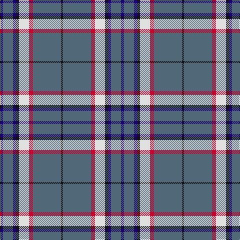

In pattern [BBBKWRBK](/patterns/bbbkwrbk/).

This was sourced from tartans-authority.  It is a [8 stripes tartan](/stripes/stripes8/).

Original link http://www.tartansauthority.com/tartan-ferret/display/8274/

## Thread count
DB/6 N20 DB6 K6 LN20 R8 N56 K/4

## Palette
Each colour and its ΔE from the base-6 reference it is a variant of.

| Colour | Shade | Base | ΔE (OKLab) |
|---|---|---|---|
| DB | <code style="background-color:#1C0070;">#1C0070</code> `#1C0070` | B <code style="background-color:#2A418A;">#2A418A</code> | 0.14 |
| K | <code style="background-color:#101010;">#101010</code> `#101010` | K <code style="background-color:#000000;">#000000</code> | 0.17 |
| LN | <code style="background-color:#E0E0E0;">#E0E0E0</code> `#E0E0E0` | W <code style="background-color:#F7F7F7;">#F7F7F7</code> | 0.07 |
| N | <code style="background-color:#506878;">#506878</code> `#506878` | B <code style="background-color:#2A418A;">#2A418A</code> | 0.14 |
| R | <code style="background-color:#C8002C;">#C8002C</code> `#C8002C` | R <code style="background-color:#CC0000;">#CC0000</code> | 0.03 |

# Sample pattern

## Nearest tartans

The nearest existing variants by ΔTartan distance.

1. [Keogh (Name)](/setts/s10/r8b36r8ba6r8k24r6b48k4y6-b1474b4-ba5c8ca8-k101010-rc80000-yfccc00/) — ΔT 0.88
1. [International Pairs (Corporate)](/setts/s10/b68y12g12r4w4r4g20y16b46w4-b2c2c80-g007460-rc80000-we0e0e0-ybc8c00/) — ΔT 1.04
1. [Perkins 2015](/setts/s7/k6b20y10b58k20r12k4-b5c8ca8-k101010-rc80000-ye8c000/) — ΔT 1.08
1. [Perkins (2015)](/setts/s7/k6b20y10b58k20r12k4-b5f749c-k101010-rc80000-ye0a126/) — ΔT 1.10
1. [Yes Scotland (Fashion)](/setts/s8/r24g8b8g8r62ba6bb24w8-b780078-ba14283c-bb1c0070-g006818-r888888-we0e0e0/) — ΔT 1.12
1. [Stewart Navy Clan Tartan Tartan Number: 1117. Earliest known date: 1971 Stewart Navy See products available Copyright © Blair Urquhart, Comrie, 2015](/setts/s10/b58ba6w20b4w4y20b10w4b8y4-b003c64-ba680028-we0e0e0-ya08858/) — ΔT 1.15
1. [Bedford Academy](/setts/s9/g16y8g70b4w16b4g8b42g8-b000080-g707070-w86c3e3-yeec327/) — ΔT 1.16
1. [Scotia](/setts/s9/w4b58g28r4w18b14ra3b8y4-b304080-g008000-r806050-rac00000-we0e0e0-yf0c000/) — ΔT 1.20
1. [Glen Moray](/setts/s8/b4y4b52ya12g12ya12r4ya4-b2c2c80-g8c7038-rc80000-ybc8c00-yaa08858/) — ΔT 1.23
1. [Vance (Family Association)](/setts/s6/r16b96w8g52b8k12-b304080-g008000-k000000-rc00000-we0e0e0/) — ΔT 1.25

## Neighbour map

Every grey dot is one of 15726 variants placed by the first two principal components of the ΔTartan feature space (44% of its variance). Red is this tartan; blue dots are its nearest — click one to open its page.

<svg viewBox="0 0 640 380" role="img" style="max-width:100%;height:auto;border:1px solid #e0e0e0;border-radius:4px;display:block" xmlns="http://www.w3.org/2000/svg"><image href="/nn/cloud.v1.png" width="640" height="380"/><a href="/setts/s10/r8b36r8ba6r8k24r6b48k4y6-b1474b4-ba5c8ca8-k101010-rc80000-yfccc00/"><circle cx="255.7" cy="153.2" r="4" fill="#3465a4"><title>Keogh (Name)</title></circle></a><a href="/setts/s10/b68y12g12r4w4r4g20y16b46w4-b2c2c80-g007460-rc80000-we0e0e0-ybc8c00/"><circle cx="320.5" cy="140.6" r="4" fill="#3465a4"><title>International Pairs (Corporate)</title></circle></a><a href="/setts/s7/k6b20y10b58k20r12k4-b5c8ca8-k101010-rc80000-ye8c000/"><circle cx="315.5" cy="176.1" r="4" fill="#3465a4"><title>Perkins 2015</title></circle></a><a href="/setts/s7/k6b20y10b58k20r12k4-b5f749c-k101010-rc80000-ye0a126/"><circle cx="332.0" cy="181.7" r="4" fill="#3465a4"><title>Perkins (2015)</title></circle></a><a href="/setts/s8/r24g8b8g8r62ba6bb24w8-b780078-ba14283c-bb1c0070-g006818-r888888-we0e0e0/"><circle cx="263.0" cy="153.5" r="4" fill="#3465a4"><title>Yes Scotland (Fashion)</title></circle></a><a href="/setts/s10/b58ba6w20b4w4y20b10w4b8y4-b003c64-ba680028-we0e0e0-ya08858/"><circle cx="301.7" cy="144.2" r="4" fill="#3465a4"><title>Stewart Navy Clan Tartan Tartan Number: 1117. Earliest known date: 1971 Stewart Navy See products available Copyright © Blair Urquhart, Comrie, 2015</title></circle></a><a href="/setts/s9/g16y8g70b4w16b4g8b42g8-b000080-g707070-w86c3e3-yeec327/"><circle cx="333.9" cy="157.1" r="4" fill="#3465a4"><title>Bedford Academy</title></circle></a><a href="/setts/s9/w4b58g28r4w18b14ra3b8y4-b304080-g008000-r806050-rac00000-we0e0e0-yf0c000/"><circle cx="269.7" cy="115.4" r="4" fill="#3465a4"><title>Scotia</title></circle></a><a href="/setts/s8/b4y4b52ya12g12ya12r4ya4-b2c2c80-g8c7038-rc80000-ybc8c00-yaa08858/"><circle cx="303.2" cy="154.3" r="4" fill="#3465a4"><title>Glen Moray</title></circle></a><a href="/setts/s6/r16b96w8g52b8k12-b304080-g008000-k000000-rc00000-we0e0e0/"><circle cx="273.9" cy="176.7" r="4" fill="#3465a4"><title>Vance (Family Association)</title></circle></a><circle cx="301.7" cy="149.3" r="5" fill="#c00000"/></svg>

ID: /setts/s8/b6ba20b6k6w20r8ba56k4-b1c0070-ba506878-k101010-rc8002c-we0e0e0/
