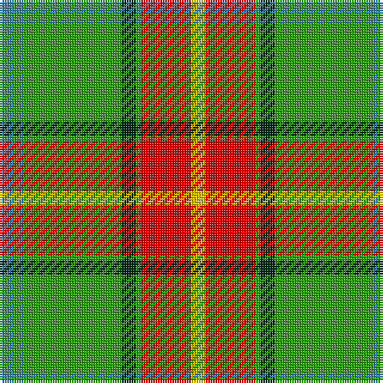

In pattern [BGBGGGRY](/patterns/bgbgggry/).

This was sourced from register-of-tartans.  It is a [8 stripes tartan](/stripes/stripes8/).

Original link https://www.tartanregister.gov.uk/tartanDetails.aspx?ref=2805

## Thread count
B/6 G2 B2 G41 DG6 G2 R21 Y/6

## Palette
Each colour and its ΔE from the base-6 reference it is a variant of.

| Colour | Shade | Base | ΔE (OKLab) |
|---|---|---|---|
| B | <code style="background-color:#3C82AF;">#3C82AF</code> `#3C82AF` | B <code style="background-color:#2A418A;">#2A418A</code> | 0.19 |
| DG | <code style="background-color:#002814;">#002814</code> `#002814` | G <code style="background-color:#006100;">#006100</code> | 0.20 |
| G | <code style="background-color:#309C18;">#309C18</code> `#309C18` | G <code style="background-color:#006100;">#006100</code> | 0.19 |
| R | <code style="background-color:#DC0000;">#DC0000</code> `#DC0000` | R <code style="background-color:#CC0000;">#CC0000</code> | 0.03 |
| Y | <code style="background-color:#E8C000;">#E8C000</code> `#E8C000` | Y <code style="background-color:#F2BF00;">#F2BF00</code> | 0.02 |

# Sample pattern

## Nearest tartans

The nearest existing variants by ΔTartan distance.

1. [Manitoba](/setts/s8/b6g2b2g41ga6g2r21y6-b5480b0-g30a010-ga003000-rc00000-yf0c000/) — ΔT 0.15
1. [Humphries (Name)](/setts/s8/g72r4w8k4w8r4ra24k8-g007800-k000000-r8c0000-ra8c6428-wc8c8c8/) — ΔT 1.13
1. [Manitoba](/setts/s8/b4g2b2g24r4g2ra12y4-b5480b0-g008000-rc00000-ra900030-yf0c000/) — ΔT 1.15
1. [Rattray](/setts/s9/g71k4r4b9r4b4r36b4w4-b304080-g008000-k000000-rc00000-we0e0e0/) — ΔT 1.17
1. [Canadian Caledonian](/setts/s10/b6g32y2r2w2r12g6r2g6w2-b304080-g008000-rc00000-we0e0e0-yf0c000/) — ΔT 1.30
1. [Fraser, Yellow](/setts/s7/r4w4y54g28y4b28y4-b304080-g008000-rc00000-we0e0e0-yf0c000/) — ΔT 1.31
1. [Manitoba](/setts/s8/b8g4b4g48ga8g4r24y8-b5480b0-g008000-ga003000-r802040-yf0c000/) — ΔT 1.34
1. [O'Neill](/setts/s8/w12g10r10g90k8ra48k8g10-g008000-k000000-rc00020-ra906030-we0e0e0/) — ΔT 1.36
1. [Dinwiddie Clan Tartan Tartan Number: 3212. Earliest known date: 2001 The registered tartan of the Dinwiddie Clan. Dinwiddies are normally associated with the Maxwells, but Lord Lyon stated, in 1988, that Dinwiddies were a sept of no other clan. See products available Copyright © Blair Urquhart, Comrie, 2015](/setts/s10/y8r4k4r84k26g50r12k4ra8k4-g289c18-k101010-r888888-rac8002c-ye8c000/) — ΔT 1.37
1. [Alberta District Tartan Tartan Number: 2055. Earliest known date: 1961 Designed for the Edmonton Rehabilitation Society as a project for handloom weaving by disabled students. The Provincial Legislative of Alberta gave formal approval for the Alberta tartan in 1961. See products available Copyright © Blair Urquhart, Comrie, 2015](/setts/s7/g24k2r2k2b4k2y8-b5c8ca8-g006818-k101010-rd05054-ye8c000/) — ΔT 1.38

## Neighbour map

Every grey dot is one of 15726 variants placed by the first two principal components of the ΔTartan feature space (44% of its variance). Red is this tartan; blue dots are its nearest — click one to open its page.

<svg viewBox="0 0 640 380" role="img" style="max-width:100%;height:auto;border:1px solid #e0e0e0;border-radius:4px;display:block" xmlns="http://www.w3.org/2000/svg"><image href="/nn/cloud.v1.png" width="640" height="380"/><a href="/setts/s8/b6g2b2g41ga6g2r21y6-b5480b0-g30a010-ga003000-rc00000-yf0c000/"><circle cx="287.2" cy="127.7" r="4" fill="#3465a4"><title>Manitoba</title></circle></a><a href="/setts/s8/g72r4w8k4w8r4ra24k8-g007800-k000000-r8c0000-ra8c6428-wc8c8c8/"><circle cx="286.0" cy="127.6" r="4" fill="#3465a4"><title>Humphries (Name)</title></circle></a><a href="/setts/s8/b4g2b2g24r4g2ra12y4-b5480b0-g008000-rc00000-ra900030-yf0c000/"><circle cx="266.2" cy="159.6" r="4" fill="#3465a4"><title>Manitoba</title></circle></a><a href="/setts/s9/g71k4r4b9r4b4r36b4w4-b304080-g008000-k000000-rc00000-we0e0e0/"><circle cx="294.5" cy="117.0" r="4" fill="#3465a4"><title>Rattray</title></circle></a><a href="/setts/s10/b6g32y2r2w2r12g6r2g6w2-b304080-g008000-rc00000-we0e0e0-yf0c000/"><circle cx="337.6" cy="132.2" r="4" fill="#3465a4"><title>Canadian Caledonian</title></circle></a><a href="/setts/s7/r4w4y54g28y4b28y4-b304080-g008000-rc00000-we0e0e0-yf0c000/"><circle cx="226.9" cy="144.7" r="4" fill="#3465a4"><title>Fraser, Yellow</title></circle></a><a href="/setts/s8/b8g4b4g48ga8g4r24y8-b5480b0-g008000-ga003000-r802040-yf0c000/"><circle cx="264.1" cy="164.2" r="4" fill="#3465a4"><title>Manitoba</title></circle></a><a href="/setts/s8/w12g10r10g90k8ra48k8g10-g008000-k000000-rc00020-ra906030-we0e0e0/"><circle cx="280.7" cy="157.8" r="4" fill="#3465a4"><title>O'Neill</title></circle></a><a href="/setts/s10/y8r4k4r84k26g50r12k4ra8k4-g289c18-k101010-r888888-rac8002c-ye8c000/"><circle cx="263.0" cy="113.5" r="4" fill="#3465a4"><title>Dinwiddie Clan Tartan Tartan Number: 3212. Earliest known date: 2001 The registered tartan of the Dinwiddie Clan. Dinwiddies are normally associated with the Maxwells, but Lord Lyon stated, in 1988, that Dinwiddies were a sept of no other clan. See products available Copyright © Blair Urquhart, Comrie, 2015</title></circle></a><a href="/setts/s7/g24k2r2k2b4k2y8-b5c8ca8-g006818-k101010-rd05054-ye8c000/"><circle cx="267.3" cy="154.1" r="4" fill="#3465a4"><title>Alberta District Tartan Tartan Number: 2055. Earliest known date: 1961 Designed for the Edmonton Rehabilitation Society as a project for handloom weaving by disabled students. The Provincial Legislative of Alberta gave formal approval for the Alberta tartan in 1961. See products available Copyright © Blair Urquhart, Comrie, 2015</title></circle></a><circle cx="286.3" cy="126.2" r="5" fill="#c00000"/></svg>

ID: /setts/s8/b6g2b2g41ga6g2r21y6-b3c82af-g309c18-ga002814-rdc0000-ye8c000/
