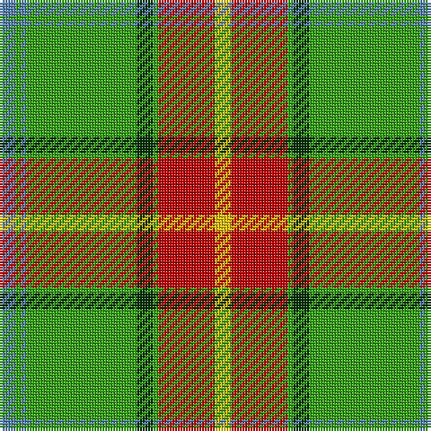

In pattern [BGBGGGRY](/patterns/bgbgggry/).

This was sourced from weddslist.  It is a [8 stripes tartan](/stripes/stripes8/).

Original link http://www.weddslist.com/cgi-bin/tartans/pg.pl?source=sts

## Thread count
B/6 G2 B2 G41 DG6 G2 R21 Y/6

## Palette
Each colour and its ΔE from the base-6 reference it is a variant of.

| Colour | Shade | Base | ΔE (OKLab) |
|---|---|---|---|
| B | <code style="background-color:#5480B0;">#5480B0</code> `#5480B0` | B <code style="background-color:#2A418A;">#2A418A</code> | 0.19 |
| DG | <code style="background-color:#003000;">#003000</code> `#003000` | G <code style="background-color:#006100;">#006100</code> | 0.17 |
| G | <code style="background-color:#30A010;">#30A010</code> `#30A010` | G <code style="background-color:#006100;">#006100</code> | 0.20 |
| R | <code style="background-color:#C00000;">#C00000</code> `#C00000` | R <code style="background-color:#CC0000;">#CC0000</code> | 0.03 |
| Y | <code style="background-color:#F0C000;">#F0C000</code> `#F0C000` | Y <code style="background-color:#F2BF00;">#F2BF00</code> | 0.00 |

# Sample pattern

## Nearest tartans

The nearest existing variants by ΔTartan distance.

1. [Manitoba](/setts/s8/b6g2b2g41ga6g2r21y6~b3c82af-g309c18-ga002814-rdc0000-ye8c000/) — ΔT 0.15
1. [Humphries (Name)](/setts/s8/g18r1w2k1w2r1ra6k2~g007800-k000000-r8c0000-ra8c6428-wc8c8c8~x4/) — ΔT 1.09
1. [Manitoba](/setts/s8/b2g1b1g12r2g1ra6y2~b5480b0-g008000-rc00000-ra900030-yf0c000~x2/) — ΔT 1.17
1. [Rattray](/setts/s9/g71k4r4b9r4b4r36b4w4~b304080-g008000-k000000-rc00000-we0e0e0/) — ΔT 1.23
1. [Canadian Caledonian](/setts/s10/b3g16y1r1w1r6g3r1g3w1~b304080-g008000-rc00000-we0e0e0-yf0c000~x2/) — ΔT 1.28
1. [Manitoba](/setts/s8/b2g1b1g12ga2g1r6y2~b5480b0-g008000-ga003000-r802040-yf0c000~x4/) — ΔT 1.31
1. [O'Neill](/setts/s8/w6g5r5g45k4ra24k4g5~g008000-k000000-rc00020-ra906030-we0e0e0~x2/) — ΔT 1.32
1. [Alberta District Tartan Tartan Number: 2055. Earliest known date: 1961 Designed for the Edmonton Rehabilitation Society as a project for handloom weaving by disabled students. The Provincial Legislative of Alberta gave formal approval for the Alberta tartan in 1961. See products available Copyright © Blair Urquhart, Comrie, 2015](/setts/s7/g12k1r1k1b2k1y4~b5c8ca8-g006818-k101010-rd05054-ye8c000~x2/) — ΔT 1.35
1. [Crieff, and Strathearn](/setts/s7/g55b7r24g12ba4y3ba4~b800080-ba304080-g008000-rc00000-yf0c000~x2/) — ΔT 1.38
1. [Gray, hunting](/setts/s11/k3w1g29ga8r2ga2r2ga2r8g7k2~g008000-ga808080-k000000-r900030-we0e0e0~x2/) — ΔT 1.39

## Neighbour map

Every grey dot is one of 15726 variants placed by the first two principal components of the ΔTartan feature space (44% of its variance). Red is this tartan; blue dots are its nearest — click one to open its page.

<svg viewBox="0 0 640 380" role="img" style="max-width:100%;height:auto;border:1px solid #e0e0e0;border-radius:4px;display:block" xmlns="http://www.w3.org/2000/svg"><image href="/nn/cloud.v1.png" width="640" height="380"/><a href="/setts/s8/b6g2b2g41ga6g2r21y6~b3c82af-g309c18-ga002814-rdc0000-ye8c000/"><circle cx="287.5" cy="127.0" r="4" fill="#3465a4"><title>Manitoba</title></circle></a><a href="/setts/s8/g18r1w2k1w2r1ra6k2~g007800-k000000-r8c0000-ra8c6428-wc8c8c8~x4/"><circle cx="287.3" cy="128.9" r="4" fill="#3465a4"><title>Humphries (Name)</title></circle></a><a href="/setts/s8/b2g1b1g12r2g1ra6y2~b5480b0-g008000-rc00000-ra900030-yf0c000~x2/"><circle cx="267.2" cy="159.9" r="4" fill="#3465a4"><title>Manitoba</title></circle></a><a href="/setts/s9/g71k4r4b9r4b4r36b4w4~b304080-g008000-k000000-rc00000-we0e0e0/"><circle cx="296.0" cy="118.2" r="4" fill="#3465a4"><title>Rattray</title></circle></a><a href="/setts/s10/b3g16y1r1w1r6g3r1g3w1~b304080-g008000-rc00000-we0e0e0-yf0c000~x2/"><circle cx="338.5" cy="133.7" r="4" fill="#3465a4"><title>Canadian Caledonian</title></circle></a><a href="/setts/s8/b2g1b1g12ga2g1r6y2~b5480b0-g008000-ga003000-r802040-yf0c000~x4/"><circle cx="265.1" cy="164.4" r="4" fill="#3465a4"><title>Manitoba</title></circle></a><a href="/setts/s8/w6g5r5g45k4ra24k4g5~g008000-k000000-rc00020-ra906030-we0e0e0~x2/"><circle cx="281.3" cy="159.0" r="4" fill="#3465a4"><title>O'Neill</title></circle></a><a href="/setts/s7/g12k1r1k1b2k1y4~b5c8ca8-g006818-k101010-rd05054-ye8c000~x2/"><circle cx="267.9" cy="155.4" r="4" fill="#3465a4"><title>Alberta District Tartan Tartan Number: 2055. Earliest known date: 1961 Designed for the Edmonton Rehabilitation Society as a project for handloom weaving by disabled students. The Provincial Legislative of Alberta gave formal approval for the Alberta tartan in 1961. See products available Copyright © Blair Urquhart, Comrie, 2015</title></circle></a><a href="/setts/s7/g55b7r24g12ba4y3ba4~b800080-ba304080-g008000-rc00000-yf0c000~x2/"><circle cx="357.2" cy="154.3" r="4" fill="#3465a4"><title>Crieff, and Strathearn</title></circle></a><a href="/setts/s11/k3w1g29ga8r2ga2r2ga2r8g7k2~g008000-ga808080-k000000-r900030-we0e0e0~x2/"><circle cx="310.3" cy="103.8" r="4" fill="#3465a4"><title>Gray, hunting</title></circle></a><circle cx="288.5" cy="128.4" r="5" fill="#c00000"/></svg>

ID: /setts/s8/b6g2b2g41ga6g2r21y6~b5480b0-g30a010-ga003000-rc00000-yf0c000/
