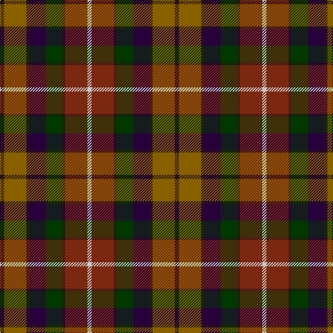

In pattern [BGBBGBRW](/patterns/bgbbgbrw/).

This was sourced from register-of-tartans.  It is a [8 stripes tartan](/stripes/stripes8/).

Original link https://www.tartanregister.gov.uk/tartanDetails.aspx?ref=4801

## Attestations

This cloth appears in 2 source records; the oldest owns this page.

- 01/01/2002 — YPO Dress (register-of-tartans, [record](https://www.tartanregister.gov.uk/tartanDetails.aspx?ref=4801))
- pre 2002 — Young Presidents Org. Dress (Corp.) (tartans-authority, [record](http://www.tartansauthority.com/tartan-ferret/display/4134/))

## Thread count
K/6 T32 K4 DP24 G24 K4 Ta32 N/6

## Palette
Each colour and its ΔE from the base-6 reference it is a variant of.

| Colour | Shade | Base | ΔE (OKLab) |
|---|---|---|---|
| DP | <code style="background-color:#28003C;">#28003C</code> `#28003C` | B <code style="background-color:#2C4084;">#2C4084</code> | 0.20 |
| G | <code style="background-color:#003800;">#003800</code> `#003800` | G <code style="background-color:#006400;">#006400</code> | 0.15 |
| K | <code style="background-color:#281414;">#281414</code> `#281414` | B <code style="background-color:#2C4084;">#2C4084</code> | 0.22 |
| N | <code style="background-color:#C8C8C8;">#C8C8C8</code> `#C8C8C8` | W <code style="background-color:#F4F4F0;">#F4F4F0</code> | 0.13 |
| T | <code style="background-color:#886000;">#886000</code> `#886000` | G <code style="background-color:#006400;">#006400</code> | 0.16 |
| Ta | <code style="background-color:#7C2810;">#7C2810</code> `#7C2810` | R <code style="background-color:#C80000;">#C80000</code> | 0.15 |

# Sample pattern

## Nearest tartans

The nearest existing variants by ΔTartan distance.

1. [Falardeau-Murphy (Canada) (Personal)](/setts/s7/g42b42y6r42ba6bb10ba6-b5f749c-ba14283c-bb5a008c-g004c00-r960028-yffe600/) — ΔT 1.16
1. [Dutch Friendship (Fashion)](/setts/s10/b6k2g28ga28k28r28gb18r8gb28k6-b80507c-g5c6428-ga707454-gb604000-k00002c-rb46800/) — ΔT 1.25
1. [Glen Chalmadale](/setts/s9/g26w4g20k10r26k6r10b30ra10-b003c64-g006818-k101010-rc80000-ra843c50-we0e0e0/) — ΔT 1.31
1. [Bracken (WCWM)](/setts/s11/g60k12g12r12y12ra28k8ra6b28k12b32-b5c5c5c-g603800-k101010-rc80000-raa07c58-ydc943c/) — ΔT 1.32
1. [Meath, County](/setts/s12/y10b4r28ba18g16b6r6b6r6b6g36ya6-b303070-ba4c3428-g003820-ra00000-ybc8c00-yac4b888/) — ΔT 1.34
1. [Falardeau-Murphy (Canada) (Personal)](/setts/s7/g42b42y6r42ba6bb10ba6-b5c8ca8-ba5c5c5c-bb780078-g006818-ra00000-yfccc00/) — ΔT 1.35
1. [Mekos, The](/setts/s6/b38g46y6ba30r22w10-b441800-ba202060-g005448-r960028-wf8f4d0-yc88c00/) — ΔT 1.40
1. [Caledonian (WCWM)](/setts/s11/r8w4r12k4r12b32y4k24ra20k4ra2-b4c3428-k101010-r880000-ra888888-wc0c0c0-ybc8c00/) — ΔT 1.42
1. [Cuthill (Personal)](/setts/s13/b6g8r4g6r6g32ba32ra32b6ra6b4ra8y6-b2c2c80-ba003c64-g006818-rc80000-ra880000-ye8c000/) — ΔT 1.44
1. [Bonnie Brae](/setts/s11/r6b3g3ra26b20ga26rb3ga4rb3ga4rb6-b000050-g908000-ga003000-r900030-ra800000-rb906030/) — ΔT 1.44

## Neighbour map

Every grey dot is one of 15726 variants placed by the first two principal components of the ΔTartan feature space (44% of its variance). Red is this tartan; blue dots are its nearest — click one to open its page.

<svg viewBox="0 0 640 380" role="img" style="max-width:100%;height:auto;border:1px solid #e0e0e0;border-radius:4px;display:block" xmlns="http://www.w3.org/2000/svg"><image href="/nn/cloud.v1.png" width="640" height="380"/><a href="/setts/s7/g42b42y6r42ba6bb10ba6-b5f749c-ba14283c-bb5a008c-g004c00-r960028-yffe600/"><circle cx="101.0" cy="188.6" r="4" fill="#3465a4"><title>Falardeau-Murphy (Canada) (Personal)</title></circle></a><a href="/setts/s10/b6k2g28ga28k28r28gb18r8gb28k6-b80507c-g5c6428-ga707454-gb604000-k00002c-rb46800/"><circle cx="88.2" cy="173.8" r="4" fill="#3465a4"><title>Dutch Friendship (Fashion)</title></circle></a><a href="/setts/s9/g26w4g20k10r26k6r10b30ra10-b003c64-g006818-k101010-rc80000-ra843c50-we0e0e0/"><circle cx="87.8" cy="194.7" r="4" fill="#3465a4"><title>Glen Chalmadale</title></circle></a><a href="/setts/s11/g60k12g12r12y12ra28k8ra6b28k12b32-b5c5c5c-g603800-k101010-rc80000-raa07c58-ydc943c/"><circle cx="145.5" cy="172.3" r="4" fill="#3465a4"><title>Bracken (WCWM)</title></circle></a><a href="/setts/s12/y10b4r28ba18g16b6r6b6r6b6g36ya6-b303070-ba4c3428-g003820-ra00000-ybc8c00-yac4b888/"><circle cx="146.4" cy="165.9" r="4" fill="#3465a4"><title>Meath, County</title></circle></a><a href="/setts/s7/g42b42y6r42ba6bb10ba6-b5c8ca8-ba5c5c5c-bb780078-g006818-ra00000-yfccc00/"><circle cx="108.5" cy="190.2" r="4" fill="#3465a4"><title>Falardeau-Murphy (Canada) (Personal)</title></circle></a><a href="/setts/s6/b38g46y6ba30r22w10-b441800-ba202060-g005448-r960028-wf8f4d0-yc88c00/"><circle cx="83.2" cy="214.3" r="4" fill="#3465a4"><title>Mekos, The</title></circle></a><a href="/setts/s11/r8w4r12k4r12b32y4k24ra20k4ra2-b4c3428-k101010-r880000-ra888888-wc0c0c0-ybc8c00/"><circle cx="120.5" cy="137.8" r="4" fill="#3465a4"><title>Caledonian (WCWM)</title></circle></a><a href="/setts/s13/b6g8r4g6r6g32ba32ra32b6ra6b4ra8y6-b2c2c80-ba003c64-g006818-rc80000-ra880000-ye8c000/"><circle cx="120.6" cy="154.2" r="4" fill="#3465a4"><title>Cuthill (Personal)</title></circle></a><a href="/setts/s11/r6b3g3ra26b20ga26rb3ga4rb3ga4rb6-b000050-g908000-ga003000-r900030-ra800000-rb906030/"><circle cx="149.1" cy="161.3" r="4" fill="#3465a4"><title>Bonnie Brae</title></circle></a><circle cx="87.4" cy="190.6" r="5" fill="#c00000"/></svg>

ID: /setts/s8/b6g32b4ba24ga24b4r32w6-b281414-ba28003c-g886000-ga003800-r7c2810-wc8c8c8/
