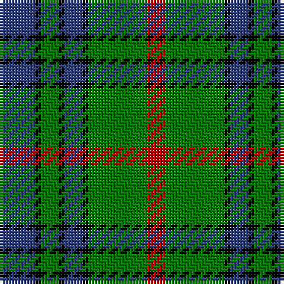

In pattern [BKGKBKGR](/patterns/bkgkbkgr/).

This was sourced from weddslist.  It is a [8 stripes tartan](/stripes/stripes8/).

Original link http://www.weddslist.com/cgi-bin/tartans/pg.pl?source=sts

## Thread count
B/12 K2 G6 K2 B6 K2 G20 R/6

## Palette
Each colour and its ΔE from the base-6 reference it is a variant of.

| Colour | Shade | Base | ΔE (OKLab) |
|---|---|---|---|
| B | <code style="background-color:#304080;">#304080</code> `#304080` | B <code style="background-color:#2A418A;">#2A418A</code> | 0.02 |
| G | <code style="background-color:#008000;">#008000</code> `#008000` | G <code style="background-color:#006100;">#006100</code> | 0.10 |
| K | <code style="background-color:#000000;">#000000</code> `#000000` | K <code style="background-color:#000000;">#000000</code> | 0.00 |
| R | <code style="background-color:#C00000;">#C00000</code> `#C00000` | R <code style="background-color:#CC0000;">#CC0000</code> | 0.03 |

# Sample pattern

## Nearest tartans

The nearest existing variants by ΔTartan distance.

1. [Kerry County, Crest Range](/setts/s10/r14b5g25b5w2g11b7w5g6r5x2~b080848-g005020-rc87814-we0e0e0/) — ΔT 0.81
1. [Crantock Trade Tartan Tartan Number: 707. Earliest known date: pre 2003 'Poached by Clan Laird from a Yorkshire mill and marketed as 'Crantock''(sic) (Scottish Tartans Society archives.) See products available Copyright © Blair Urquhart, Comrie, 2015](/setts/s8/g24b3g3b3g3b7ga20r3x2~b780078-g289c18-ga003820-rc80000/) — ΔT 0.86
1. [Tweedside Hunting District Tartan Tartan Number: 163. Earliest known date: 20th Century A variation of Wilson's design. There is no record of this sett in any of the old collections which points to dating it in this century. It is the most popular of Tweedside district tartans. See products available Copyright © Blair Urquhart, Comrie, 2015](/setts/s9/b21g5k5g15w3g5w3g5k3x2~b2c2c80-g006818-k101010-we0e0e0/) — ΔT 0.90
1. [John Telfar, Dunbar hunting](/setts/s7/g5k2g28k10r26b4g4x2~b304080-g008000-k000000-r806050/) — ΔT 0.94
1. [Tweedside, hunting](/setts/s9/b21g5k5g15w3g5w3g5k3x2~b304080-g008000-k000000-we0e0e0/) — ΔT 0.95
1. [U.S. Border Patrol](/setts/s8/k10b10k15g40k15b10k10y3x2~b1474b4-g408060-k101010-ye8c000/) — ΔT 0.95
1. [Crantock](/setts/s8/g24b3g3b3g3b7ga20r3x2~b800080-g30a010-ga003000-rc00000/) — ΔT 0.98
1. [Cameron of Lochiel (Hunting)](/setts/s7/r3g10r3g14b16g3y2x2~b1c0070-g006818-rc80000-ye8c000/) — ΔT 0.98
1. [Brunton (Personal)](/setts/s8/k7r3k27g27y3g3y3g3x2~g007c48-k101010-rc80000-yc4bc68/) — ΔT 1.00
1. [Trafalger](/setts/s6/g3b1g8b7k3y1x2~b304080-g008000-k000000-yf0c000/) — ΔT 1.00

## Neighbour map

Every grey dot is one of 15726 variants placed by the first two principal components of the ΔTartan feature space (44% of its variance). Red is this tartan; blue dots are its nearest — click one to open its page.

<svg viewBox="0 0 640 380" role="img" style="max-width:100%;height:auto;border:1px solid #e0e0e0;border-radius:4px;display:block" xmlns="http://www.w3.org/2000/svg"><image href="/nn/cloud.v1.png" width="640" height="380"/><a href="/setts/s10/r14b5g25b5w2g11b7w5g6r5x2~b080848-g005020-rc87814-we0e0e0/"><circle cx="223.0" cy="184.7" r="4" fill="#3465a4"><title>Kerry County, Crest Range</title></circle></a><a href="/setts/s8/g24b3g3b3g3b7ga20r3x2~b780078-g289c18-ga003820-rc80000/"><circle cx="224.7" cy="195.3" r="4" fill="#3465a4"><title>Crantock Trade Tartan Tartan Number: 707. Earliest known date: pre 2003 'Poached by Clan Laird from a Yorkshire mill and marketed as 'Crantock''(sic) (Scottish Tartans Society archives.) See products available Copyright © Blair Urquhart, Comrie, 2015</title></circle></a><a href="/setts/s9/b21g5k5g15w3g5w3g5k3x2~b2c2c80-g006818-k101010-we0e0e0/"><circle cx="204.9" cy="209.7" r="4" fill="#3465a4"><title>Tweedside Hunting District Tartan Tartan Number: 163. Earliest known date: 20th Century A variation of Wilson's design. There is no record of this sett in any of the old collections which points to dating it in this century. It is the most popular of Tweedside district tartans. See products available Copyright © Blair Urquhart, Comrie, 2015</title></circle></a><a href="/setts/s7/g5k2g28k10r26b4g4x2~b304080-g008000-k000000-r806050/"><circle cx="250.7" cy="190.2" r="4" fill="#3465a4"><title>John Telfar, Dunbar hunting</title></circle></a><a href="/setts/s9/b21g5k5g15w3g5w3g5k3x2~b304080-g008000-k000000-we0e0e0/"><circle cx="185.3" cy="202.6" r="4" fill="#3465a4"><title>Tweedside, hunting</title></circle></a><a href="/setts/s8/k10b10k15g40k15b10k10y3x2~b1474b4-g408060-k101010-ye8c000/"><circle cx="225.2" cy="202.5" r="4" fill="#3465a4"><title>U.S. Border Patrol</title></circle></a><a href="/setts/s8/g24b3g3b3g3b7ga20r3x2~b800080-g30a010-ga003000-rc00000/"><circle cx="217.0" cy="192.1" r="4" fill="#3465a4"><title>Crantock</title></circle></a><a href="/setts/s7/r3g10r3g14b16g3y2x2~b1c0070-g006818-rc80000-ye8c000/"><circle cx="257.2" cy="225.1" r="4" fill="#3465a4"><title>Cameron of Lochiel (Hunting)</title></circle></a><a href="/setts/s8/k7r3k27g27y3g3y3g3x2~g007c48-k101010-rc80000-yc4bc68/"><circle cx="249.0" cy="189.0" r="4" fill="#3465a4"><title>Brunton (Personal)</title></circle></a><a href="/setts/s6/g3b1g8b7k3y1x2~b304080-g008000-k000000-yf0c000/"><circle cx="213.7" cy="232.3" r="4" fill="#3465a4"><title>Trafalger</title></circle></a><circle cx="222.0" cy="200.4" r="5" fill="#c00000"/></svg>

ID: /setts/s8/b6k1g3k1b3k1g10r3x2~b304080-g008000-k000000-rc00000/
