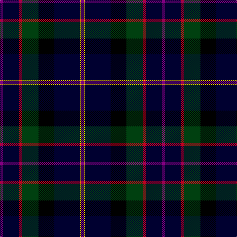

In pattern [BKRGKKYB](/patterns/bkrgkkyb/).

This was sourced from weddslist.  It is a [8 stripes tartan](/stripes/stripes8/).

Original link http://www.weddslist.com/cgi-bin/tartans/pg.pl?source=sts

## Thread count
P/6 DB32 R6 DG34 K32 DB52 Y2 P/6

## Palette
Each colour and its ΔE from the base-6 reference it is a variant of.

| Colour | Shade | Base | ΔE (OKLab) |
|---|---|---|---|
| DB | <code style="background-color:#000030;">#000030</code> `#000030` | K <code style="background-color:#000000;">#000000</code> | 0.17 |
| DG | <code style="background-color:#004010;">#004010</code> `#004010` | G <code style="background-color:#006100;">#006100</code> | 0.11 |
| K | <code style="background-color:#000000;">#000000</code> `#000000` | K <code style="background-color:#000000;">#000000</code> | 0.00 |
| P | <code style="background-color:#800080;">#800080</code> `#800080` | B <code style="background-color:#2A418A;">#2A418A</code> | 0.17 |
| R | <code style="background-color:#C00020;">#C00020</code> `#C00020` | R <code style="background-color:#CC0000;">#CC0000</code> | 0.03 |
| Y | <code style="background-color:#F0C000;">#F0C000</code> `#F0C000` | Y <code style="background-color:#F2BF00;">#F2BF00</code> | 0.00 |

# Sample pattern

## Nearest tartans

The nearest existing variants by ΔTartan distance.

1. [Fergusson](/setts/s7/b48k16g16r4g16k2y4-b000052-g11450d-k000000-raa0000-yaaaaaa/) — ΔT 1.25
1. [Fergusson](/setts/s7/b24k8g8r2g8k1y2-b000052-g11450d-k000000-raa0000-yaaaaaa/) — ΔT 1.25
1. [MacLaren](/setts/s7/b48k16g16r4g16k2y4-b000052-g11450d-k000000-raa0000-yaaaa00/) — ΔT 1.27
1. [MacLaren](/setts/s7/b24k8g8r2g8k1y2-b000052-g11450d-k000000-raa0000-yaaaa00/) — ΔT 1.27
1. [National Wedding (Fashion)](/setts/s9/g44y4g8b6g8k40ba40k2w6-b64008c-ba000064-g003014-k000000-wc8c8c8-yc48800/) — ΔT 1.36
1. [Faber (2015)](/setts/s7/k20b8ba50w2g26ba26r6-b780078-ba1c0070-g285800-k101010-rd40000-we0e0e0/) — ΔT 1.43
1. [National Wedding](/setts/s9/g44y4g8b6g8k40ba40k2w6-b64008c-ba000080-g003014-k000000-wc8c8c8-yc48800/) — ΔT 1.44
1. [Chesters, Eric (Personal)](/setts/s7/k24g16y2ga26w2b62k16-b000064-g006818-ga003c14-k101010-w98c8e8-yfccc00/) — ΔT 1.46
1. [Fergusson](/setts/s7/b24k8g8r2g8k1w2-b00004c-g004c00-k000000-rc80000-wd0d0d0/) — ΔT 1.47
1. [Colqhoun VS](/setts/s7/b8k4b32y2k16g48r8-b000052-g11450d-k000000-raa0000-yaaaaaa/) — ΔT 1.48

## Neighbour map

Every grey dot is one of 15726 variants placed by the first two principal components of the ΔTartan feature space (44% of its variance). Red is this tartan; blue dots are its nearest — click one to open its page.

<svg viewBox="0 0 640 380" role="img" style="max-width:100%;height:auto;border:1px solid #e0e0e0;border-radius:4px;display:block" xmlns="http://www.w3.org/2000/svg"><image href="/nn/cloud.v1.png" width="640" height="380"/><a href="/setts/s7/b48k16g16r4g16k2y4-b000052-g11450d-k000000-raa0000-yaaaaaa/"><circle cx="262.5" cy="164.4" r="4" fill="#3465a4"><title>Fergusson</title></circle></a><a href="/setts/s7/b24k8g8r2g8k1y2-b000052-g11450d-k000000-raa0000-yaaaaaa/"><circle cx="262.5" cy="164.4" r="4" fill="#3465a4"><title>Fergusson</title></circle></a><a href="/setts/s7/b48k16g16r4g16k2y4-b000052-g11450d-k000000-raa0000-yaaaa00/"><circle cx="261.9" cy="164.3" r="4" fill="#3465a4"><title>MacLaren</title></circle></a><a href="/setts/s7/b24k8g8r2g8k1y2-b000052-g11450d-k000000-raa0000-yaaaa00/"><circle cx="261.9" cy="164.3" r="4" fill="#3465a4"><title>MacLaren</title></circle></a><a href="/setts/s9/g44y4g8b6g8k40ba40k2w6-b64008c-ba000064-g003014-k000000-wc8c8c8-yc48800/"><circle cx="188.3" cy="137.0" r="4" fill="#3465a4"><title>National Wedding (Fashion)</title></circle></a><a href="/setts/s7/k20b8ba50w2g26ba26r6-b780078-ba1c0070-g285800-k101010-rd40000-we0e0e0/"><circle cx="291.4" cy="163.2" r="4" fill="#3465a4"><title>Faber (2015)</title></circle></a><a href="/setts/s9/g44y4g8b6g8k40ba40k2w6-b64008c-ba000080-g003014-k000000-wc8c8c8-yc48800/"><circle cx="183.3" cy="134.6" r="4" fill="#3465a4"><title>National Wedding</title></circle></a><a href="/setts/s7/k24g16y2ga26w2b62k16-b000064-g006818-ga003c14-k101010-w98c8e8-yfccc00/"><circle cx="247.2" cy="156.7" r="4" fill="#3465a4"><title>Chesters, Eric (Personal)</title></circle></a><a href="/setts/s7/b24k8g8r2g8k1w2-b00004c-g004c00-k000000-rc80000-wd0d0d0/"><circle cx="248.7" cy="158.4" r="4" fill="#3465a4"><title>Fergusson</title></circle></a><a href="/setts/s7/b8k4b32y2k16g48r8-b000052-g11450d-k000000-raa0000-yaaaaaa/"><circle cx="243.2" cy="166.2" r="4" fill="#3465a4"><title>Colqhoun VS</title></circle></a><circle cx="258.1" cy="156.3" r="5" fill="#c00000"/></svg>

ID: /setts/s8/b6k32r6g34ka32k52y2b6-b800080-g004010-k000030-ka000000-rc00020-yf0c000/
