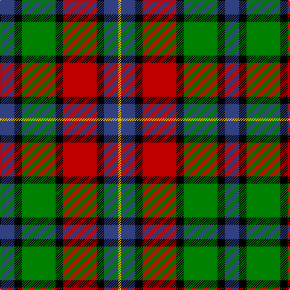

In pattern [BKGKRKBY](/patterns/bkgkrkby/).

This was sourced from weddslist.  It is a [8 stripes tartan](/stripes/stripes8/).

Original link http://www.weddslist.com/cgi-bin/tartans/pg.pl?source=sts

## Thread count
B/24 K12 G56 K12 R56 K12 B24 Y/4

## Palette
Each colour and its ΔE from the base-6 reference it is a variant of.

| Colour | Shade | Base | ΔE (OKLab) |
|---|---|---|---|
| B | <code style="background-color:#304080;">#304080</code> `#304080` | B <code style="background-color:#2A418A;">#2A418A</code> | 0.02 |
| G | <code style="background-color:#008000;">#008000</code> `#008000` | G <code style="background-color:#006100;">#006100</code> | 0.10 |
| K | <code style="background-color:#000000;">#000000</code> `#000000` | K <code style="background-color:#000000;">#000000</code> | 0.00 |
| R | <code style="background-color:#C00000;">#C00000</code> `#C00000` | R <code style="background-color:#CC0000;">#CC0000</code> | 0.03 |
| Y | <code style="background-color:#F0C000;">#F0C000</code> `#F0C000` | Y <code style="background-color:#F2BF00;">#F2BF00</code> | 0.00 |

# Sample pattern

## Nearest tartans

The nearest existing variants by ΔTartan distance.

1. [Kilgour (Asymmetrical)](/setts/s8/b6k3r14k3g14k3b6y1x4~b2c2c80-g006818-k101010-rc80000-ye8c000/) — ΔT 0.86
1. [Kilgour (Cant)](/setts/s8/b6y1b6k3r14k3g14k3x4~b2c2c80-g006818-k101010-rc80000-ye8c000/) — ΔT 0.86
1. [Kilgour (Symmetrical)](/setts/s8/b6k3g14k3r14k3b6y1x4~b2c2c80-g006818-k101010-rc80000-ye8c000/) — ΔT 0.86
1. [Unidentified 25](/setts/s10/r4g7y3g12k16b5r20b5k4b2x2~b5480b0-g008000-k000000-rc00000-yf0c000/) — ΔT 0.86
1. [Sir George, Etienne-Cartier](/setts/s10/r4g6y3g12k14b5r20b5k4b2x2~b304080-g008000-k000000-rc00000-yf0c000/) — ΔT 0.88
1. [Unnamed 2](/setts/s9/r5b1r5g13b8ba5r5w1b3x2~b000050-ba5480b0-g30a010-rc00000-we0e0e0/) — ΔT 0.89
1. [Cumming LO](/setts/s9/r4w1r4g10y1k10w4k2w4~g004c00-k000000-rc80000-wd0d0d0-yffc800/) — ΔT 0.93
1. [Unidentified #9](/setts/s10/r4g7y3g12k16b5r20b5k4b2x2~b3c82af-g005020-k101010-rdc0000-ye8c000/) — ΔT 0.95
1. [Unidentified #27](/setts/s9/r5b1r5g13b8ba5r5w1b3x2~b080848-ba3c82af-g309c18-rdc0000-we0e0e0/) — ΔT 0.98
1. [Unidentified Canadian Tartan Tartan Number: 276. Earliest known date: 1978 This is a duplicate of 277 using ancient azure blue. See products available Copyright © Blair Urquhart, Comrie, 2015](/setts/s10/r4g7y3g12k16b5r20b5k4b2x2~b5c8ca8-g006818-k101010-rc80000-ye8c000/) — ΔT 0.98

## Neighbour map

Every grey dot is one of 15726 variants placed by the first two principal components of the ΔTartan feature space (44% of its variance). Red is this tartan; blue dots are its nearest — click one to open its page.

<svg viewBox="0 0 640 380" role="img" style="max-width:100%;height:auto;border:1px solid #e0e0e0;border-radius:4px;display:block" xmlns="http://www.w3.org/2000/svg"><image href="/nn/cloud.v1.png" width="640" height="380"/><a href="/setts/s8/b6k3r14k3g14k3b6y1x4~b2c2c80-g006818-k101010-rc80000-ye8c000/"><circle cx="134.4" cy="171.3" r="4" fill="#3465a4"><title>Kilgour (Asymmetrical)</title></circle></a><a href="/setts/s8/b6y1b6k3r14k3g14k3x4~b2c2c80-g006818-k101010-rc80000-ye8c000/"><circle cx="134.4" cy="171.3" r="4" fill="#3465a4"><title>Kilgour (Cant)</title></circle></a><a href="/setts/s8/b6k3g14k3r14k3b6y1x4~b2c2c80-g006818-k101010-rc80000-ye8c000/"><circle cx="134.4" cy="171.3" r="4" fill="#3465a4"><title>Kilgour (Symmetrical)</title></circle></a><a href="/setts/s10/r4g7y3g12k16b5r20b5k4b2x2~b5480b0-g008000-k000000-rc00000-yf0c000/"><circle cx="91.7" cy="161.9" r="4" fill="#3465a4"><title>Unidentified 25</title></circle></a><a href="/setts/s10/r4g6y3g12k14b5r20b5k4b2x2~b304080-g008000-k000000-rc00000-yf0c000/"><circle cx="100.2" cy="164.0" r="4" fill="#3465a4"><title>Sir George, Etienne-Cartier</title></circle></a><a href="/setts/s9/r5b1r5g13b8ba5r5w1b3x2~b000050-ba5480b0-g30a010-rc00000-we0e0e0/"><circle cx="116.8" cy="165.4" r="4" fill="#3465a4"><title>Unnamed 2</title></circle></a><a href="/setts/s9/r4w1r4g10y1k10w4k2w4~g004c00-k000000-rc80000-wd0d0d0-yffc800/"><circle cx="77.8" cy="165.0" r="4" fill="#3465a4"><title>Cumming LO</title></circle></a><a href="/setts/s10/r4g7y3g12k16b5r20b5k4b2x2~b3c82af-g005020-k101010-rdc0000-ye8c000/"><circle cx="112.2" cy="167.0" r="4" fill="#3465a4"><title>Unidentified #9</title></circle></a><a href="/setts/s9/r5b1r5g13b8ba5r5w1b3x2~b080848-ba3c82af-g309c18-rdc0000-we0e0e0/"><circle cx="117.5" cy="163.3" r="4" fill="#3465a4"><title>Unidentified #27</title></circle></a><a href="/setts/s10/r4g7y3g12k16b5r20b5k4b2x2~b5c8ca8-g006818-k101010-rc80000-ye8c000/"><circle cx="113.5" cy="168.0" r="4" fill="#3465a4"><title>Unidentified Canadian Tartan Tartan Number: 276. Earliest known date: 1978 This is a duplicate of 277 using ancient azure blue. See products available Copyright © Blair Urquhart, Comrie, 2015</title></circle></a><circle cx="110.9" cy="163.6" r="5" fill="#c00000"/></svg>

ID: /setts/s8/b6k3g14k3r14k3b6y1x4~b304080-g008000-k000000-rc00000-yf0c000/
