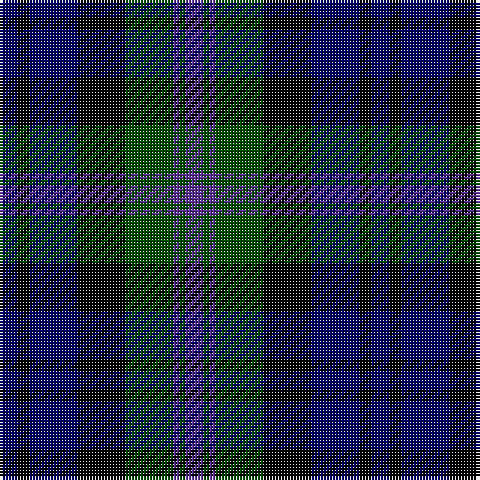

In pattern [BGBGKBKB](/patterns/bgbgkbkb/).

This was sourced from weddslist.  It is a [8 stripes tartan](/stripes/stripes8/).

Original link http://www.weddslist.com/cgi-bin/tartans/pg.pl?source=rb

## Thread count
DB/6 K4 DB16 K16 G16 P2 G2 P/6

## Palette
Each colour and its ΔE from the base-6 reference it is a variant of.

| Colour | Shade | Base | ΔE (OKLab) |
|---|---|---|---|
| DB | <code style="background-color:#000064;">#000064</code> `#000064` | B <code style="background-color:#2C4084;">#2C4084</code> | 0.17 |
| G | <code style="background-color:#004C00;">#004C00</code> `#004C00` | G <code style="background-color:#006400;">#006400</code> | 0.08 |
| K | <code style="background-color:#000000;">#000000</code> `#000000` | K <code style="background-color:#000000;">#000000</code> | 0.00 |
| P | <code style="background-color:#5A3094;">#5A3094</code> `#5A3094` | B <code style="background-color:#2C4084;">#2C4084</code> | 0.08 |

# Sample pattern

ID: /setts/s8/b6k4b16k16g16ba2g2ba6-b000064-ba5a3094-g004c00-k000000/
