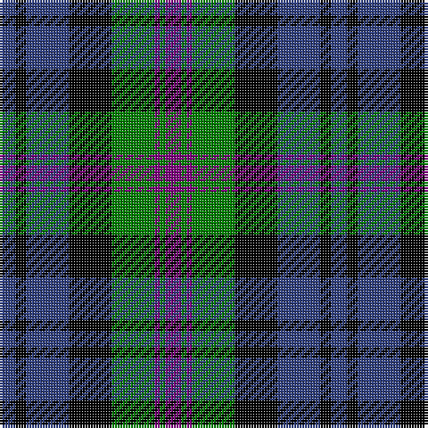

In pattern [BGBGKBKB](/patterns/bgbgkbkb/).

This was sourced from weddslist.  It is a [8 stripes tartan](/stripes/stripes8/).

Original link http://www.weddslist.com/cgi-bin/tartans/pg.pl?source=sts

## Thread count
B/6 K4 B16 K16 G16 P2 G2 P/6

## Palette
Each colour and its ΔE from the base-6 reference it is a variant of.

| Colour | Shade | Base | ΔE (OKLab) |
|---|---|---|---|
| B | <code style="background-color:#304080;">#304080</code> `#304080` | B <code style="background-color:#2C4084;">#2C4084</code> | 0.01 |
| G | <code style="background-color:#008000;">#008000</code> `#008000` | G <code style="background-color:#006400;">#006400</code> | 0.09 |
| K | <code style="background-color:#000000;">#000000</code> `#000000` | K <code style="background-color:#000000;">#000000</code> | 0.00 |
| P | <code style="background-color:#800080;">#800080</code> `#800080` | B <code style="background-color:#2C4084;">#2C4084</code> | 0.17 |

# Sample pattern

## Nearest tartans

The nearest existing variants by ΔTartan distance.

1. [Alexander, hunting](/setts/s9/b24r4b8r8k30b8g8b4g24-b304080-g008000-k000000-rc00000/) — ΔT 0.64
1. [Fletcher of Dunans](/setts/s7/b12k2b12k16r2g16r4-b304080-g008000-k000000-rc00000/) — ΔT 0.65
1. [Fletcher](/setts/s7/b12k2b12k16r2g16k4-b304080-g008000-k000000-rc00000/) — ΔT 0.79
1. [Gordon of Esslemont](/setts/s7/y12g6y6g44k46b46k8-b5a008c-g005020-k101010-ye8c000/) — ΔT 0.80
1. [Unnamed, No 115](/setts/s8/b20k12ba2g12k2g12ba2k12-b304080-ba5480b0-g008000-k000000/) — ΔT 0.92
1. [Reid Taylor, "House Check"](/setts/s7/b4k2r2b18k18g20k4-b304080-g008000-k000000-rc00000/) — ΔT 0.93
1. [Brabender](/setts/s8/g6b42k6b6k24r6g24k6-b304080-g008000-k000000-rc00000/) — ΔT 0.93
1. [MacCorquodale](/setts/s7/r14k8b56k48ba48k8b8-b304080-ba5480b0-k000000-rc00000/) — ΔT 0.96
1. [Forbes](/setts/s9/b16k4b4k4b4k16g14k2w2-b304080-g008000-k000000-we0e0e0/) — ΔT 0.98
1. [Louisiana](/setts/s8/k6g6w4g22k24b36k4w6-b00008c-g007800-k000000-wc8c8c8/) — ΔT 0.98

## Neighbour map

Every grey dot is one of 15726 variants placed by the first two principal components of the ΔTartan feature space (44% of its variance). Red is this tartan; blue dots are its nearest — click one to open its page.

<svg viewBox="0 0 640 380" role="img" style="max-width:100%;height:auto;border:1px solid #e0e0e0;border-radius:4px;display:block" xmlns="http://www.w3.org/2000/svg"><image href="/nn/cloud.v1.png" width="640" height="380"/><a href="/setts/s9/b24r4b8r8k30b8g8b4g24-b304080-g008000-k000000-rc00000/"><circle cx="141.9" cy="210.0" r="4" fill="#3465a4"><title>Alexander, hunting</title></circle></a><a href="/setts/s7/b12k2b12k16r2g16r4-b304080-g008000-k000000-rc00000/"><circle cx="144.1" cy="226.6" r="4" fill="#3465a4"><title>Fletcher of Dunans</title></circle></a><a href="/setts/s7/b12k2b12k16r2g16k4-b304080-g008000-k000000-rc00000/"><circle cx="154.8" cy="230.8" r="4" fill="#3465a4"><title>Fletcher</title></circle></a><a href="/setts/s7/y12g6y6g44k46b46k8-b5a008c-g005020-k101010-ye8c000/"><circle cx="145.2" cy="215.4" r="4" fill="#3465a4"><title>Gordon of Esslemont</title></circle></a><a href="/setts/s8/b20k12ba2g12k2g12ba2k12-b304080-ba5480b0-g008000-k000000/"><circle cx="142.4" cy="213.3" r="4" fill="#3465a4"><title>Unnamed, No 115</title></circle></a><a href="/setts/s7/b4k2r2b18k18g20k4-b304080-g008000-k000000-rc00000/"><circle cx="166.1" cy="206.3" r="4" fill="#3465a4"><title>Reid Taylor, &quot;House Check&quot;</title></circle></a><a href="/setts/s8/g6b42k6b6k24r6g24k6-b304080-g008000-k000000-rc00000/"><circle cx="172.0" cy="209.0" r="4" fill="#3465a4"><title>Brabender</title></circle></a><a href="/setts/s7/r14k8b56k48ba48k8b8-b304080-ba5480b0-k000000-rc00000/"><circle cx="140.4" cy="218.0" r="4" fill="#3465a4"><title>MacCorquodale</title></circle></a><a href="/setts/s9/b16k4b4k4b4k16g14k2w2-b304080-g008000-k000000-we0e0e0/"><circle cx="167.4" cy="205.2" r="4" fill="#3465a4"><title>Forbes</title></circle></a><a href="/setts/s8/k6g6w4g22k24b36k4w6-b00008c-g007800-k000000-wc8c8c8/"><circle cx="132.4" cy="197.1" r="4" fill="#3465a4"><title>Louisiana</title></circle></a><circle cx="125.6" cy="215.2" r="5" fill="#c00000"/></svg>

ID: /setts/s8/b6k4b16k16g16ba2g2ba6-b304080-ba800080-g008000-k000000/
