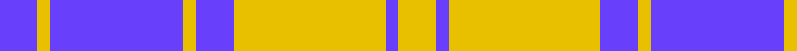

**Bands:** [BYBYBYBY](/stripes/bybybyby/) · **Stripes:** [B LY B LY B LY B LY](/stripes/stripes8/) B LY B LY B LY B LY

This was sourced from register-of-tartans.  It is a [8 band tartan](/bands/bands8/).

Original link https://www.tartanregister.gov.uk/tartanDetails.aspx?ref=2586

## Register references

External register numbers recorded for this tartan.

- Scottish Register of Tartans: [2586](https://www.tartanregister.gov.uk/tartanDetails.aspx?ref=2586)
- Scottish Tartans Authority (ITI): 6272

## Thread count
P/12 Y4 P42 Y4 P12 Y48 P4 Y/12

## Palette
Each colour and its ΔE from the base-6 reference it is a variant of.

| Colour | Shade | Base | ΔE (OKLab) |
|---|---|---|---|
| P | <code style="background-color:#6840FC;">#6840FC</code> `#6840FC` | B <code style="background-color:#2A418A;">#2A418A</code> | 0.20 |
| Y | <code style="background-color:#E8C000;">#E8C000</code> `#E8C000` | Y <code style="background-color:#F2BF00;">#F2BF00</code> | 0.02 |

# Sample pattern

## Nearest tartans

The nearest existing variants by ΔTartan distance.

1. [Erskine Blue (Dance)](/setts/s6/db6w2db29w29db2w6~x2/) — ΔT 1.04
1. [Yorkshire, The Spirit of](/setts/s10/db19ly2db3w7db3w7db9w3db2w19~x2/) — ΔT 1.29
1. [Erskine Purple (Dance) Fashion Tartan Tartan Number: 6534. Earliest known date: 01/01/1980 A dancers' tartan now woven by D C Dalgliesh of Selkirk. See products available Copyright © Blair Urquhart, Comrie, 2015](/setts/s6/dp6w2dp29w29dp2w6~x2/) — ΔT 1.36
1. [Jeux Canada Games '87 (Corporate)](/setts/s9/w16db3w2db3w2db3r5db6w2~x4/) — ΔT 1.38
1. [Erskine Purple (Dance)](/setts/s6/dp2w1dp9w9dp1w2~x6/) — ΔT 1.45
1. [Buchanan Dress Blue (Dance)](/setts/s6/w5db16w5db16w33r3~x2/) — ΔT 1.47
1. [Ailsa, Navy (Dance)](/setts/s6/db8w3db28w32k3w4~x2/) — ΔT 1.52
1. [MacMugen](/setts/s6/dt3w16dt4w3dt12w2~x3/) — ΔT 1.61
1. [Erskine, Grey](/setts/s6/lb6n2lb25n25lb2n6~x2/) — ΔT 1.65
1. [Erskine Blanket](/setts/s6/db1w1db5w5db1w1~x8/) — ΔT 1.67

## Neighbour map

Every grey dot is one of 14313 variants placed by the first two principal components of the ΔTartan feature space (44% of its variance). Red is this tartan; blue dots are its nearest — click one to open its page.

<svg viewBox="0 0 640 380" role="img" style="max-width:100%;height:auto;border:1px solid #e0e0e0;border-radius:4px;display:block" xmlns="http://www.w3.org/2000/svg"><image href="/nn/cloud.v1.png" width="640" height="380"/><a href="/setts/s6/db6w2db29w29db2w6~x2/"><circle cx="320.4" cy="190.5" r="4" fill="#3465a4"><title>Erskine Blue (Dance)</title></circle></a><a href="/setts/s10/db19ly2db3w7db3w7db9w3db2w19~x2/"><circle cx="265.5" cy="184.2" r="4" fill="#3465a4"><title>Yorkshire, The Spirit of</title></circle></a><a href="/setts/s6/dp6w2dp29w29dp2w6~x2/"><circle cx="341.9" cy="186.9" r="4" fill="#3465a4"><title>Erskine Purple (Dance) Fashion Tartan Tartan Number: 6534. Earliest known date: 01/01/1980 A dancers' tartan now woven by D C Dalgliesh of Selkirk. See products available Copyright © Blair Urquhart, Comrie, 2015</title></circle></a><a href="/setts/s9/w16db3w2db3w2db3r5db6w2~x4/"><circle cx="256.7" cy="181.1" r="4" fill="#3465a4"><title>Jeux Canada Games '87 (Corporate)</title></circle></a><a href="/setts/s6/dp2w1dp9w9dp1w2~x6/"><circle cx="310.3" cy="203.7" r="4" fill="#3465a4"><title>Erskine Purple (Dance)</title></circle></a><a href="/setts/s6/w5db16w5db16w33r3~x2/"><circle cx="284.0" cy="195.0" r="4" fill="#3465a4"><title>Buchanan Dress Blue (Dance)</title></circle></a><a href="/setts/s6/db8w3db28w32k3w4~x2/"><circle cx="279.5" cy="190.2" r="4" fill="#3465a4"><title>Ailsa, Navy (Dance)</title></circle></a><a href="/setts/s6/dt3w16dt4w3dt12w2~x3/"><circle cx="294.5" cy="226.7" r="4" fill="#3465a4"><title>MacMugen</title></circle></a><a href="/setts/s6/lb6n2lb25n25lb2n6~x2/"><circle cx="357.1" cy="221.7" r="4" fill="#3465a4"><title>Erskine, Grey</title></circle></a><a href="/setts/s6/db1w1db5w5db1w1~x8/"><circle cx="281.0" cy="247.6" r="4" fill="#3465a4"><title>Erskine Blanket</title></circle></a><circle cx="326.7" cy="189.1" r="5" fill="#c00000"/></svg>

ID: /setts/s8/b6ly2b21ly2b6ly24b2ly6~x2/
