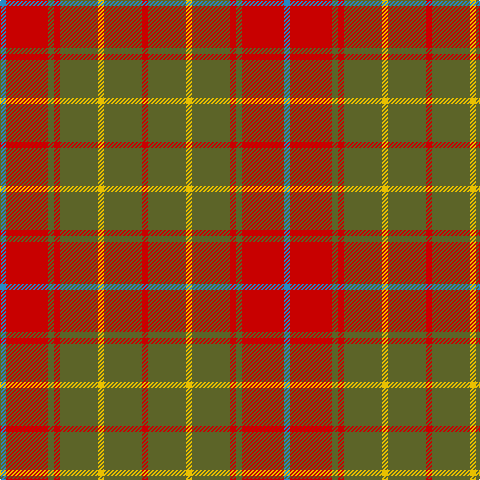

In pattern [BRGRGYGR](/patterns/brgrgygr/).

This was sourced from tartans-authority.  It is a [8 stripes tartan](/stripes/stripes8/).

Original link http://www.tartansauthority.com/tartan-ferret/display/3951/

## Thread count
B/6 R42 G6 R6 G38 Y6 G38 R/6

## Palette
Each colour and its ΔE from the base-6 reference it is a variant of.

| Colour | Shade | Base | ΔE (OKLab) |
|---|---|---|---|
| B | <code style="background-color:#2888C4;">#2888C4</code> `#2888C4` | B <code style="background-color:#2A418A;">#2A418A</code> | 0.21 |
| G | <code style="background-color:#5C6428;">#5C6428</code> `#5C6428` | G <code style="background-color:#006100;">#006100</code> | 0.10 |
| R | <code style="background-color:#C80000;">#C80000</code> `#C80000` | R <code style="background-color:#CC0000;">#CC0000</code> | 0.01 |
| Y | <code style="background-color:#E8C000;">#E8C000</code> `#E8C000` | Y <code style="background-color:#F2BF00;">#F2BF00</code> | 0.02 |

# Sample pattern

## Nearest tartans

The nearest existing variants by ΔTartan distance.

1. [Hubbard (2016)](/setts/s9/b10r38ba4g16r6g36ba4g18ba4-b003c64-ba1c1c1c-g5c6428-rc80000/) — ΔT 1.03
1. [Miyuki #4](/setts/s8/r6y16r6y40g40y6g16y6-g604000-rc80000-ya08858/) — ΔT 1.17
1. [Burnett of Powis (Modern) (Personal)](/setts/s14/g38y6g38r6g38y6g38r6g6r42b6r42g6r6-b2888c4-g5c6428-rc80000-ye8c000/) — ΔT 1.19
1. [Burnett](/setts/s8/g8r58ga6r8ga28y6ga28r8-g789484-ga006818-rc80000-yd8b000/) — ΔT 1.31
1. [Bruce](/setts/s11/y2r16g4r4g12r2g12r4g4r16ya2-g11450d-raa0000-yaaaa00-yaaaaaaa/) — ΔT 1.34
1. [Crossnor School](/setts/s7/g8r4g26w4r26g4r8-g285800-rb03000-we8ccb8/) — ΔT 1.36
1. [Chisholm](/setts/s8/r24b4y2b4r6g16r6b2-b6e5058-g11450d-raa0000-yaaaaaa/) — ΔT 1.40
1. [Chisholm](/setts/s8/r12b2y1b2r3g8r3b1-b6e5058-g11450d-raa0000-yaaaaaa/) — ΔT 1.40
1. [Land's End (Unnamed Camel)](/setts/s9/r48b4r6ra12r6b4g30r40b8-b401000-g003000-r906030-ra806050/) — ΔT 1.40
1. [MacKinnon Hunting](/setts/s7/g2r16g16ra2g16r16w2-g004c00-ra52a2a-rac80000-wd0d0d0/) — ΔT 1.43

## Neighbour map

Every grey dot is one of 15726 variants placed by the first two principal components of the ΔTartan feature space (44% of its variance). Red is this tartan; blue dots are its nearest — click one to open its page.

<svg viewBox="0 0 640 380" role="img" style="max-width:100%;height:auto;border:1px solid #e0e0e0;border-radius:4px;display:block" xmlns="http://www.w3.org/2000/svg"><image href="/nn/cloud.v1.png" width="640" height="380"/><a href="/setts/s9/b10r38ba4g16r6g36ba4g18ba4-b003c64-ba1c1c1c-g5c6428-rc80000/"><circle cx="316.5" cy="208.8" r="4" fill="#3465a4"><title>Hubbard (2016)</title></circle></a><a href="/setts/s8/r6y16r6y40g40y6g16y6-g604000-rc80000-ya08858/"><circle cx="351.1" cy="251.4" r="4" fill="#3465a4"><title>Miyuki #4</title></circle></a><a href="/setts/s14/g38y6g38r6g38y6g38r6g6r42b6r42g6r6-b2888c4-g5c6428-rc80000-ye8c000/"><circle cx="354.6" cy="205.9" r="4" fill="#3465a4"><title>Burnett of Powis (Modern) (Personal)</title></circle></a><a href="/setts/s8/g8r58ga6r8ga28y6ga28r8-g789484-ga006818-rc80000-yd8b000/"><circle cx="308.4" cy="193.1" r="4" fill="#3465a4"><title>Burnett</title></circle></a><a href="/setts/s11/y2r16g4r4g12r2g12r4g4r16ya2-g11450d-raa0000-yaaaa00-yaaaaaaa/"><circle cx="327.4" cy="209.1" r="4" fill="#3465a4"><title>Bruce</title></circle></a><a href="/setts/s7/g8r4g26w4r26g4r8-g285800-rb03000-we8ccb8/"><circle cx="327.5" cy="248.1" r="4" fill="#3465a4"><title>Crossnor School</title></circle></a><a href="/setts/s8/r24b4y2b4r6g16r6b2-b6e5058-g11450d-raa0000-yaaaaaa/"><circle cx="376.9" cy="202.9" r="4" fill="#3465a4"><title>Chisholm</title></circle></a><a href="/setts/s8/r12b2y1b2r3g8r3b1-b6e5058-g11450d-raa0000-yaaaaaa/"><circle cx="376.9" cy="202.9" r="4" fill="#3465a4"><title>Chisholm</title></circle></a><a href="/setts/s9/r48b4r6ra12r6b4g30r40b8-b401000-g003000-r906030-ra806050/"><circle cx="409.5" cy="207.2" r="4" fill="#3465a4"><title>Land's End (Unnamed Camel)</title></circle></a><a href="/setts/s7/g2r16g16ra2g16r16w2-g004c00-ra52a2a-rac80000-wd0d0d0/"><circle cx="303.5" cy="238.0" r="4" fill="#3465a4"><title>MacKinnon Hunting</title></circle></a><circle cx="352.4" cy="222.4" r="5" fill="#c00000"/></svg>

ID: /setts/s8/b6r42g6r6g38y6g38r6-b2888c4-g5c6428-rc80000-ye8c000/
