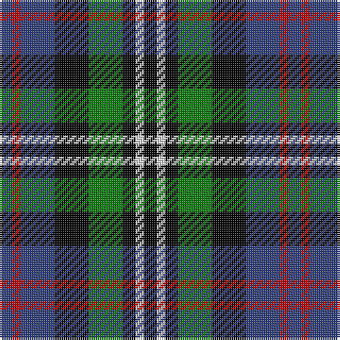

In pattern [BRBKGKWK](/patterns/brbkgkwk/).

This was sourced from weddslist.  It is a [8 stripes tartan](/stripes/stripes8/).

Original link http://www.weddslist.com/cgi-bin/tartans/pg.pl?source=sts

## Thread count
B/6 R4 B16 K16 G16 K6 LN4 K/6

## Palette
Each colour and its ΔE from the base-6 reference it is a variant of.

| Colour | Shade | Base | ΔE (OKLab) |
|---|---|---|---|
| B | <code style="background-color:#304080;">#304080</code> `#304080` | B <code style="background-color:#2A418A;">#2A418A</code> | 0.02 |
| G | <code style="background-color:#008000;">#008000</code> `#008000` | G <code style="background-color:#006100;">#006100</code> | 0.10 |
| K | <code style="background-color:#000000;">#000000</code> `#000000` | K <code style="background-color:#000000;">#000000</code> | 0.00 |
| LN | <code style="background-color:#E0E0E0;">#E0E0E0</code> `#E0E0E0` | W <code style="background-color:#F7F7F7;">#F7F7F7</code> | 0.07 |
| R | <code style="background-color:#C00000;">#C00000</code> `#C00000` | R <code style="background-color:#CC0000;">#CC0000</code> | 0.03 |

# Sample pattern

## Nearest tartans

The nearest existing variants by ΔTartan distance.

1. [MacKean dress](/setts/s9/r6k12g24k6g6k12b18k6w6-b304080-g004010-k000000-rc00000-we0e0e0/) — ΔT 0.54
1. [Maitland](/setts/s9/g3b9g3k4g8y2b2y2r2-b00004c-g004c00-k000000-rc80000-yc8c800/) — ΔT 0.85
1. [MacCallum, of Berwick](/setts/s9/b20r14b62k50g46k16b14k16y10-b304080-g008000-k000000-rc00000-yf0c000/) — ΔT 0.86
1. [Hinnigan (Personal)](/setts/s8/r16g8b32g8k28r28b8ba6-b000064-ba3474fc-g006818-k000000-r8c6428/) — ΔT 0.89
1. [Vosko](/setts/s9/b50k24y8k18r12k18y8k24g50-b304080-g008000-k000000-rc00000-yf0c000/) — ΔT 0.92
1. [Davidson, Double](/setts/s8/b6r4b16k16g16k6w4k6-b2c2c80-g006818-k101010-rc80000-wfcfcfc/) — ΔT 0.94
1. [Davidson Double](/setts/s8/b3r2b8k8g8k3w2g3-b000064-g004c00-k000000-rc80000-wd0d0d0/) — ΔT 0.97
1. [MacKean Dress (Personal)](/setts/s9/r6k12g24k6g6k12b18k6w6-b2c2c80-g006818-k101010-rc80000-we0e0e0/) — ΔT 0.99
1. [Wilson's, No 194](/setts/s6/b6w2k6g10r2k6-b800080-g008000-k000000-rc00000-we0e0e0/) — ΔT 1.01
1. [Dyce](/setts/s6/k8y4g24k24b24w4-b304080-g008000-k000000-we0e0e0-yf0c000/) — ΔT 1.03

## Neighbour map

Every grey dot is one of 15726 variants placed by the first two principal components of the ΔTartan feature space (44% of its variance). Red is this tartan; blue dots are its nearest — click one to open its page.

<svg viewBox="0 0 640 380" role="img" style="max-width:100%;height:auto;border:1px solid #e0e0e0;border-radius:4px;display:block" xmlns="http://www.w3.org/2000/svg"><image href="/nn/cloud.v1.png" width="640" height="380"/><a href="/setts/s9/r6k12g24k6g6k12b18k6w6-b304080-g004010-k000000-rc00000-we0e0e0/"><circle cx="85.9" cy="232.8" r="4" fill="#3465a4"><title>MacKean dress</title></circle></a><a href="/setts/s9/g3b9g3k4g8y2b2y2r2-b00004c-g004c00-k000000-rc80000-yc8c800/"><circle cx="105.7" cy="220.3" r="4" fill="#3465a4"><title>Maitland</title></circle></a><a href="/setts/s9/b20r14b62k50g46k16b14k16y10-b304080-g008000-k000000-rc00000-yf0c000/"><circle cx="116.3" cy="205.4" r="4" fill="#3465a4"><title>MacCallum, of Berwick</title></circle></a><a href="/setts/s8/r16g8b32g8k28r28b8ba6-b000064-ba3474fc-g006818-k000000-r8c6428/"><circle cx="80.6" cy="222.6" r="4" fill="#3465a4"><title>Hinnigan (Personal)</title></circle></a><a href="/setts/s9/b50k24y8k18r12k18y8k24g50-b304080-g008000-k000000-rc00000-yf0c000/"><circle cx="102.0" cy="203.5" r="4" fill="#3465a4"><title>Vosko</title></circle></a><a href="/setts/s8/b6r4b16k16g16k6w4k6-b2c2c80-g006818-k101010-rc80000-wfcfcfc/"><circle cx="101.2" cy="240.8" r="4" fill="#3465a4"><title>Davidson, Double</title></circle></a><a href="/setts/s8/b3r2b8k8g8k3w2g3-b000064-g004c00-k000000-rc80000-wd0d0d0/"><circle cx="62.1" cy="242.9" r="4" fill="#3465a4"><title>Davidson Double</title></circle></a><a href="/setts/s9/r6k12g24k6g6k12b18k6w6-b2c2c80-g006818-k101010-rc80000-we0e0e0/"><circle cx="97.1" cy="234.9" r="4" fill="#3465a4"><title>MacKean Dress (Personal)</title></circle></a><a href="/setts/s6/b6w2k6g10r2k6-b800080-g008000-k000000-rc00000-we0e0e0/"><circle cx="82.8" cy="238.4" r="4" fill="#3465a4"><title>Wilson's, No 194</title></circle></a><a href="/setts/s6/k8y4g24k24b24w4-b304080-g008000-k000000-we0e0e0-yf0c000/"><circle cx="97.3" cy="223.0" r="4" fill="#3465a4"><title>Dyce</title></circle></a><circle cx="79.1" cy="233.7" r="5" fill="#c00000"/></svg>

ID: /setts/s8/b6r4b16k16g16k6w4k6-b304080-g008000-k000000-rc00000-we0e0e0/
