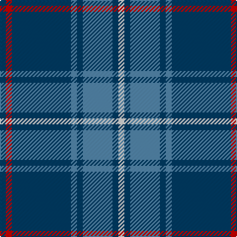

In pattern [BRBBBBBW](/patterns/brbbbbbw/).

This was sourced from register-of-tartans.  It is a [8 stripes tartan](/stripes/stripes8/).

Original link https://www.tartanregister.gov.uk/tartanDetails.aspx?ref=5708

## Thread count
DB/6 R6 DB60 Ba6 DB6 Ba30 DB6 LN/6

## Palette
Each colour and its ΔE from the base-6 reference it is a variant of.

| Colour | Shade | Base | ΔE (OKLab) |
|---|---|---|---|
| B | <code style="background-color:#38409C;">#38409C</code> `#38409C` | B <code style="background-color:#2C4084;">#2C4084</code> | 0.04 |
| Ba | <code style="background-color:#5488AC;">#5488AC</code> `#5488AC` | B <code style="background-color:#2C4084;">#2C4084</code> | 0.22 |
| DB | <code style="background-color:#003C64;">#003C64</code> `#003C64` | B <code style="background-color:#2C4084;">#2C4084</code> | 0.07 |
| LN | <code style="background-color:#E0E0E0;">#E0E0E0</code> `#E0E0E0` | W <code style="background-color:#F4F4F0;">#F4F4F0</code> | 0.06 |
| R | <code style="background-color:#C80000;">#C80000</code> `#C80000` | R <code style="background-color:#C80000;">#C80000</code> | 0.00 |

# Sample pattern

ID: /setts/s8/b6r6b60ba6b6ba30b6w6-b003c64-ba5488ac-rc80000-we0e0e0/
