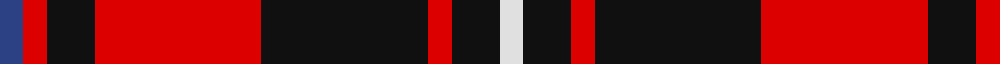

In pattern [BRKRKRKW](/patterns/brkrkrkw/).

This was sourced from register-of-tartans.  It is a [8 stripes tartan](/stripes/stripes8/).

Original link https://www.tartanregister.gov.uk/tartanDetails.aspx?ref=5997

## Thread count
B/6 R6 K12 R42 K42 R6 K12 LN/6

## Palette
Each colour and its ΔE from the base-6 reference it is a variant of.

| Colour | Shade | Base | ΔE (OKLab) |
|---|---|---|---|
| B | <code style="background-color:#2C4084;">#2C4084</code> `#2C4084` | B <code style="background-color:#2C4084;">#2C4084</code> | 0.00 |
| K | <code style="background-color:#101010;">#101010</code> `#101010` | K <code style="background-color:#000000;">#000000</code> | 0.17 |
| LN | <code style="background-color:#E0E0E0;">#E0E0E0</code> `#E0E0E0` | W <code style="background-color:#F4F4F0;">#F4F4F0</code> | 0.06 |
| R | <code style="background-color:#DC0000;">#DC0000</code> `#DC0000` | R <code style="background-color:#C80000;">#C80000</code> | 0.04 |

# Sample pattern

## Nearest tartans

The nearest existing variants by ΔTartan distance.

1. [Nakayama (Fashion)](/setts/s8/b6r6k12r42k42r6k12w6-b3850c8-k101010-rc80000-we0e0e0/) — ΔT 0.24
1. [MacIver (Clan)](/setts/s9/w4r24k6r6k32r6k6r24y4-k101010-rc80000-wfcfcfc-yd8b000/) — ΔT 0.85
1. [MacPherson Red Cluny](/setts/s7/r12k6r58k46w8k14y6-k101010-rdc0000-we0e0e0-ye8c000/) — ΔT 0.86
1. [Alexander](/setts/s9/r24b4r8b8k30g8r8g4r24-b304080-g008000-k000000-rc00000/) — ΔT 0.93
1. [MacPherson, Red Cluny](/setts/s7/r12k6r58k46w8k14y6-k000000-rc00000-we0e0e0-yf0c000/) — ΔT 1.00
1. [Scoepaig, fragment](/setts/s10/k20b2k2r20b2k2b2r20g12r4-b5480b0-g008000-k000000-rc00000/) — ΔT 1.03
1. [MacKinnon Black (Personal)](/setts/s12/b6r8k10r24k48r6k20r52k24b6r12w6-b780078-k101010-rc80000-we0e0e0/) — ΔT 1.06
1. [Cameron of Locheil #2](/setts/s9/r24g12r24b4w4b4r8b32r16-b000048-g006818-rc80000-wfcfcfc/) — ΔT 1.09
1. [Cameron of Locheil #3](/setts/s9/r24b8r23k4w4k4r10k32r8-b2c4084-k101010-rdc0000-we0e0e0/) — ΔT 1.11
1. [Cetoloni (Personal)](/setts/s6/b4r48k24y4k24b4-b2c2c80-k101010-rc80000-ye8c000/) — ΔT 1.16

## Neighbour map

Every grey dot is one of 15726 variants placed by the first two principal components of the ΔTartan feature space (44% of its variance). Red is this tartan; blue dots are its nearest — click one to open its page.

<svg viewBox="0 0 640 380" role="img" style="max-width:100%;height:auto;border:1px solid #e0e0e0;border-radius:4px;display:block" xmlns="http://www.w3.org/2000/svg"><image href="/nn/cloud.v1.png" width="640" height="380"/><a href="/setts/s8/b6r6k12r42k42r6k12w6-b3850c8-k101010-rc80000-we0e0e0/"><circle cx="265.2" cy="193.9" r="4" fill="#3465a4"><title>Nakayama (Fashion)</title></circle></a><a href="/setts/s9/w4r24k6r6k32r6k6r24y4-k101010-rc80000-wfcfcfc-yd8b000/"><circle cx="283.5" cy="184.8" r="4" fill="#3465a4"><title>MacIver (Clan)</title></circle></a><a href="/setts/s7/r12k6r58k46w8k14y6-k101010-rdc0000-we0e0e0-ye8c000/"><circle cx="261.4" cy="177.4" r="4" fill="#3465a4"><title>MacPherson Red Cluny</title></circle></a><a href="/setts/s9/r24b4r8b8k30g8r8g4r24-b304080-g008000-k000000-rc00000/"><circle cx="243.2" cy="197.2" r="4" fill="#3465a4"><title>Alexander</title></circle></a><a href="/setts/s7/r12k6r58k46w8k14y6-k000000-rc00000-we0e0e0-yf0c000/"><circle cx="252.4" cy="179.7" r="4" fill="#3465a4"><title>MacPherson, Red Cluny</title></circle></a><a href="/setts/s10/k20b2k2r20b2k2b2r20g12r4-b5480b0-g008000-k000000-rc00000/"><circle cx="247.1" cy="162.9" r="4" fill="#3465a4"><title>Scoepaig, fragment</title></circle></a><a href="/setts/s12/b6r8k10r24k48r6k20r52k24b6r12w6-b780078-k101010-rc80000-we0e0e0/"><circle cx="257.8" cy="175.2" r="4" fill="#3465a4"><title>MacKinnon Black (Personal)</title></circle></a><a href="/setts/s9/r24g12r24b4w4b4r8b32r16-b000048-g006818-rc80000-wfcfcfc/"><circle cx="268.8" cy="197.8" r="4" fill="#3465a4"><title>Cameron of Locheil #2</title></circle></a><a href="/setts/s9/r24b8r23k4w4k4r10k32r8-b2c4084-k101010-rdc0000-we0e0e0/"><circle cx="281.9" cy="188.8" r="4" fill="#3465a4"><title>Cameron of Locheil #3</title></circle></a><a href="/setts/s6/b4r48k24y4k24b4-b2c2c80-k101010-rc80000-ye8c000/"><circle cx="272.8" cy="188.6" r="4" fill="#3465a4"><title>Cetoloni (Personal)</title></circle></a><circle cx="262.0" cy="190.9" r="5" fill="#c00000"/></svg>

ID: /setts/s8/b6r6k12r42k42r6k12w6-b2c4084-k101010-rdc0000-we0e0e0/
