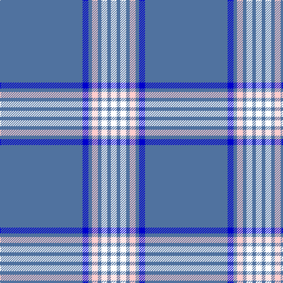

In pattern [BBBWBWBK](/stripes/bbbwbwbk/).

This was sourced from house-of-tartan.  It is a [8 stripe tartan](/stripes/stripes8/).

Original link http://www.house-of-tartan.scotland.net/house/TartanViewjs.asp?colr=Def&tnam=10610

## Thread count
B/140 Ba10 B6 W10 B6 Wa10 B6 R/10

## Palette
Each colour and its ΔE from the base-6 reference it is a variant of.

| Colour | Shade | Base | ΔE (OKLab) |
|---|---|---|---|
| B | <code style="background-color:#50729F;">#50729F</code> `#50729F` | B <code style="background-color:#2A418A;">#2A418A</code> | 0.15 |
| Ba | <code style="background-color:#0000CD;">#0000CD</code> `#0000CD` | B <code style="background-color:#2A418A;">#2A418A</code> | 0.14 |
| W | <code style="background-color:#FFCCCC;">#FFCCCC</code> `#FFCCCC` | W <code style="background-color:#F7F7F7;">#F7F7F7</code> | 0.10 |
| Wa | <code style="background-color:#FFFFFF;">#FFFFFF</code> `#FFFFFF` | W <code style="background-color:#F7F7F7;">#F7F7F7</code> | 0.02 |

# Sample pattern

## Nearest tartans

The nearest existing variants by ΔTartan distance.

1. [Wyckoff, Ann Grainger Phillips](/setts/s9/b70db5b3w5b3w5b3r5b8~x2/) — ΔT 1.16
1. [Boat of Garten (District)](/setts/s8/db61w4db2w7p2g3ly2db16~x2/) — ΔT 1.49
1. [St. Petersburg City (District)](/setts/s8/db60g10db3lb6ly2db9r2w2~x2/) — ΔT 1.51
1. [RAAF #5](/setts/s9/t66w2t10w2t10w2t12r3db24~x2/) — ΔT 1.52
1. [Caledonian Railway (Commemorative)](/setts/s11/b6k1lo6k1b28lb1k2lb1b16lb1r5~x2/) — ΔT 1.62
1. [Laidlaw's Highland Drovers](/setts/s6/b35k10b4w2b3r2~x2/) — ΔT 1.71
1. [Tokyo Bluebells (Corporate)](/setts/s8/b18r1b1r1b1k7b13w2~x4/) — ΔT 1.79
1. [Worsoff (Personal)](/setts/s14/b32db1w2b1w2db1b32db1w2db1w2db1ly5db1~x2/) — ΔT 1.81
1. [Inverness, Duke of York](/setts/s8/db122r11w4r15ly4db6ly4db30/) — ΔT 1.82
1. [Wylie](/setts/s6/db45ly3db10o4k1w2~x2/) — ΔT 1.89

## Neighbour map

Every grey dot is one of 14299 variants placed by the first two principal components of the ΔTartan feature space (44% of its variance). Red is this tartan; blue dots are its nearest — click one to open its page.

<svg viewBox="0 0 640 380" role="img" style="max-width:100%;height:auto;border:1px solid #e0e0e0;border-radius:4px;display:block" xmlns="http://www.w3.org/2000/svg"><image href="/nn/cloud.v1.png" width="640" height="380"/><a href="/setts/s9/b70db5b3w5b3w5b3r5b8~x2/"><circle cx="559.8" cy="126.5" r="4" fill="#3465a4"><title>Wyckoff, Ann Grainger Phillips</title></circle></a><a href="/setts/s8/db61w4db2w7p2g3ly2db16~x2/"><circle cx="534.7" cy="111.4" r="4" fill="#3465a4"><title>Boat of Garten (District)</title></circle></a><a href="/setts/s8/db60g10db3lb6ly2db9r2w2~x2/"><circle cx="479.2" cy="97.4" r="4" fill="#3465a4"><title>St. Petersburg City (District)</title></circle></a><a href="/setts/s9/t66w2t10w2t10w2t12r3db24~x2/"><circle cx="501.0" cy="131.2" r="4" fill="#3465a4"><title>RAAF #5</title></circle></a><a href="/setts/s11/b6k1lo6k1b28lb1k2lb1b16lb1r5~x2/"><circle cx="460.8" cy="117.5" r="4" fill="#3465a4"><title>Caledonian Railway (Commemorative)</title></circle></a><a href="/setts/s6/b35k10b4w2b3r2~x2/"><circle cx="472.6" cy="175.0" r="4" fill="#3465a4"><title>Laidlaw's Highland Drovers</title></circle></a><a href="/setts/s8/b18r1b1r1b1k7b13w2~x4/"><circle cx="461.4" cy="170.7" r="4" fill="#3465a4"><title>Tokyo Bluebells (Corporate)</title></circle></a><a href="/setts/s14/b32db1w2b1w2db1b32db1w2db1w2db1ly5db1~x2/"><circle cx="523.3" cy="91.0" r="4" fill="#3465a4"><title>Worsoff (Personal)</title></circle></a><a href="/setts/s8/db122r11w4r15ly4db6ly4db30/"><circle cx="576.2" cy="137.7" r="4" fill="#3465a4"><title>Inverness, Duke of York</title></circle></a><a href="/setts/s6/db45ly3db10o4k1w2~x2/"><circle cx="593.6" cy="123.9" r="4" fill="#3465a4"><title>Wylie</title></circle></a><circle cx="514.1" cy="109.3" r="5" fill="#c00000"/></svg>

ID: /setts/s8/b70db5b3w5b3w5b3k5~x2/
