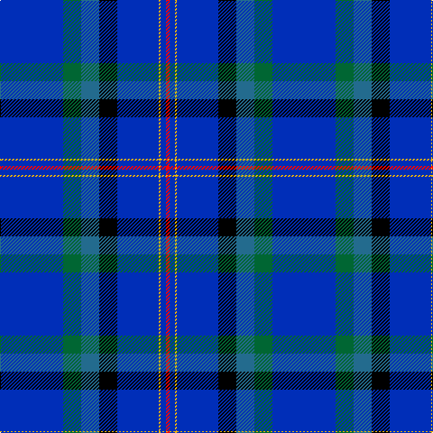

In pattern [BGBKBYBR](/patterns/bgbkbybr/).

This was sourced from register-of-tartans.  It is a [8 stripes tartan](/stripes/stripes8/).

Original link https://www.tartanregister.gov.uk/tartanDetails.aspx?ref=10599

## Thread count
B/70 G20 Ba20 K20 B46 Y2 B6 R/4

## Palette
Each colour and its ΔE from the base-6 reference it is a variant of.

| Colour | Shade | Base | ΔE (OKLab) |
|---|---|---|---|
| B | <code style="background-color:#002EB8;">#002EB8</code> `#002EB8` | B <code style="background-color:#2C4084;">#2C4084</code> | 0.10 |
| Ba | <code style="background-color:#236B8E;">#236B8E</code> `#236B8E` | B <code style="background-color:#2C4084;">#2C4084</code> | 0.12 |
| G | <code style="background-color:#006633;">#006633</code> `#006633` | G <code style="background-color:#006400;">#006400</code> | 0.04 |
| K | <code style="background-color:#000000;">#000000</code> `#000000` | K <code style="background-color:#000000;">#000000</code> | 0.00 |
| R | <code style="background-color:#FF0000;">#FF0000</code> `#FF0000` | R <code style="background-color:#C80000;">#C80000</code> | 0.11 |
| Y | <code style="background-color:#F5B800;">#F5B800</code> `#F5B800` | Y <code style="background-color:#E8C000;">#E8C000</code> | 0.03 |

# Sample pattern

ID: /setts/s8/b70g20ba20k20b46y2b6r4-b002eb8-ba236b8e-g006633-k000000-rff0000-yf5b800/
