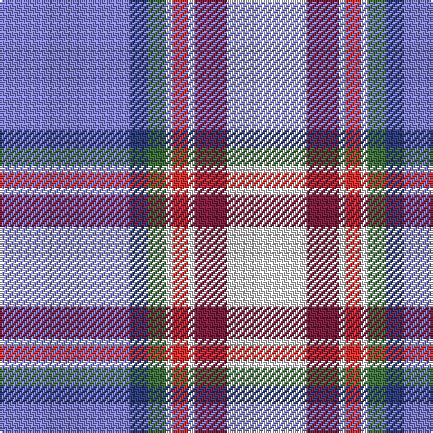

In pattern [BBGWRWRW](/patterns/bbgwrwrw/).

This was sourced from weddslist.  It is a [8 stripes tartan](/stripes/stripes8/).

Original link http://www.weddslist.com/cgi-bin/tartans/pg.pl?source=sts

## Thread count
B/72 Ba10 G10 LN4 R8 LN4 DR18 LN/44

## Palette
Each colour and its ΔE from the base-6 reference it is a variant of.

| Colour | Shade | Base | ΔE (OKLab) |
|---|---|---|---|
| B | <code style="background-color:#8080D0;">#8080D0</code> `#8080D0` | B <code style="background-color:#2C4084;">#2C4084</code> | 0.24 |
| Ba | <code style="background-color:#304080;">#304080</code> `#304080` | B <code style="background-color:#2C4084;">#2C4084</code> | 0.01 |
| DR | <code style="background-color:#802040;">#802040</code> `#802040` | R <code style="background-color:#C80000;">#C80000</code> | 0.16 |
| G | <code style="background-color:#407040;">#407040</code> `#407040` | G <code style="background-color:#006400;">#006400</code> | 0.08 |
| LN | <code style="background-color:#E0E0E0;">#E0E0E0</code> `#E0E0E0` | W <code style="background-color:#F4F4F0;">#F4F4F0</code> | 0.06 |
| R | <code style="background-color:#D03030;">#D03030</code> `#D03030` | R <code style="background-color:#C80000;">#C80000</code> | 0.05 |

# Sample pattern

## Nearest tartans

The nearest existing variants by ΔTartan distance.

1. [Heather, (R.S.S.P.C.C.)](/setts/s9/b4w3wa28w3ba16w4ba8wb46g4-b000060-ba800080-g008000-we0e0e0-wac0c0c0-wbc0a0e0/) — ΔT 0.76
1. [Heather (R.S.S.P.C.C.) Corporate Tartan Tartan Number: 2108. Earliest known date: 1990 The design 'Heather Tartan' has been produced at the request of the Royal Society for Prevention of Cruelty to Children, as the Society's corporate tartan. The colours of the design are taken from the Society's badge and lettrhead. Dark Pink Mix, Light Pink Mix, Kingfisher and Emerald. See products available Copyright © Blair Urquhart, Comrie, 2015](/setts/s9/b4w3wa28w3ba16w4ba8wb46g4-b1c0070-ba780078-g006818-we0e0e0-wac0c0c0-wbc49cd8/) — ΔT 0.79
1. [South Canterbury Jubillee (Corporate](/setts/s8/b72ba10g10w4r8w4ra18w44-b2888c4-ba2c2c80-g289c18-re87878-ra901c38-we0e0e0/) — ΔT 0.89
1. [Jubilee, South Canterbury Centre Piping & Dancing Association](/setts/s8/b72ba10g10w4r8w4ra18w44-b0596fa-ba2c4084-g3c7846-rc82828-ra781c38-we0e0e0/) — ΔT 1.03
1. [Dignan School of Dancing](/setts/s7/y8r4b64k20ba8w42ba4-b2474e8-ba6c0070-k101010-r880000-wc0c0c0-yd09800/) — ΔT 1.40
1. [Lethcoe (Personal)](/setts/s13/w38b5w6b5w4ba20w38r12wa3bb30wa3bb2wa7-b780078-ba202060-bb5c5c5c-r888888-wc0c0c0-wae8ccb8/) — ΔT 1.41
1. [St. Andrews Management School](/setts/s12/r10w4b4w4y10w4wa4w4k14b28wa60w8-b5838a4-k101010-rc80000-we0e0e0-wab8c4c8-ye8c000/) — ΔT 1.42
1. [Queensferry High (School)](/setts/s9/y5w3wa7y5wa27b8ba43wb3wa3-b4444bc-ba003c64-wc8c8c8-waa8ace8-wbe0e0e0-y949494/) — ΔT 1.43
1. [Morgan in Maryland (USA)](/setts/s9/b8k2y36g4y22g22w36k2r8-b41418c-g645541-k000000-raa3746-wb4bee6-ya5cdb4/) — ΔT 1.44
1. [Morris, Tom (Corporate)](/setts/s13/w38b5w6b5w4ba20w38r12wa3bb30wa3bb2wa7-b440044-ba202060-bb5c5c5c-r888888-wc0c0c0-wae8ccb8/) — ΔT 1.47

## Neighbour map

Every grey dot is one of 15726 variants placed by the first two principal components of the ΔTartan feature space (44% of its variance). Red is this tartan; blue dots are its nearest — click one to open its page.

<svg viewBox="0 0 640 380" role="img" style="max-width:100%;height:auto;border:1px solid #e0e0e0;border-radius:4px;display:block" xmlns="http://www.w3.org/2000/svg"><image href="/nn/cloud.v1.png" width="640" height="380"/><a href="/setts/s9/b4w3wa28w3ba16w4ba8wb46g4-b000060-ba800080-g008000-we0e0e0-wac0c0c0-wbc0a0e0/"><circle cx="180.9" cy="108.9" r="4" fill="#3465a4"><title>Heather, (R.S.S.P.C.C.)</title></circle></a><a href="/setts/s9/b4w3wa28w3ba16w4ba8wb46g4-b1c0070-ba780078-g006818-we0e0e0-wac0c0c0-wbc49cd8/"><circle cx="181.3" cy="108.6" r="4" fill="#3465a4"><title>Heather (R.S.S.P.C.C.) Corporate Tartan Tartan Number: 2108. Earliest known date: 1990 The design 'Heather Tartan' has been produced at the request of the Royal Society for Prevention of Cruelty to Children, as the Society's corporate tartan. The colours of the design are taken from the Society's badge and lettrhead. Dark Pink Mix, Light Pink Mix, Kingfisher and Emerald. See products available Copyright © Blair Urquhart, Comrie, 2015</title></circle></a><a href="/setts/s8/b72ba10g10w4r8w4ra18w44-b2888c4-ba2c2c80-g289c18-re87878-ra901c38-we0e0e0/"><circle cx="189.7" cy="113.9" r="4" fill="#3465a4"><title>South Canterbury Jubillee (Corporate</title></circle></a><a href="/setts/s8/b72ba10g10w4r8w4ra18w44-b0596fa-ba2c4084-g3c7846-rc82828-ra781c38-we0e0e0/"><circle cx="184.3" cy="112.2" r="4" fill="#3465a4"><title>Jubilee, South Canterbury Centre Piping &amp; Dancing Association</title></circle></a><a href="/setts/s7/y8r4b64k20ba8w42ba4-b2474e8-ba6c0070-k101010-r880000-wc0c0c0-yd09800/"><circle cx="173.3" cy="127.5" r="4" fill="#3465a4"><title>Dignan School of Dancing</title></circle></a><a href="/setts/s13/w38b5w6b5w4ba20w38r12wa3bb30wa3bb2wa7-b780078-ba202060-bb5c5c5c-r888888-wc0c0c0-wae8ccb8/"><circle cx="211.4" cy="97.1" r="4" fill="#3465a4"><title>Lethcoe (Personal)</title></circle></a><a href="/setts/s12/r10w4b4w4y10w4wa4w4k14b28wa60w8-b5838a4-k101010-rc80000-we0e0e0-wab8c4c8-ye8c000/"><circle cx="154.9" cy="80.7" r="4" fill="#3465a4"><title>St. Andrews Management School</title></circle></a><a href="/setts/s9/y5w3wa7y5wa27b8ba43wb3wa3-b4444bc-ba003c64-wc8c8c8-waa8ace8-wbe0e0e0-y949494/"><circle cx="191.4" cy="119.8" r="4" fill="#3465a4"><title>Queensferry High (School)</title></circle></a><a href="/setts/s9/b8k2y36g4y22g22w36k2r8-b41418c-g645541-k000000-raa3746-wb4bee6-ya5cdb4/"><circle cx="167.7" cy="126.0" r="4" fill="#3465a4"><title>Morgan in Maryland (USA)</title></circle></a><a href="/setts/s13/w38b5w6b5w4ba20w38r12wa3bb30wa3bb2wa7-b440044-ba202060-bb5c5c5c-r888888-wc0c0c0-wae8ccb8/"><circle cx="206.7" cy="95.8" r="4" fill="#3465a4"><title>Morris, Tom (Corporate)</title></circle></a><circle cx="200.8" cy="112.2" r="5" fill="#c00000"/></svg>

ID: /setts/s8/b72ba10g10w4r8w4ra18w44-b8080d0-ba304080-g407040-rd03030-ra802040-we0e0e0/
