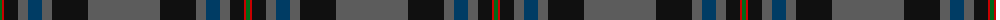

In pattern [BKBBBKRG](/patterns/bkbbbkrg/).

This was sourced from tartans-authority.  It is a [8 stripes tartan](/stripes/stripes8/).

Original link http://www.tartansauthority.com/tartan-ferret/display/7668/

## Attestations

This cloth appears in 2 source records; the oldest owns this page.

- 2007 — Suttle (Personal) (tartans-authority, [record](http://www.tartansauthority.com/tartan-ferret/display/7668/))
- undated — Suttle (Personal) (register-of-tartans, [record](https://www.tartanregister.gov.uk/tartanDetails.aspx?ref=5671))

## Thread count
G/4 R2 K14 N10 DB14 N10 K36 N/72

## Palette
Each colour and its ΔE from the base-6 reference it is a variant of.

| Colour | Shade | Base | ΔE (OKLab) |
|---|---|---|---|
| DB | <code style="background-color:#003C64;">#003C64</code> `#003C64` | B <code style="background-color:#2A418A;">#2A418A</code> | 0.08 |
| G | <code style="background-color:#006818;">#006818</code> `#006818` | G <code style="background-color:#006100;">#006100</code> | 0.02 |
| K | <code style="background-color:#101010;">#101010</code> `#101010` | K <code style="background-color:#000000;">#000000</code> | 0.17 |
| N | <code style="background-color:#5C5C5C;">#5C5C5C</code> `#5C5C5C` | B <code style="background-color:#2A418A;">#2A418A</code> | 0.15 |
| R | <code style="background-color:#C80000;">#C80000</code> `#C80000` | R <code style="background-color:#CC0000;">#CC0000</code> | 0.01 |

# Sample pattern

## Nearest tartans

The nearest existing variants by ΔTartan distance.

1. [Hebridean Heather Fashion Tartan Tartan Number: 6820. Earliest known date: 2005 Designed for new House of Edgar Collection in wedding grays. Originally called Balmoral but this was disallowed in recording as Balmoral tartans are restricted to the Royal Family. See products available Copyright © Blair Urquhart, Comrie, 2015](/setts/s9/b8ba4b14bb60b16bb14r10ba2w4-b5c5c5c-ba003c64-bb1c1c1c-r800028-we0e0e0/) — ΔT 0.70
1. [Hebridean Heather](/setts/s9/b8ba4b14bb60b16bb14r10ba2w4-b5c5c5c-ba003c64-bb1c1c1c-r800028-wf8f8f8/) — ΔT 0.83
1. [Raymond of Doune](/setts/s8/r8g20y2w2b8w2b50r4-b14283c-g003820-r880000-wc0c0c0-yd09800/) — ΔT 1.12
1. [Glen and Son, William (Corporate)](/setts/s11/r12k6b8k20b10ra6k4b62w2b4w4-b3c3c3c-k101010-r880000-ra888888-we0e0e0/) — ΔT 1.13
1. [MacWilliam Htg](/setts/s7/g4ga64ga24k20r2b32r4-b2c2c80-g285800-ga604000-k101010-rc80000/) — ΔT 1.21
1. [MacLaurin of Brioch](/setts/s7/b72k20g6r6g12k2y4-b2c4084-g005020-k101010-rdc0000-ye8c000/) — ΔT 1.32
1. [MacWilliam Hunting](/setts/s6/g4ga88k20r2b32r2-b2c2c80-g604000-ga285800-k101010-rc80000/) — ΔT 1.32
1. [Green Swamp Youth Campers](/setts/s6/k16r4k26y4g96b12-b2474e8-g004028-k101010-rc82828-ye0a126/) — ΔT 1.35
1. [MacNeill](/setts/s9/b10r6b42k10b10k80ka4k4w2-b304080-k101010-ka000000-rc00000-we0e0e0/) — ΔT 1.37
1. [Orkney Slate](/setts/s8/b8g74k8b42g11k2g16b4-b222222-g6a6a6a-k000000/) — ΔT 1.38

## Neighbour map

Every grey dot is one of 15726 variants placed by the first two principal components of the ΔTartan feature space (44% of its variance). Red is this tartan; blue dots are its nearest — click one to open its page.

<svg viewBox="0 0 640 380" role="img" style="max-width:100%;height:auto;border:1px solid #e0e0e0;border-radius:4px;display:block" xmlns="http://www.w3.org/2000/svg"><image href="/nn/cloud.v1.png" width="640" height="380"/><a href="/setts/s9/b8ba4b14bb60b16bb14r10ba2w4-b5c5c5c-ba003c64-bb1c1c1c-r800028-we0e0e0/"><circle cx="371.6" cy="140.1" r="4" fill="#3465a4"><title>Hebridean Heather Fashion Tartan Tartan Number: 6820. Earliest known date: 2005 Designed for new House of Edgar Collection in wedding grays. Originally called Balmoral but this was disallowed in recording as Balmoral tartans are restricted to the Royal Family. See products available Copyright © Blair Urquhart, Comrie, 2015</title></circle></a><a href="/setts/s9/b8ba4b14bb60b16bb14r10ba2w4-b5c5c5c-ba003c64-bb1c1c1c-r800028-wf8f8f8/"><circle cx="364.6" cy="137.1" r="4" fill="#3465a4"><title>Hebridean Heather</title></circle></a><a href="/setts/s8/r8g20y2w2b8w2b50r4-b14283c-g003820-r880000-wc0c0c0-yd09800/"><circle cx="411.9" cy="155.0" r="4" fill="#3465a4"><title>Raymond of Doune</title></circle></a><a href="/setts/s11/r12k6b8k20b10ra6k4b62w2b4w4-b3c3c3c-k101010-r880000-ra888888-we0e0e0/"><circle cx="398.2" cy="118.9" r="4" fill="#3465a4"><title>Glen and Son, William (Corporate)</title></circle></a><a href="/setts/s7/g4ga64ga24k20r2b32r4-b2c2c80-g285800-ga604000-k101010-rc80000/"><circle cx="409.7" cy="171.5" r="4" fill="#3465a4"><title>MacWilliam Htg</title></circle></a><a href="/setts/s7/b72k20g6r6g12k2y4-b2c4084-g005020-k101010-rdc0000-ye8c000/"><circle cx="389.0" cy="130.7" r="4" fill="#3465a4"><title>MacLaurin of Brioch</title></circle></a><a href="/setts/s6/g4ga88k20r2b32r2-b2c2c80-g604000-ga285800-k101010-rc80000/"><circle cx="423.7" cy="148.2" r="4" fill="#3465a4"><title>MacWilliam Hunting</title></circle></a><a href="/setts/s6/k16r4k26y4g96b12-b2474e8-g004028-k101010-rc82828-ye0a126/"><circle cx="404.2" cy="169.0" r="4" fill="#3465a4"><title>Green Swamp Youth Campers</title></circle></a><a href="/setts/s9/b10r6b42k10b10k80ka4k4w2-b304080-k101010-ka000000-rc00000-we0e0e0/"><circle cx="406.1" cy="124.7" r="4" fill="#3465a4"><title>MacNeill</title></circle></a><a href="/setts/s8/b8g74k8b42g11k2g16b4-b222222-g6a6a6a-k000000/"><circle cx="429.3" cy="147.1" r="4" fill="#3465a4"><title>Orkney Slate</title></circle></a><circle cx="393.4" cy="146.5" r="5" fill="#c00000"/></svg>

ID: /setts/s8/b72k36b10ba14b10k14r2g4-b5c5c5c-ba003c64-g006818-k101010-rc80000/
