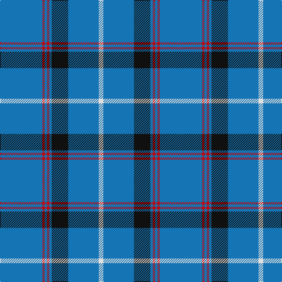

In pattern [BRBRBKBW](/patterns/brbrbkbw/).

This was sourced from tartans-authority.  It is a [8 stripes tartan](/stripes/stripes8/).

Original link http://www.tartansauthority.com/tartan-ferret/display/2538/

## Thread count
B/72 R4 B4 R4 B4 K28 B52 LN/8

## Palette
Each colour and its ΔE from the base-6 reference it is a variant of.

| Colour | Shade | Base | ΔE (OKLab) |
|---|---|---|---|
| B | <code style="background-color:#1474B4;">#1474B4</code> `#1474B4` | B <code style="background-color:#2A418A;">#2A418A</code> | 0.15 |
| K | <code style="background-color:#101010;">#101010</code> `#101010` | K <code style="background-color:#000000;">#000000</code> | 0.17 |
| LN | <code style="background-color:#E0E0E0;">#E0E0E0</code> `#E0E0E0` | W <code style="background-color:#F7F7F7;">#F7F7F7</code> | 0.07 |
| R | <code style="background-color:#C80000;">#C80000</code> `#C80000` | R <code style="background-color:#CC0000;">#CC0000</code> | 0.01 |

# Sample pattern

## Nearest tartans

The nearest existing variants by ΔTartan distance.

1. [Laidlaw's Highland Drovers](/setts/s6/b70k20b8w4b6r4-b1474b4-k101010-rc80000-wf8f8f8/) — ΔT 0.68
1. [Wheadon (Name)](/setts/s6/b80g14y6g14b30r10-b34349c-g008c20-rc80000-ye8c000/) — ΔT 1.23
1. [RAAF #5](/setts/s9/b132w4b20w4b20w4b24r6ba48-b5c8ca8-ba1c0070-rc80000-we0e0e0/) — ΔT 1.28
1. [Tokyo Bluebells (Dance)](/setts/s14/b72r4b4r4b4k28b52w8b52k28b4r4b4r4-b1474b4-k101010-rc80000-we0e0e0/) — ΔT 1.30
1. [Dundee Football Club](/setts/s10/b6w4b4w6b12y4b52y4b12r4-b003c64-rc80000-wc4c4c4-ye8c000/) — ΔT 1.43
1. [JetBlue (Corporate)](/setts/s7/b8w6ba12b80ba16b24g6-b2c2c80-ba1474b4-g289c18-wfcfcfc/) — ΔT 1.48
1. [Tokyo Bluebells](/setts/s8/b72r4b4r4b4k28b52w8-b304080-k000000-rc00000-we0e0e0/) — ΔT 1.52
1. [Dominion (Fashion)](/setts/s7/y12r2y34b6y6b16y2-b2c2c80-rc80000-y6c9cb4/) — ΔT 1.54
1. [Caledonian Railway (Commemorative)](/setts/s11/b12k2y12k2b56w2k4w2b32w2r10-b1474b4-k101010-rc80000-we8ccb8-ybc8c00/) — ΔT 1.55
1. [Pride of the Clyde](/setts/s8/b8w4ba6b2ba6r10ba63w3-b2c2c80-ba003c64-r888888-we0e0e0/) — ΔT 1.63

## Neighbour map

Every grey dot is one of 15726 variants placed by the first two principal components of the ΔTartan feature space (44% of its variance). Red is this tartan; blue dots are its nearest — click one to open its page.

<svg viewBox="0 0 640 380" role="img" style="max-width:100%;height:auto;border:1px solid #e0e0e0;border-radius:4px;display:block" xmlns="http://www.w3.org/2000/svg"><image href="/nn/cloud.v1.png" width="640" height="380"/><a href="/setts/s6/b70k20b8w4b6r4-b1474b4-k101010-rc80000-wf8f8f8/"><circle cx="470.2" cy="173.1" r="4" fill="#3465a4"><title>Laidlaw's Highland Drovers</title></circle></a><a href="/setts/s6/b80g14y6g14b30r10-b34349c-g008c20-rc80000-ye8c000/"><circle cx="426.3" cy="199.7" r="4" fill="#3465a4"><title>Wheadon (Name)</title></circle></a><a href="/setts/s9/b132w4b20w4b20w4b24r6ba48-b5c8ca8-ba1c0070-rc80000-we0e0e0/"><circle cx="498.3" cy="128.8" r="4" fill="#3465a4"><title>RAAF #5</title></circle></a><a href="/setts/s14/b72r4b4r4b4k28b52w8b52k28b4r4b4r4-b1474b4-k101010-rc80000-we0e0e0/"><circle cx="414.4" cy="140.5" r="4" fill="#3465a4"><title>Tokyo Bluebells (Dance)</title></circle></a><a href="/setts/s10/b6w4b4w6b12y4b52y4b12r4-b003c64-rc80000-wc4c4c4-ye8c000/"><circle cx="483.8" cy="160.2" r="4" fill="#3465a4"><title>Dundee Football Club</title></circle></a><a href="/setts/s7/b8w6ba12b80ba16b24g6-b2c2c80-ba1474b4-g289c18-wfcfcfc/"><circle cx="468.9" cy="196.4" r="4" fill="#3465a4"><title>JetBlue (Corporate)</title></circle></a><a href="/setts/s8/b72r4b4r4b4k28b52w8-b304080-k000000-rc00000-we0e0e0/"><circle cx="458.3" cy="167.0" r="4" fill="#3465a4"><title>Tokyo Bluebells</title></circle></a><a href="/setts/s7/y12r2y34b6y6b16y2-b2c2c80-rc80000-y6c9cb4/"><circle cx="452.5" cy="205.1" r="4" fill="#3465a4"><title>Dominion (Fashion)</title></circle></a><a href="/setts/s11/b12k2y12k2b56w2k4w2b32w2r10-b1474b4-k101010-rc80000-we8ccb8-ybc8c00/"><circle cx="457.2" cy="114.2" r="4" fill="#3465a4"><title>Caledonian Railway (Commemorative)</title></circle></a><a href="/setts/s8/b8w4ba6b2ba6r10ba63w3-b2c2c80-ba003c64-r888888-we0e0e0/"><circle cx="506.8" cy="141.5" r="4" fill="#3465a4"><title>Pride of the Clyde</title></circle></a><circle cx="458.9" cy="168.5" r="5" fill="#c00000"/></svg>

ID: /setts/s8/b72r4b4r4b4k28b52w8-b1474b4-k101010-rc80000-we0e0e0/
