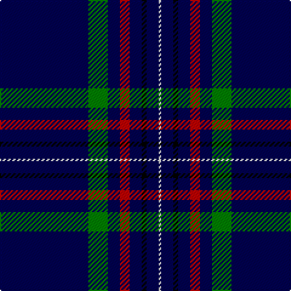

In pattern [BGBRBKBW](/patterns/bgbrbkbw/).

This was sourced from weddslist.  It is a [8 stripes tartan](/stripes/stripes8/).

Original link http://www.weddslist.com/cgi-bin/tartans/pg.pl?source=sts

## Thread count
DB/73 G16 DB10 R8 DB10 K4 DB10 LN/2

## Palette
Each colour and its ΔE from the base-6 reference it is a variant of.

| Colour | Shade | Base | ΔE (OKLab) |
|---|---|---|---|
| DB | <code style="background-color:#000050;">#000050</code> `#000050` | B <code style="background-color:#2C4084;">#2C4084</code> | 0.20 |
| G | <code style="background-color:#008000;">#008000</code> `#008000` | G <code style="background-color:#006400;">#006400</code> | 0.09 |
| K | <code style="background-color:#000000;">#000000</code> `#000000` | K <code style="background-color:#000000;">#000000</code> | 0.00 |
| LN | <code style="background-color:#E0E0E0;">#E0E0E0</code> `#E0E0E0` | W <code style="background-color:#F4F4F0;">#F4F4F0</code> | 0.06 |
| R | <code style="background-color:#C00000;">#C00000</code> `#C00000` | R <code style="background-color:#C80000;">#C80000</code> | 0.02 |

# Sample pattern

## Nearest tartans

The nearest existing variants by ΔTartan distance.

1. [McCann of Castlecraig (Personal)](/setts/s7/k128g24b12k30r2g10y2-b5c5c5c-g545c24-k00002c-rb47800-ya0a0a0/) — ΔT 1.12
1. [London Scottish Rugby Club](/setts/s6/r10k80w2k26g16ka8-g008000-k000030-ka000000-rc00000-we0e0e0/) — ΔT 1.19
1. [World Youth Congress (Corporate)](/setts/s10/r4b16y2b32w2g24b54w2b2w2-b202060-g006818-rc80000-we0e0e0-ye8c000/) — ΔT 1.31
1. [United States](/setts/s9/b7k5y6k5r7k2b2k70y2-b304080-k000030-rc00000-yb0b0b0/) — ΔT 1.31
1. [Gibson, Robert (Personal)](/setts/s7/k20b60k20ba4k140r4k8-b0000cd-ba1474b4-k101010-rb458ac/) — ΔT 1.38
1. [Marine Harvest (Scotland)](/setts/s8/b20ba4k4b2k12ba2k90y4-b0000cd-ba778899-k101010-yffa500/) — ΔT 1.50
1. [Scotch Whisky Heritage Centre](/setts/s8/b146g32b20r16b20k8b20w4-b202060-g006818-k101010-rc80000-we0e0e0/) — ΔT 1.51
1. [Scotch Whisky Heritage Corporate Tartan Tartan Number: 1920. Earliest known date: 1987 Half actual count for display. See products available Copyright © Blair Urquhart, Comrie, 2015](/setts/s8/b73g16b10r8b10k4b10w2-b202060-g006818-k101010-rc80000-we0e0e0/) — ΔT 1.51
1. [Calum's Cabin](/setts/s10/b32r4ba12b2ba4b2ba2g16b67r6-b000048-ba003c64-g808080-re86000/) — ΔT 1.52
1. [Parkin](/setts/s8/w6b18y2wa6ba18wa2b80ba4-b14283c-ba780078-we0e0e0-waa8ace8-ye8c000/) — ΔT 1.56

## Neighbour map

Every grey dot is one of 15726 variants placed by the first two principal components of the ΔTartan feature space (44% of its variance). Red is this tartan; blue dots are its nearest — click one to open its page.

<svg viewBox="0 0 640 380" role="img" style="max-width:100%;height:auto;border:1px solid #e0e0e0;border-radius:4px;display:block" xmlns="http://www.w3.org/2000/svg"><image href="/nn/cloud.v1.png" width="640" height="380"/><a href="/setts/s7/k128g24b12k30r2g10y2-b5c5c5c-g545c24-k00002c-rb47800-ya0a0a0/"><circle cx="531.6" cy="127.7" r="4" fill="#3465a4"><title>McCann of Castlecraig (Personal)</title></circle></a><a href="/setts/s6/r10k80w2k26g16ka8-g008000-k000030-ka000000-rc00000-we0e0e0/"><circle cx="473.4" cy="146.9" r="4" fill="#3465a4"><title>London Scottish Rugby Club</title></circle></a><a href="/setts/s10/r4b16y2b32w2g24b54w2b2w2-b202060-g006818-rc80000-we0e0e0-ye8c000/"><circle cx="463.2" cy="130.5" r="4" fill="#3465a4"><title>World Youth Congress (Corporate)</title></circle></a><a href="/setts/s9/b7k5y6k5r7k2b2k70y2-b304080-k000030-rc00000-yb0b0b0/"><circle cx="531.1" cy="117.7" r="4" fill="#3465a4"><title>United States</title></circle></a><a href="/setts/s7/k20b60k20ba4k140r4k8-b0000cd-ba1474b4-k101010-rb458ac/"><circle cx="521.7" cy="162.7" r="4" fill="#3465a4"><title>Gibson, Robert (Personal)</title></circle></a><a href="/setts/s8/b20ba4k4b2k12ba2k90y4-b0000cd-ba778899-k101010-yffa500/"><circle cx="547.8" cy="122.3" r="4" fill="#3465a4"><title>Marine Harvest (Scotland)</title></circle></a><a href="/setts/s8/b146g32b20r16b20k8b20w4-b202060-g006818-k101010-rc80000-we0e0e0/"><circle cx="538.0" cy="137.3" r="4" fill="#3465a4"><title>Scotch Whisky Heritage Centre</title></circle></a><a href="/setts/s8/b73g16b10r8b10k4b10w2-b202060-g006818-k101010-rc80000-we0e0e0/"><circle cx="538.0" cy="137.3" r="4" fill="#3465a4"><title>Scotch Whisky Heritage Corporate Tartan Tartan Number: 1920. Earliest known date: 1987 Half actual count for display. See products available Copyright © Blair Urquhart, Comrie, 2015</title></circle></a><a href="/setts/s10/b32r4ba12b2ba4b2ba2g16b67r6-b000048-ba003c64-g808080-re86000/"><circle cx="457.8" cy="133.6" r="4" fill="#3465a4"><title>Calum's Cabin</title></circle></a><a href="/setts/s8/w6b18y2wa6ba18wa2b80ba4-b14283c-ba780078-we0e0e0-waa8ace8-ye8c000/"><circle cx="470.7" cy="107.0" r="4" fill="#3465a4"><title>Parkin</title></circle></a><circle cx="499.9" cy="128.8" r="5" fill="#c00000"/></svg>

ID: /setts/s8/b73g16b10r8b10k4b10w2-b000050-g008000-k000000-rc00000-we0e0e0/
