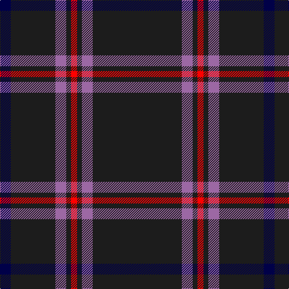

In pattern [BBRBRBRB](/patterns/bbrbrbrb/).

This was sourced from register-of-tartans.  It is a [8 stripes tartan](/stripes/stripes8/).

Original link https://www.tartanregister.gov.uk/tartanDetails.aspx?ref=10860

## Register references

External register numbers recorded for this tartan.

- Scottish Register of Tartans: [10860](https://www.tartanregister.gov.uk/tartanDetails.aspx?ref=10860)

## Thread count
DB/18 K74 LP18 K8 R10 K8 LP18 K/148

## Palette
Each colour and its ΔE from the base-6 reference it is a variant of.

| Colour | Shade | Base | ΔE (OKLab) |
|---|---|---|---|
| DB | <code style="background-color:#000048;">#000048</code> `#000048` | B <code style="background-color:#2A418A;">#2A418A</code> | 0.22 |
| G | <code style="background-color:#005448;">#005448</code> `#005448` | G <code style="background-color:#006100;">#006100</code> | 0.10 |
| K | <code style="background-color:#1C1C1C;">#1C1C1C</code> `#1C1C1C` | B <code style="background-color:#2A418A;">#2A418A</code> | 0.21 |
| LP | <code style="background-color:#9C68A4;">#9C68A4</code> `#9C68A4` | R <code style="background-color:#CC0000;">#CC0000</code> | 0.21 |
| R | <code style="background-color:#FF0000;">#FF0000</code> `#FF0000` | R <code style="background-color:#CC0000;">#CC0000</code> | 0.11 |

# Sample pattern

## Nearest tartans

The nearest existing variants by ΔTartan distance.

1. [Laird Abdullah (Personal)](/setts/s8/k10b2k2b8k40r4k5ra2~b5c5c5c-k101010-rc80000-rae87878~x2/) — ΔT 0.56
1. [Clan Inebriated](/setts/s9/k21b2r1k1r1b2k6ba2r1~b780078-ba1c0070-k101010-r888888~x4/) — ΔT 0.90
1. [Ironside (Personal)](/setts/s10/k40b2k6ba2k2ba2k10b4w2b5~b780078-ba1474b4-k101010-we0e0e0~x2/) — ΔT 0.98
1. [Harley Davidson](/setts/s10/k49r8k4b6ra4b6k4r8k49ra2~b5c5c5c-k101010-rb84c00-ra888888/) — ΔT 1.04
1. [MacLaine of Lochbuie Hunting](/setts/s5/b32r3b4k2y3~b14283c-k101010-r880000-yd09800~x2/) — ΔT 1.31
1. [Springbank](/setts/s11/k14b2k2b5k25w1b9r3k3w1k14~b505050-k101010-r9c68a4-wffffff~x2/) — ΔT 1.36
1. [Highland Brewing Company](/setts/s8/k42b2r3k5r16k8y2k3~b2888c4-k101010-ra00000-ye8c000~x2/) — ΔT 1.38
1. [Langhein, Alex (Personal)](/setts/s7/k40g15k10r2k10y2k10~g005830-k101010-rb03000-yd09800~x2/) — ΔT 1.39
1. [Whitaker (2014)](/setts/s8/k60r3k15r3w2r5b3r2~b2c2c80-k101010-rc80000-wc0c0c0~x2/) — ΔT 1.39
1. [Springbank](/setts/s11/k14b2k2b5k25w1b9ba3k3w1k14~b5c5c5c-ba9058d8-k101010-wfcfcfc~x2/) — ΔT 1.46

## Neighbour map

Every grey dot is one of 15726 variants placed by the first two principal components of the ΔTartan feature space (44% of its variance). Red is this tartan; blue dots are its nearest — click one to open its page.

<svg viewBox="0 0 640 380" role="img" style="max-width:100%;height:auto;border:1px solid #e0e0e0;border-radius:4px;display:block" xmlns="http://www.w3.org/2000/svg"><image href="/nn/cloud.v1.png" width="640" height="380"/><a href="/setts/s8/k10b2k2b8k40r4k5ra2~b5c5c5c-k101010-rc80000-rae87878~x2/"><circle cx="537.1" cy="175.4" r="4" fill="#3465a4"><title>Laird Abdullah (Personal)</title></circle></a><a href="/setts/s9/k21b2r1k1r1b2k6ba2r1~b780078-ba1c0070-k101010-r888888~x4/"><circle cx="528.8" cy="161.2" r="4" fill="#3465a4"><title>Clan Inebriated</title></circle></a><a href="/setts/s10/k40b2k6ba2k2ba2k10b4w2b5~b780078-ba1474b4-k101010-we0e0e0~x2/"><circle cx="523.5" cy="153.3" r="4" fill="#3465a4"><title>Ironside (Personal)</title></circle></a><a href="/setts/s10/k49r8k4b6ra4b6k4r8k49ra2~b5c5c5c-k101010-rb84c00-ra888888/"><circle cx="506.7" cy="156.2" r="4" fill="#3465a4"><title>Harley Davidson</title></circle></a><a href="/setts/s5/b32r3b4k2y3~b14283c-k101010-r880000-yd09800~x2/"><circle cx="584.3" cy="212.8" r="4" fill="#3465a4"><title>MacLaine of Lochbuie Hunting</title></circle></a><a href="/setts/s11/k14b2k2b5k25w1b9r3k3w1k14~b505050-k101010-r9c68a4-wffffff~x2/"><circle cx="474.2" cy="166.6" r="4" fill="#3465a4"><title>Springbank</title></circle></a><a href="/setts/s8/k42b2r3k5r16k8y2k3~b2888c4-k101010-ra00000-ye8c000~x2/"><circle cx="480.2" cy="164.2" r="4" fill="#3465a4"><title>Highland Brewing Company</title></circle></a><a href="/setts/s7/k40g15k10r2k10y2k10~g005830-k101010-rb03000-yd09800~x2/"><circle cx="546.9" cy="218.7" r="4" fill="#3465a4"><title>Langhein, Alex (Personal)</title></circle></a><a href="/setts/s8/k60r3k15r3w2r5b3r2~b2c2c80-k101010-rc80000-wc0c0c0~x2/"><circle cx="578.8" cy="143.5" r="4" fill="#3465a4"><title>Whitaker (2014)</title></circle></a><a href="/setts/s11/k14b2k2b5k25w1b9ba3k3w1k14~b5c5c5c-ba9058d8-k101010-wfcfcfc~x2/"><circle cx="465.4" cy="162.7" r="4" fill="#3465a4"><title>Springbank</title></circle></a><circle cx="538.2" cy="183.6" r="5" fill="#c00000"/></svg>

ID: /setts/s8/b74r9b4ra5b4r9b37ba9~b1c1c1c-ba000048-r9c68a4-raff0000~x2/
