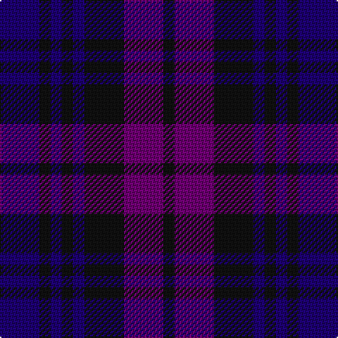

In pattern [BKBKBKBK](/patterns/bkbkbkbk/).

This was sourced from register-of-tartans.  It is a [8 stripes tartan](/stripes/stripes8/).

Original link https://www.tartanregister.gov.uk/tartanDetails.aspx?ref=1351

## Attestations

This cloth appears in 2 source records; the oldest owns this page.

- 01/01/1992 — Glasgow Academy (register-of-tartans, [record](https://www.tartanregister.gov.uk/tartanDetails.aspx?ref=1351))
- 1996 — Glasgow Academy (Corporate) (tartans-authority, [record](http://www.tartansauthority.com/tartan-ferret/display/2052/))

## Register references

External register numbers recorded for this tartan.

- Scottish Register of Tartans: [1351](https://www.tartanregister.gov.uk/tartanDetails.aspx?ref=1351)
- Scottish Tartans Authority (ITI): 2052
- Scottish Tartans World Register: 2052

## Thread count
DB/28 K8 DB8 K8 DB8 K28 P28 K/8

## Palette
Each colour and its ΔE from the base-6 reference it is a variant of.

| Colour | Shade | Base | ΔE (OKLab) |
|---|---|---|---|
| DB | <code style="background-color:#1C0070;">#1C0070</code> `#1C0070` | B <code style="background-color:#2A418A;">#2A418A</code> | 0.14 |
| K | <code style="background-color:#101010;">#101010</code> `#101010` | K <code style="background-color:#000000;">#000000</code> | 0.17 |
| P | <code style="background-color:#6C0070;">#6C0070</code> `#6C0070` | B <code style="background-color:#2A418A;">#2A418A</code> | 0.16 |

# Sample pattern

## Nearest tartans

The nearest existing variants by ΔTartan distance.

1. [Unidentified no. 54](/setts/s6/b2g6b6ba5b1ba2~b080848-ba280032-g005020~x2/) — ΔT 1.55
1. [Glasgow Academy Corporate Tartan Tartan Number: 2052. Earliest known date: January 1992 Designed as the result of the merger of two Glasgow schools: The Westbourne School for girls and the Glasgow Academy. The Westbourne uniform was predominately purple and the Academy blue. The design is based on the Black Watch. See products available Copyright © Blair Urquhart, Comrie, 2015](/setts/s13/b22k3b3k3b3k22ba22k4ba22k22b22k4b4~b202060-ba780078-k101010/) — ΔT 1.70
1. [Daks (Blue)](/setts/s8/g3b6ba2y2ba11b2ba2g3~b2c2c80-ba202060-g604000-ya08858~x2/) — ΔT 1.81
1. [Mundigl Family Tartan Tartan Number: 6066. Earliest known date: 2003 We chose blue because we liked it See products available Copyright © Blair Urquhart, Comrie, 2015](/setts/s15/b12k2b2k2b2k10r2k10ba12k3ba12k10b11k2b2~b2c2c80-ba243494-k101010-rc8002c~x2/) — ΔT 1.96
1. [Clemson University](/setts/s13/b11k2b2k2b2k8ba8y2ba8k8b8k2b2~b2c2c80-ba780078-k101010-yd87c00~x4/) — ΔT 2.03
1. [McWilliams (2014)](/setts/s12/b3k2b13k9g3k2g14k2g3k9b15k3~b202060-g604000-k101010~x2/) — ΔT 2.05
1. [Clergy (Clark)](/setts/s11/g2b5g2b3g2k10g2k10b10g2k2~b2c4084-g005020-k101010~x2/) — ΔT 2.05
1. [Slanj, The](/setts/s6/b5k22ba4k4ba26k4~b0596fa-ba080848-k101010~x2/) — ΔT 2.06
1. [Sutherland 42nd](/setts/s6/b1k1b3k3g3k1~b2c4084-g005020-k101010~x4/) — ΔT 2.10
1. [MacDevitt (Name)](/setts/s13/b12k2b2k2b2k10r12k3r12k10b12k2b2~b1c0070-k101010-r880000~x2/) — ΔT 2.11

## Neighbour map

Every grey dot is one of 15726 variants placed by the first two principal components of the ΔTartan feature space (44% of its variance). Red is this tartan; blue dots are its nearest — click one to open its page.

<svg viewBox="0 0 640 380" role="img" style="max-width:100%;height:auto;border:1px solid #e0e0e0;border-radius:4px;display:block" xmlns="http://www.w3.org/2000/svg"><image href="/nn/cloud.v1.png" width="640" height="380"/><a href="/setts/s6/b2g6b6ba5b1ba2~b080848-ba280032-g005020~x2/"><circle cx="287.4" cy="320.8" r="4" fill="#3465a4"><title>Unidentified no. 54</title></circle></a><a href="/setts/s13/b22k3b3k3b3k22ba22k4ba22k22b22k4b4~b202060-ba780078-k101010/"><circle cx="280.7" cy="246.8" r="4" fill="#3465a4"><title>Glasgow Academy Corporate Tartan Tartan Number: 2052. Earliest known date: January 1992 Designed as the result of the merger of two Glasgow schools: The Westbourne School for girls and the Glasgow Academy. The Westbourne uniform was predominately purple and the Academy blue. The design is based on the Black Watch. See products available Copyright © Blair Urquhart, Comrie, 2015</title></circle></a><a href="/setts/s8/g3b6ba2y2ba11b2ba2g3~b2c2c80-ba202060-g604000-ya08858~x2/"><circle cx="303.3" cy="268.2" r="4" fill="#3465a4"><title>Daks (Blue)</title></circle></a><a href="/setts/s15/b12k2b2k2b2k10r2k10ba12k3ba12k10b11k2b2~b2c2c80-ba243494-k101010-rc8002c~x2/"><circle cx="253.3" cy="241.7" r="4" fill="#3465a4"><title>Mundigl Family Tartan Tartan Number: 6066. Earliest known date: 2003 We chose blue because we liked it See products available Copyright © Blair Urquhart, Comrie, 2015</title></circle></a><a href="/setts/s13/b11k2b2k2b2k8ba8y2ba8k8b8k2b2~b2c2c80-ba780078-k101010-yd87c00~x4/"><circle cx="210.3" cy="236.4" r="4" fill="#3465a4"><title>Clemson University</title></circle></a><a href="/setts/s12/b3k2b13k9g3k2g14k2g3k9b15k3~b202060-g604000-k101010~x2/"><circle cx="300.2" cy="258.6" r="4" fill="#3465a4"><title>McWilliams (2014)</title></circle></a><a href="/setts/s11/g2b5g2b3g2k10g2k10b10g2k2~b2c4084-g005020-k101010~x2/"><circle cx="277.9" cy="269.2" r="4" fill="#3465a4"><title>Clergy (Clark)</title></circle></a><a href="/setts/s6/b5k22ba4k4ba26k4~b0596fa-ba080848-k101010~x2/"><circle cx="344.4" cy="285.0" r="4" fill="#3465a4"><title>Slanj, The</title></circle></a><a href="/setts/s6/b1k1b3k3g3k1~b2c4084-g005020-k101010~x4/"><circle cx="231.0" cy="340.3" r="4" fill="#3465a4"><title>Sutherland 42nd</title></circle></a><a href="/setts/s13/b12k2b2k2b2k10r12k3r12k10b12k2b2~b1c0070-k101010-r880000~x2/"><circle cx="237.3" cy="245.1" r="4" fill="#3465a4"><title>MacDevitt (Name)</title></circle></a><circle cx="274.3" cy="313.5" r="5" fill="#c00000"/></svg>

ID: /setts/s8/b7k2b2k2b2k7ba7k2~b1c0070-ba6c0070-k101010~x4/
