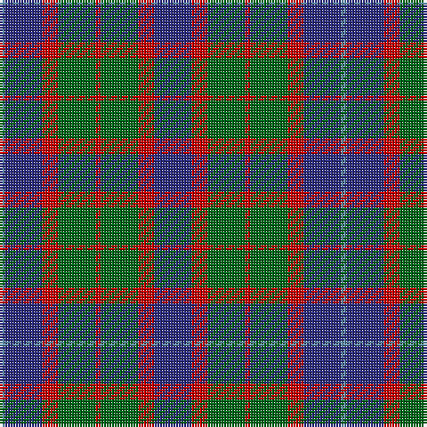

In pattern [BBRGRGRB](/patterns/bbrgrgrb/).

This was sourced from register-of-tartans.  It is a [8 stripes tartan](/stripes/stripes8/).

Original link https://www.tartanregister.gov.uk/tartanDetails.aspx?ref=1664

## Thread count
B/2 DB14 R6 G14 R2 G14 R6 DB/14

## Palette
Each colour and its ΔE from the base-6 reference it is a variant of.

| Colour | Shade | Base | ΔE (OKLab) |
|---|---|---|---|
| B | <code style="background-color:#5C8CA8;">#5C8CA8</code> `#5C8CA8` | B <code style="background-color:#2A418A;">#2A418A</code> | 0.23 |
| DB | <code style="background-color:#2C2C80;">#2C2C80</code> `#2C2C80` | B <code style="background-color:#2A418A;">#2A418A</code> | 0.06 |
| G | <code style="background-color:#006818;">#006818</code> `#006818` | G <code style="background-color:#006100;">#006100</code> | 0.02 |
| R | <code style="background-color:#C80000;">#C80000</code> `#C80000` | R <code style="background-color:#CC0000;">#CC0000</code> | 0.01 |

# Sample pattern

## Nearest tartans

The nearest existing variants by ΔTartan distance.

1. [Daks (Navy)](/setts/s8/r3g6b2ba2b11g9b2r3x2~b202060-ba2c2c80-g006818-rc80000/) — ΔT 0.72
1. [Tennant](/setts/s7/r1b7g7b7g7ba7r1x4~b304080-ba401000-g008000-rc00000/) — ΔT 0.85
1. [Mariverain](/setts/s11/b5r1b5g7b3y1b4r5g2y2g2x8~b303070-g006818-r880000-yd09800/) — ΔT 0.93
1. [Fletcher of Dunans](/setts/s7/b10k3b10k14r2g14r5x2~b1870a4-g006818-k101010-rc80000/) — ΔT 1.00
1. [Brough (Name)](/setts/s7/r18b12w2b12g8r3g10x2~b202060-g285800-r880000-wfcfcfc/) — ΔT 1.01
1. [Tamer of Wolves (Fashion)](/setts/s9/w9b2g8ba6g9ba15g13ba3b4x2~b2c2c80-ba5c5c5c-g604000-we0e0e0/) — ΔT 1.07
1. [Fletcher of Dunans Clan Tartan Tartan Number: 272. Earliest known date: 1906 The Fletchers of Dunans tartan is distinguished by a red stripe in place of the more usual black. Fletchers were arrow makers associated with the Stewarts and Campbells in Argyll and with the MacGregors in Perthshire. See products available Copyright © Blair Urquhart, Comrie, 2015](/setts/s7/b6k1b6k8r1g8r2x2~b2c2c80-g006818-k101010-rc80000/) — ΔT 1.07
1. [Wilson's No.124](/setts/s8/g14b11ga3k5ga3b11g14y2x2~b780078-g006818-ga789484-k101010-yd8b000/) — ΔT 1.07
1. [Unidentified Pinafore](/setts/s7/g24k4g24k24b7r24b7x2~b3c82af-g005020-k101010-r960028/) — ΔT 1.07
1. [Alexander Hunting (Name)](/setts/s9/b12r2b4r4k15b4g4b2g12x2~b2c2c80-g006818-k101010-rc80000/) — ΔT 1.12

## Neighbour map

Every grey dot is one of 15726 variants placed by the first two principal components of the ΔTartan feature space (44% of its variance). Red is this tartan; blue dots are its nearest — click one to open its page.

<svg viewBox="0 0 640 380" role="img" style="max-width:100%;height:auto;border:1px solid #e0e0e0;border-radius:4px;display:block" xmlns="http://www.w3.org/2000/svg"><image href="/nn/cloud.v1.png" width="640" height="380"/><a href="/setts/s8/r3g6b2ba2b11g9b2r3x2~b202060-ba2c2c80-g006818-rc80000/"><circle cx="197.9" cy="243.3" r="4" fill="#3465a4"><title>Daks (Navy)</title></circle></a><a href="/setts/s7/r1b7g7b7g7ba7r1x4~b304080-ba401000-g008000-rc00000/"><circle cx="177.3" cy="260.8" r="4" fill="#3465a4"><title>Tennant</title></circle></a><a href="/setts/s11/b5r1b5g7b3y1b4r5g2y2g2x8~b303070-g006818-r880000-yd09800/"><circle cx="210.3" cy="236.5" r="4" fill="#3465a4"><title>Mariverain</title></circle></a><a href="/setts/s7/b10k3b10k14r2g14r5x2~b1870a4-g006818-k101010-rc80000/"><circle cx="138.6" cy="247.3" r="4" fill="#3465a4"><title>Fletcher of Dunans</title></circle></a><a href="/setts/s7/r18b12w2b12g8r3g10x2~b202060-g285800-r880000-wfcfcfc/"><circle cx="193.0" cy="242.8" r="4" fill="#3465a4"><title>Brough (Name)</title></circle></a><a href="/setts/s9/w9b2g8ba6g9ba15g13ba3b4x2~b2c2c80-ba5c5c5c-g604000-we0e0e0/"><circle cx="203.2" cy="237.4" r="4" fill="#3465a4"><title>Tamer of Wolves (Fashion)</title></circle></a><a href="/setts/s7/b6k1b6k8r1g8r2x2~b2c2c80-g006818-k101010-rc80000/"><circle cx="185.4" cy="242.3" r="4" fill="#3465a4"><title>Fletcher of Dunans Clan Tartan Tartan Number: 272. Earliest known date: 1906 The Fletchers of Dunans tartan is distinguished by a red stripe in place of the more usual black. Fletchers were arrow makers associated with the Stewarts and Campbells in Argyll and with the MacGregors in Perthshire. See products available Copyright © Blair Urquhart, Comrie, 2015</title></circle></a><a href="/setts/s8/g14b11ga3k5ga3b11g14y2x2~b780078-g006818-ga789484-k101010-yd8b000/"><circle cx="182.5" cy="218.5" r="4" fill="#3465a4"><title>Wilson's No.124</title></circle></a><a href="/setts/s7/g24k4g24k24b7r24b7x2~b3c82af-g005020-k101010-r960028/"><circle cx="190.1" cy="264.1" r="4" fill="#3465a4"><title>Unidentified Pinafore</title></circle></a><a href="/setts/s9/b12r2b4r4k15b4g4b2g12x2~b2c2c80-g006818-k101010-rc80000/"><circle cx="181.8" cy="224.9" r="4" fill="#3465a4"><title>Alexander Hunting (Name)</title></circle></a><circle cx="191.2" cy="243.8" r="5" fill="#c00000"/></svg>

ID: /setts/s8/b7r3g7r1g7r3b7ba1x2~b2c2c80-ba5c8ca8-g006818-rc80000/
