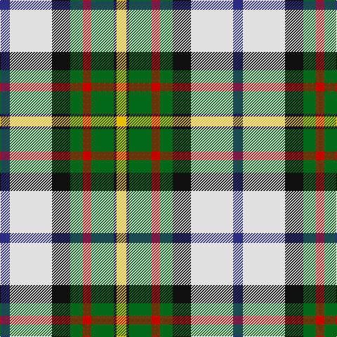

In pattern [BWKGRGKY](/patterns/bwkgrgky/).

This was sourced from house-of-tartan.  It is a [8 stripes tartan](/stripes/stripes8/).

Original link http://www.house-of-tartan.scotland.net/house/TartanViewjs.asp?colr=Def&tnam=649

## Thread count
DB/14 LN60 K26 G18 R12 G32 K4 Y/14

## Palette
Each colour and its ΔE from the base-6 reference it is a variant of.

| Colour | Shade | Base | ΔE (OKLab) |
|---|---|---|---|
| DB | <code style="background-color:#2C2C80;">#2C2C80</code> `#2C2C80` | B <code style="background-color:#2A418A;">#2A418A</code> | 0.06 |
| G | <code style="background-color:#006818;">#006818</code> `#006818` | G <code style="background-color:#006100;">#006100</code> | 0.02 |
| K | <code style="background-color:#101010;">#101010</code> `#101010` | K <code style="background-color:#000000;">#000000</code> | 0.17 |
| LN | <code style="background-color:#E0E0E0;">#E0E0E0</code> `#E0E0E0` | W <code style="background-color:#F7F7F7;">#F7F7F7</code> | 0.07 |
| R | <code style="background-color:#C80000;">#C80000</code> `#C80000` | R <code style="background-color:#CC0000;">#CC0000</code> | 0.01 |
| Y | <code style="background-color:#E8C000;">#E8C000</code> `#E8C000` | Y <code style="background-color:#F2BF00;">#F2BF00</code> | 0.02 |

# Sample pattern

## Nearest tartans

The nearest existing variants by ΔTartan distance.

1. [MacLaren dress](/setts/s8/b7w30k13g9r6g16k2y7~b304080-g008000-k000000-rc00000-we0e0e0-yf0c000~x2/) — ΔT 0.35
1. [MacLaren Dress](/setts/s8/b2w12k8g8r2g8k1y2~b2c2c80-g408060-k101010-rc80000-wf8f8f8-yd09800~x2/) — ΔT 0.65
1. [Gillies, dress Green](/setts/s10/y6k2g15r6g8k12w25b2w3b2~b5480b0-g008000-k000000-rc00000-we0e0e0-yf0c000~x2/) — ΔT 0.86
1. [Carmen Lau (Hong Kong) (Personal)](/setts/s7/y8r3b2ba1w6g12ba2~b1474b4-ba2c2c80-g006818-r901c38-wfcfcfc-yfccc00~x2/) — ΔT 0.88
1. [Hackett William (Coatbridge) Hunting (Personal)](/setts/s8/k20y4r4y20g20w5g2ya2~g346428-k101010-rff0000-wffffff-ycfb47f-ya86ac5f~x2/) — ΔT 1.00
1. [Carmen Lau (Hong Kong) (Personal)](/setts/s7/y8k3b2ba1w6g12ba2~b5f749c-ba3d3134-g649848-k000000-wf9f5ef-yf8e38c~x2/) — ΔT 1.04
1. [Coulter Dress (Personal)](/setts/s8/r6w20g12ra3g8b20k2b3~b788cb4-g007800-k000000-r8c0000-raa0783c-wf0f0f0~x2/) — ΔT 1.08
1. [Gillies Dress Green](/setts/s10/y12k3g24r12g24k32w44g4w8g4~g006818-k101010-rc80000-wfcfcfc-yd09800/) — ΔT 1.08
1. [Gillies Dress, Green (Dance)](/setts/s10/y6k2g12r4g8k10w24b2w3b2~b1474b4-g00a824-k000000-rc80000-we0e0e0-ye8c000~x2/) — ΔT 1.13
1. [Ontario Northern Canadian District Tartan Tartan Number: 956. Earliest known date: 1967 The six colours represent the nickel bearing rocks (grey), the snow (white), the sky and the lakes (blue), gold, the forests and fields (green), and the Indian Nation (red brown). See products available Copyright © Blair Urquhart, Comrie, 2015](/setts/s7/g17r5b2w12b2y4ga7~b2c2c80-g604000-ga006818-r888888-we0e0e0-ye8c000~x2/) — ΔT 1.16

## Neighbour map

Every grey dot is one of 15726 variants placed by the first two principal components of the ΔTartan feature space (44% of its variance). Red is this tartan; blue dots are its nearest — click one to open its page.

<svg viewBox="0 0 640 380" role="img" style="max-width:100%;height:auto;border:1px solid #e0e0e0;border-radius:4px;display:block" xmlns="http://www.w3.org/2000/svg"><image href="/nn/cloud.v1.png" width="640" height="380"/><a href="/setts/s8/b7w30k13g9r6g16k2y7~b304080-g008000-k000000-rc00000-we0e0e0-yf0c000~x2/"><circle cx="72.8" cy="133.8" r="4" fill="#3465a4"><title>MacLaren dress</title></circle></a><a href="/setts/s8/b2w12k8g8r2g8k1y2~b2c2c80-g408060-k101010-rc80000-wf8f8f8-yd09800~x2/"><circle cx="95.1" cy="145.9" r="4" fill="#3465a4"><title>MacLaren Dress</title></circle></a><a href="/setts/s10/y6k2g15r6g8k12w25b2w3b2~b5480b0-g008000-k000000-rc00000-we0e0e0-yf0c000~x2/"><circle cx="81.5" cy="117.7" r="4" fill="#3465a4"><title>Gillies, dress Green</title></circle></a><a href="/setts/s7/y8r3b2ba1w6g12ba2~b1474b4-ba2c2c80-g006818-r901c38-wfcfcfc-yfccc00~x2/"><circle cx="86.9" cy="144.9" r="4" fill="#3465a4"><title>Carmen Lau (Hong Kong) (Personal)</title></circle></a><a href="/setts/s8/k20y4r4y20g20w5g2ya2~g346428-k101010-rff0000-wffffff-ycfb47f-ya86ac5f~x2/"><circle cx="85.7" cy="143.7" r="4" fill="#3465a4"><title>Hackett William (Coatbridge) Hunting (Personal)</title></circle></a><a href="/setts/s7/y8k3b2ba1w6g12ba2~b5f749c-ba3d3134-g649848-k000000-wf9f5ef-yf8e38c~x2/"><circle cx="80.8" cy="141.7" r="4" fill="#3465a4"><title>Carmen Lau (Hong Kong) (Personal)</title></circle></a><a href="/setts/s8/r6w20g12ra3g8b20k2b3~b788cb4-g007800-k000000-r8c0000-raa0783c-wf0f0f0~x2/"><circle cx="79.5" cy="151.9" r="4" fill="#3465a4"><title>Coulter Dress (Personal)</title></circle></a><a href="/setts/s10/y12k3g24r12g24k32w44g4w8g4~g006818-k101010-rc80000-wfcfcfc-yd09800/"><circle cx="104.3" cy="136.5" r="4" fill="#3465a4"><title>Gillies Dress Green</title></circle></a><a href="/setts/s10/y6k2g12r4g8k10w24b2w3b2~b1474b4-g00a824-k000000-rc80000-we0e0e0-ye8c000~x2/"><circle cx="89.5" cy="116.4" r="4" fill="#3465a4"><title>Gillies Dress, Green (Dance)</title></circle></a><a href="/setts/s7/g17r5b2w12b2y4ga7~b2c2c80-g604000-ga006818-r888888-we0e0e0-ye8c000~x2/"><circle cx="85.2" cy="165.5" r="4" fill="#3465a4"><title>Ontario Northern Canadian District Tartan Tartan Number: 956. Earliest known date: 1967 The six colours represent the nickel bearing rocks (grey), the snow (white), the sky and the lakes (blue), gold, the forests and fields (green), and the Indian Nation (red brown). See products available Copyright © Blair Urquhart, Comrie, 2015</title></circle></a><circle cx="80.3" cy="135.5" r="5" fill="#c00000"/></svg>

ID: /setts/s8/b7w30k13g9r6g16k2y7~b2c2c80-g006818-k101010-rc80000-we0e0e0-ye8c000~x2/
