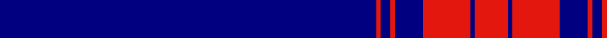
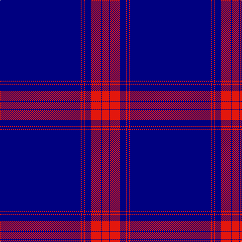

In pattern [BRBRBRBR](/patterns/brbrbrbr/).

This was sourced from register-of-tartans.  It is a [8 stripes tartan](/stripes/stripes8/).

Original link https://www.tartanregister.gov.uk/tartanDetails.aspx?ref=10795

## Thread count
DB/160 R2 DB4 R2 DB12 R20 DB2 R/14

## Palette
Each colour and its ΔE from the base-6 reference it is a variant of.

| Colour | Shade | Base | ΔE (OKLab) |
|---|---|---|---|
| DB | <code style="background-color:#000080;">#000080</code> `#000080` | B <code style="background-color:#2A418A;">#2A418A</code> | 0.14 |
| R | <code style="background-color:#E3170D;">#E3170D</code> `#E3170D` | R <code style="background-color:#CC0000;">#CC0000</code> | 0.05 |

# Sample pattern

## Nearest tartans

The nearest existing variants by ΔTartan distance.

1. [University of Delaware (Corporate)](/setts/s9/b43y5b1y4b1y2b7w1b2~b2c2c80-we0e0e0-yfccc00~x2/) — ΔT 1.89
1. [Weir Minerals (Corporate)](/setts/s4/b80w1y8w3~b1c0070-we0e0e0-yd87c00~x2/) — ΔT 1.91
1. [Auchairne](/setts/s6/b10ba6b3ba62w4ba5~b8080d0-ba000050-we0e0e0~x2/) — ΔT 2.02
1. [Duke of York (Royal)](/setts/s8/b61r6w2r8y2b3y2b15~b00008c-r8c0000-wfcfcfc-yc88c00~x2/) — ΔT 2.03
1. [Inverness Htg (Royal)](/setts/s8/b61r6w2r8y2b3y2b15~b1c0070-r880000-wfcfcfc-yd09800~x2/) — ΔT 2.10
1. [Angotta (Name)](/setts/s13/y6b1y1b1y1b5y2b5y4b2r1b40r1~b2c2c80-rc80000-ybc8c00~x2/) — ΔT 2.15
1. [Spirit of Ulster](/setts/s7/w2b4r2b90w2b4r1~b1c0070-rc80000-we0e0e0~x2/) — ΔT 2.25
1. [Angotta](/setts/s13/y6b1y1b1y1b5y2b5y4b2r1b40r1~b380474-ree0000-ycdad00~x2/) — ΔT 2.27
1. [Cougan Irish Personal Tartan Tartan Number: 6782. Earliest known date: 2005 September Designed by Douglas Gregor of Tartanweb as a personal tartan for Margot Coogan of County Laois, Ireland. The colours reflect those in the Cougan coat of arms - deep red representing the red cross in the shield and the white lines representing the three silver oak leaves. See products available Copyright © Blair Urquhart, Comrie, 2015](/setts/s10/b66r16w2r1w1r1w2r16b66y2~b1c0070-r880000-wf8f8f8-ye8c000~x2/) — ΔT 2.28
1. [Auchairne (Corporate)](/setts/s6/b11ba7b3ba70w4ba6~b1474b4-ba1c1c50-w98c8e8~x2/) — ΔT 2.29

## Neighbour map

Every grey dot is one of 15726 variants placed by the first two principal components of the ΔTartan feature space (44% of its variance). Red is this tartan; blue dots are its nearest — click one to open its page.

<svg viewBox="0 0 640 380" role="img" style="max-width:100%;height:auto;border:1px solid #e0e0e0;border-radius:4px;display:block" xmlns="http://www.w3.org/2000/svg"><image href="/nn/cloud.v1.png" width="640" height="380"/><a href="/setts/s9/b43y5b1y4b1y2b7w1b2~b2c2c80-we0e0e0-yfccc00~x2/"><circle cx="579.1" cy="117.8" r="4" fill="#3465a4"><title>University of Delaware (Corporate)</title></circle></a><a href="/setts/s4/b80w1y8w3~b1c0070-we0e0e0-yd87c00~x2/"><circle cx="626.0" cy="176.4" r="4" fill="#3465a4"><title>Weir Minerals (Corporate)</title></circle></a><a href="/setts/s6/b10ba6b3ba62w4ba5~b8080d0-ba000050-we0e0e0~x2/"><circle cx="550.0" cy="190.2" r="4" fill="#3465a4"><title>Auchairne</title></circle></a><a href="/setts/s8/b61r6w2r8y2b3y2b15~b00008c-r8c0000-wfcfcfc-yc88c00~x2/"><circle cx="548.3" cy="144.0" r="4" fill="#3465a4"><title>Duke of York (Royal)</title></circle></a><a href="/setts/s8/b61r6w2r8y2b3y2b15~b1c0070-r880000-wfcfcfc-yd09800~x2/"><circle cx="559.1" cy="142.9" r="4" fill="#3465a4"><title>Inverness Htg (Royal)</title></circle></a><a href="/setts/s13/y6b1y1b1y1b5y2b5y4b2r1b40r1~b2c2c80-rc80000-ybc8c00~x2/"><circle cx="567.4" cy="107.5" r="4" fill="#3465a4"><title>Angotta (Name)</title></circle></a><a href="/setts/s7/w2b4r2b90w2b4r1~b1c0070-rc80000-we0e0e0~x2/"><circle cx="626.0" cy="147.4" r="4" fill="#3465a4"><title>Spirit of Ulster</title></circle></a><a href="/setts/s13/y6b1y1b1y1b5y2b5y4b2r1b40r1~b380474-ree0000-ycdad00~x2/"><circle cx="546.1" cy="95.3" r="4" fill="#3465a4"><title>Angotta</title></circle></a><a href="/setts/s10/b66r16w2r1w1r1w2r16b66y2~b1c0070-r880000-wf8f8f8-ye8c000~x2/"><circle cx="544.5" cy="116.8" r="4" fill="#3465a4"><title>Cougan Irish Personal Tartan Tartan Number: 6782. Earliest known date: 2005 September Designed by Douglas Gregor of Tartanweb as a personal tartan for Margot Coogan of County Laois, Ireland. The colours reflect those in the Cougan coat of arms - deep red representing the red cross in the shield and the white lines representing the three silver oak leaves. See products available Copyright © Blair Urquhart, Comrie, 2015</title></circle></a><a href="/setts/s6/b11ba7b3ba70w4ba6~b1474b4-ba1c1c50-w98c8e8~x2/"><circle cx="611.4" cy="199.7" r="4" fill="#3465a4"><title>Auchairne (Corporate)</title></circle></a><circle cx="626.0" cy="144.2" r="5" fill="#c00000"/></svg>

ID: /setts/s8/b80r1b2r1b6r10b1r7~b000080-re3170d~x2/
