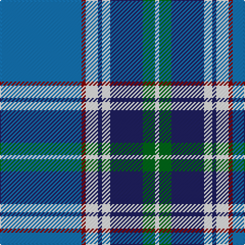

In pattern [BRWBWBGW](/patterns/brwbwbgw/).

This was sourced from tartans-authority.  It is a [8 stripes tartan](/stripes/stripes8/).

Original link http://www.tartansauthority.com/tartan-ferret/display/10591/

## Thread count
B/80 DR4 W12 DB4 W8 DB32 G12 W/4

## Palette
Each colour and its ΔE from the base-6 reference it is a variant of.

| Colour | Shade | Base | ΔE (OKLab) |
|---|---|---|---|
| B | <code style="background-color:#1474B4;">#1474B4</code> `#1474B4` | B <code style="background-color:#2A418A;">#2A418A</code> | 0.15 |
| DB | <code style="background-color:#202060;">#202060</code> `#202060` | B <code style="background-color:#2A418A;">#2A418A</code> | 0.11 |
| DR | <code style="background-color:#880000;">#880000</code> `#880000` | R <code style="background-color:#CC0000;">#CC0000</code> | 0.15 |
| G | <code style="background-color:#006818;">#006818</code> `#006818` | G <code style="background-color:#006100;">#006100</code> | 0.02 |
| W | <code style="background-color:#FCFCFC;">#FCFCFC</code> `#FCFCFC` | W <code style="background-color:#F7F7F7;">#F7F7F7</code> | 0.01 |

# Sample pattern

## Nearest tartans

The nearest existing variants by ΔTartan distance.

1. [Kruenaegel and Schropp](/setts/s8/b80r4w12ba4w8ba32g12w4-b2c5890-ba043c48-g549028-r902c58-we8e8e8/) — ΔT 0.81
1. [Blue Knights, The](/setts/s9/w6y30b12ba4b2ba4b2ba42ya4-b1c1c50-ba2c2c80-wffffff-y48a4c0-yae8c000/) — ΔT 0.86
1. [MacRaes of America](/setts/s8/w16b8y4b72ba96b4ba8r10-b202060-ba5c8ca8-rc80000-wf0f0d8-ye8c000/) — ΔT 0.90
1. [Blue Knights, The (Corporate))](/setts/s9/w6y30b12ba4b2ba4b2ba42ya4-b1c1c50-ba2c2c80-we0e0e0-y48a4c0-yae8c000/) — ΔT 0.93
1. [Rikaco Morning Dew 1 (Fashion)](/setts/s10/b8w4b2ba48b20w2bb4w10bb6r4-b202060-ba2888c4-bb1c0070-rc80000-we0e0e0/) — ΔT 0.96
1. [Herriot New Zealand](/setts/s6/w15y2k5wa3b40k10-b006699-k000033-wffffff-wac0c0c0-yffff33/) — ΔT 1.08
1. [Blalack (Name)](/setts/s10/g8y4b28y4b4y4b4y28k2w4-b2c2c80-g00801c-k101010-wf8f8f8-y48a4c0/) — ΔT 1.12
1. [Blalack](/setts/s10/g8y4b28y4b4y4b4y28k2w4-b2c2c80-g006818-k101010-wf8f8f8-y48a4c0/) — ΔT 1.12
1. [Los Angeles](/setts/s8/y8b48ba10g4b6k10ba66r4-b2c2c80-ba6098b8-g289c18-k101010-rc80000-ye8c000/) — ΔT 1.18
1. [Comrie, Navy Blue (Dance)](/setts/s8/b84ba4w4ba4b10k24w64bb8-b003c64-ba2888c4-bb1c0070-k101010-wf0e0c8/) — ΔT 1.20

## Neighbour map

Every grey dot is one of 15726 variants placed by the first two principal components of the ΔTartan feature space (44% of its variance). Red is this tartan; blue dots are its nearest — click one to open its page.

<svg viewBox="0 0 640 380" role="img" style="max-width:100%;height:auto;border:1px solid #e0e0e0;border-radius:4px;display:block" xmlns="http://www.w3.org/2000/svg"><image href="/nn/cloud.v1.png" width="640" height="380"/><a href="/setts/s8/b80r4w12ba4w8ba32g12w4-b2c5890-ba043c48-g549028-r902c58-we8e8e8/"><circle cx="277.4" cy="129.5" r="4" fill="#3465a4"><title>Kruenaegel and Schropp</title></circle></a><a href="/setts/s9/w6y30b12ba4b2ba4b2ba42ya4-b1c1c50-ba2c2c80-wffffff-y48a4c0-yae8c000/"><circle cx="241.8" cy="123.8" r="4" fill="#3465a4"><title>Blue Knights, The</title></circle></a><a href="/setts/s8/w16b8y4b72ba96b4ba8r10-b202060-ba5c8ca8-rc80000-wf0f0d8-ye8c000/"><circle cx="279.3" cy="118.8" r="4" fill="#3465a4"><title>MacRaes of America</title></circle></a><a href="/setts/s9/w6y30b12ba4b2ba4b2ba42ya4-b1c1c50-ba2c2c80-we0e0e0-y48a4c0-yae8c000/"><circle cx="247.4" cy="126.4" r="4" fill="#3465a4"><title>Blue Knights, The (Corporate))</title></circle></a><a href="/setts/s10/b8w4b2ba48b20w2bb4w10bb6r4-b202060-ba2888c4-bb1c0070-rc80000-we0e0e0/"><circle cx="227.8" cy="105.3" r="4" fill="#3465a4"><title>Rikaco Morning Dew 1 (Fashion)</title></circle></a><a href="/setts/s6/w15y2k5wa3b40k10-b006699-k000033-wffffff-wac0c0c0-yffff33/"><circle cx="248.2" cy="138.6" r="4" fill="#3465a4"><title>Herriot New Zealand</title></circle></a><a href="/setts/s10/g8y4b28y4b4y4b4y28k2w4-b2c2c80-g00801c-k101010-wf8f8f8-y48a4c0/"><circle cx="229.4" cy="143.4" r="4" fill="#3465a4"><title>Blalack (Name)</title></circle></a><a href="/setts/s10/g8y4b28y4b4y4b4y28k2w4-b2c2c80-g006818-k101010-wf8f8f8-y48a4c0/"><circle cx="230.1" cy="143.7" r="4" fill="#3465a4"><title>Blalack</title></circle></a><a href="/setts/s8/y8b48ba10g4b6k10ba66r4-b2c2c80-ba6098b8-g289c18-k101010-rc80000-ye8c000/"><circle cx="246.2" cy="125.8" r="4" fill="#3465a4"><title>Los Angeles</title></circle></a><a href="/setts/s8/b84ba4w4ba4b10k24w64bb8-b003c64-ba2888c4-bb1c0070-k101010-wf0e0c8/"><circle cx="226.1" cy="115.6" r="4" fill="#3465a4"><title>Comrie, Navy Blue (Dance)</title></circle></a><circle cx="259.5" cy="121.5" r="5" fill="#c00000"/></svg>

ID: /setts/s8/b80r4w12ba4w8ba32g12w4-b1474b4-ba202060-g006818-r880000-wfcfcfc/
