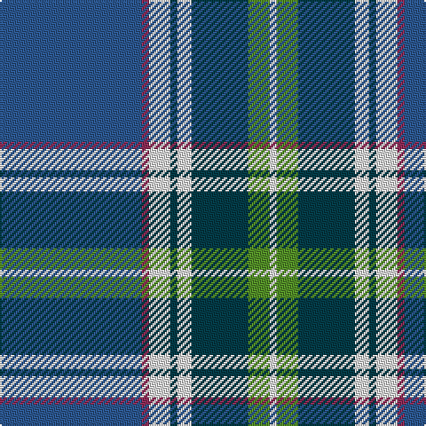

In pattern [BRWBWBGW](/patterns/brwbwbgw/).

This was sourced from house-of-tartan.  It is a [8 stripes tartan](/stripes/stripes8/).

Original link http://www.house-of-tartan.scotland.net/house/TartanViewjs.asp?colr=Def&tnam=10591

## Thread count
B/80 DR4 LN12 G4 LN8 G32 LG12 LN/4

## Palette
Each colour and its ΔE from the base-6 reference it is a variant of.

| Colour | Shade | Base | ΔE (OKLab) |
|---|---|---|---|
| B | <code style="background-color:#2C5890;">#2C5890</code> `#2C5890` | B <code style="background-color:#2C4084;">#2C4084</code> | 0.07 |
| DR | <code style="background-color:#902C58;">#902C58</code> `#902C58` | R <code style="background-color:#C80000;">#C80000</code> | 0.14 |
| G | <code style="background-color:#043C48;">#043C48</code> `#043C48` | B <code style="background-color:#2C4084;">#2C4084</code> | 0.11 |
| LG | <code style="background-color:#549028;">#549028</code> `#549028` | G <code style="background-color:#006400;">#006400</code> | 0.16 |
| LN | <code style="background-color:#E8E8E8;">#E8E8E8</code> `#E8E8E8` | W <code style="background-color:#F4F4F0;">#F4F4F0</code> | 0.04 |

# Sample pattern

ID: /setts/s8/b80r4w12ba4w8ba32g12w4-b2c5890-ba043c48-g549028-r902c58-we8e8e8/
